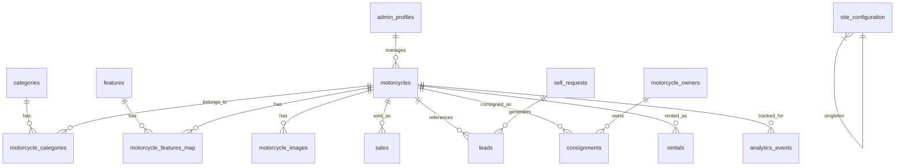

# Data Model: AF Motos Platform

**Feature**: 001-af-motos-platform | **Date**: 2026-08-21

## Entity Relationship Diagram



---

## Entities

### 1. admin_profiles

Administrative users linked to Supabase Auth.

| Column | Type | Constraints | Description |
|--------|------|-------------|-------------|
| id | `uuid` | PK, DEFAULT gen_random_uuid() | Primary key |
| auth_user_id | `uuid` | UNIQUE, NOT NULL, FK → auth.users(id) | Supabase Auth user ID |
| name | `text` | NOT NULL | Display name |
| email | `text` | NOT NULL | Email address |
| role | `text` | NOT NULL, DEFAULT 'admin', CHECK (role IN ('admin', 'super_admin')) | Role for future multi-admin |
| is_active | `boolean` | NOT NULL, DEFAULT true | Whether account is active |
| created_at | `timestamptz` | NOT NULL, DEFAULT now() | Creation timestamp |
| updated_at | `timestamptz` | NOT NULL, DEFAULT now() | Last update timestamp |

**Indexes**: `auth_user_id` (unique)

**Notes**: MVP supports single admin. `role` column prepares for future multi-admin without schema changes. `auth_user_id` links to Supabase Auth identity.

---

### 2. categories

Motorcycle categories, admin-managed via reference table.

| Column | Type | Constraints | Description |
|--------|------|-------------|-------------|
| id | `uuid` | PK, DEFAULT gen_random_uuid() | Primary key |
| name | `text` | NOT NULL, UNIQUE | Category name (e.g., "Street", "Naked") |
| slug | `text` | NOT NULL, UNIQUE | URL-safe identifier |
| description | `text` | | Optional description |
| icon | `text` | | Optional icon identifier |
| sort_order | `integer` | NOT NULL, DEFAULT 0 | Display ordering |
| is_active | `boolean` | NOT NULL, DEFAULT true | Whether category is visible |
| created_at | `timestamptz` | NOT NULL, DEFAULT now() | Creation timestamp |

**Indexes**: `slug` (unique), `sort_order`

**Seed data**: Street, Naked, Trail, Scooter, Custom, Esportiva, Touring, Off-road

---

### 3. features

Motorcycle differentials/characteristics, admin-managed.

| Column | Type | Constraints | Description |
|--------|------|-------------|-------------|
| id | `uuid` | PK, DEFAULT gen_random_uuid() | Primary key |
| name | `text` | NOT NULL, UNIQUE | Feature name (e.g., "Revisada", "Pneus novos") |
| icon | `text` | | Optional icon identifier |
| sort_order | `integer` | NOT NULL, DEFAULT 0 | Display ordering |
| is_active | `boolean` | NOT NULL, DEFAULT true | Whether feature is available for selection |
| created_at | `timestamptz` | NOT NULL, DEFAULT now() | Creation timestamp |

**Indexes**: `sort_order`

**Seed data**: Revisada, Pneus novos, Manual do proprietário, Chave reserva, Vistoriada, Garantia, Acessórios originais, Acessórios extras, Único dono, Baixa quilometragem

---

### 4. motorcycles

Central entity representing a motorcycle in the system.

| Column | Type | Constraints | Description |
|--------|------|-------------|-------------|
| id | `uuid` | PK, DEFAULT gen_random_uuid() | Primary key |
| slug | `text` | NOT NULL, UNIQUE | SEO-friendly URL slug |
| internal_code | `text` | NOT NULL, UNIQUE | Internal reference code (e.g., "AF-0042") |
| brand | `text` | NOT NULL | Manufacturer (e.g., "Honda") |
| model | `text` | NOT NULL | Model name (e.g., "CB 500F") |
| version | `text` | | Trim/version (e.g., "ABS") |
| year_manufacture | `integer` | NOT NULL | Manufacturing year |
| year_model | `integer` | NOT NULL | Model year |
| mileage | `integer` | | Odometer reading (km) |
| engine_capacity | `integer` | | Engine displacement (cc) |
| fuel | `text` | CHECK (fuel IN ('gasolina', 'etanol', 'flex', 'eletrico', 'diesel')) | Fuel type |
| transmission | `text` | CHECK (transmission IN ('manual', 'automatico', 'semiautomatico', 'cvt')) | Transmission type |
| color | `text` | | Exterior color |
| price | `numeric(12,2)` | | Listed sale price (R$) |
| description | `text` | | Detailed description (markdown-safe) |
| ownership_type | `text` | NOT NULL, DEFAULT 'OWNED', CHECK (ownership_type IN ('OWNED', 'CONSIGNMENT')) | Ownership model |
| operation_type | `text` | NOT NULL, DEFAULT 'SALE', CHECK (operation_type IN ('SALE', 'RENTAL', 'SALE_AND_RENTAL')) | Intended operation |
| status | `text` | NOT NULL, DEFAULT 'AVAILABLE', CHECK (status IN ('AVAILABLE', 'RESERVED', 'SOLD', 'RENTED', 'MAINTENANCE', 'UNAVAILABLE', 'HIDDEN')) | Current status |
| featured | `boolean` | NOT NULL, DEFAULT false | Whether motorcycle is featured/highlighted |
| license_plate | `text` | | Vehicle plate (PRIVATE — never exposed publicly) |
| location | `text` | DEFAULT 'São Paulo, SP' | Display location |
| daily_rate | `numeric(10,2)` | | Rental daily rate (when operation_type includes RENTAL) |
| weekly_rate | `numeric(10,2)` | | Rental weekly rate |
| monthly_rate | `numeric(10,2)` | | Rental monthly rate |
| created_at | `timestamptz` | NOT NULL, DEFAULT now() | Creation timestamp |
| updated_at | `timestamptz` | NOT NULL, DEFAULT now() | Last update timestamp |

**Indexes**: `slug` (unique), `internal_code` (unique), `status`, `brand`, `operation_type`, `featured`, `created_at DESC`

**Validation rules**:
- `year_manufacture` and `year_model` must be ≥ 1900 and ≤ current year + 2
- `mileage` must be ≥ 0
- `engine_capacity` must be > 0
- `price` must be ≥ 0
- `slug` auto-generated from brand + model + year_model, with numeric suffix for duplicates

**State transitions** (see `lib/domain/motorcycle-status.ts`):
```
AVAILABLE → RESERVED | SOLD | RENTED | MAINTENANCE | UNAVAILABLE | HIDDEN
RESERVED → AVAILABLE | SOLD | RENTED | UNAVAILABLE
SOLD → (terminal, requires explicit admin reversal action)
RENTED → AVAILABLE | MAINTENANCE
MAINTENANCE → AVAILABLE | UNAVAILABLE
UNAVAILABLE → AVAILABLE | HIDDEN | MAINTENANCE
HIDDEN → AVAILABLE | RESERVED | MAINTENANCE | UNAVAILABLE
```

---

### 5. motorcycle_categories

Many-to-many join between motorcycles and categories.

| Column | Type | Constraints | Description |
|--------|------|-------------|-------------|
| motorcycle_id | `uuid` | PK, FK → motorcycles(id) ON DELETE CASCADE | Motorcycle reference |
| category_id | `uuid` | PK, FK → categories(id) ON DELETE CASCADE | Category reference |

**Indexes**: Composite PK (`motorcycle_id`, `category_id`)

---

### 6. motorcycle_features_map

Many-to-many join between motorcycles and features.

| Column | Type | Constraints | Description |
|--------|------|-------------|-------------|
| motorcycle_id | `uuid` | PK, FK → motorcycles(id) ON DELETE CASCADE | Motorcycle reference |
| feature_id | `uuid` | PK, FK → features(id) ON DELETE CASCADE | Feature reference |

**Indexes**: Composite PK (`motorcycle_id`, `feature_id`)

---

### 7. motorcycle_images

Photos associated with a motorcycle.

| Column | Type | Constraints | Description |
|--------|------|-------------|-------------|
| id | `uuid` | PK, DEFAULT gen_random_uuid() | Primary key |
| motorcycle_id | `uuid` | NOT NULL, FK → motorcycles(id) ON DELETE CASCADE | Parent motorcycle |
| storage_path | `text` | NOT NULL | Path in Supabase Storage bucket |
| alt_text | `text` | | Image alt text for accessibility |
| sort_order | `integer` | NOT NULL, DEFAULT 0 | Display ordering (0-based) |
| is_primary | `boolean` | NOT NULL, DEFAULT false | Whether this is the main photo |
| width | `integer` | | Original image width (px) |
| height | `integer` | | Original image height (px) |
| file_size | `integer` | | File size in bytes |
| created_at | `timestamptz` | NOT NULL, DEFAULT now() | Upload timestamp |

**Indexes**: `motorcycle_id` + `sort_order`, `motorcycle_id` + `is_primary`

**Constraints**:
- Unique constraint: only one `is_primary = true` per `motorcycle_id` (enforced via partial unique index or trigger)
- `sort_order` should be unique per `motorcycle_id`

**Notes**: `storage_path` stores the path within the `motorcycle-images` bucket (e.g., `motorcycles/{motorcycle_id}/{filename}`). Full public URL reconstructed via `{SUPABASE_URL}/storage/v1/object/public/motorcycle-images/{storage_path}`.

---

### 8. motorcycle_owners

Owners of consigned motorcycles. Private data.

| Column | Type | Constraints | Description |
|--------|------|-------------|-------------|
| id | `uuid` | PK, DEFAULT gen_random_uuid() | Primary key |
| name | `text` | NOT NULL | Owner full name |
| phone | `text` | NOT NULL | WhatsApp/phone number |
| email | `text` | | Email address |
| document | `text` | | CPF or document number (encrypted future) |
| notes | `text` | | Internal notes |
| created_at | `timestamptz` | NOT NULL, DEFAULT now() | Creation timestamp |
| updated_at | `timestamptz` | NOT NULL, DEFAULT now() | Last update timestamp |

**Indexes**: `phone`, `email`

**Security**: This table is NEVER exposed via public RLS policies. Admin-only access.

---

### 9. consignments

Consignment contracts linking owners to motorcycles.

| Column | Type | Constraints | Description |
|--------|------|-------------|-------------|
| id | `uuid` | PK, DEFAULT gen_random_uuid() | Primary key |
| motorcycle_id | `uuid` | NOT NULL, FK → motorcycles(id) | Consigned motorcycle |
| owner_id | `uuid` | NOT NULL, FK → motorcycle_owners(id) | Motorcycle owner |
| asking_price | `numeric(12,2)` | NOT NULL | Owner's desired price |
| minimum_price | `numeric(12,2)` | | Minimum acceptable price |
| advertised_price | `numeric(12,2)` | | Price shown on catalog |
| commission_type | `text` | NOT NULL, CHECK (commission_type IN ('percentage', 'fixed')) | Commission calculation method |
| commission_value | `numeric(10,2)` | NOT NULL | Commission rate (%) or fixed amount (R$) |
| commission_amount | `numeric(12,2)` | | Calculated commission value (R$) |
| contract_status | `text` | NOT NULL, DEFAULT 'DRAFT', CHECK (contract_status IN ('DRAFT', 'ACTIVE', 'SOLD', 'EXPIRED', 'CANCELLED', 'RETURNED')) | Contract lifecycle status |
| start_date | `date` | | Contract start date |
| end_date | `date` | | Contract end date |
| notes | `text` | | Internal observations |
| created_at | `timestamptz` | NOT NULL, DEFAULT now() | Creation timestamp |
| updated_at | `timestamptz` | NOT NULL, DEFAULT now() | Last update timestamp |

**Indexes**: `motorcycle_id`, `owner_id`, `contract_status`

**Validation rules**:
- `commission_value` must be > 0
- If `commission_type = 'percentage'`: `commission_value` must be between 0.01 and 100
- `end_date` must be ≥ `start_date` when both set
- `commission_amount` = calculated at application layer:
  - Percentage: `advertised_price × (commission_value / 100)`
  - Fixed: `commission_value`

**Security**: Admin-only access. Financial data never exposed publicly.

---

### 10. sales

Historical record of motorcycle sales.

| Column | Type | Constraints | Description |
|--------|------|-------------|-------------|
| id | `uuid` | PK, DEFAULT gen_random_uuid() | Primary key |
| motorcycle_id | `uuid` | NOT NULL, FK → motorcycles(id) | Sold motorcycle |
| sale_price | `numeric(12,2)` | NOT NULL | Final sale price |
| sale_date | `date` | NOT NULL, DEFAULT CURRENT_DATE | Date of sale |
| buyer_name | `text` | | Buyer name (private) |
| buyer_phone | `text` | | Buyer phone (private) |
| buyer_email | `text` | | Buyer email (private) |
| payment_method | `text` | | Payment method used |
| consignment_id | `uuid` | FK → consignments(id) | Related consignment if applicable |
| notes | `text` | | Internal observations |
| created_at | `timestamptz` | NOT NULL, DEFAULT now() | Record creation timestamp |

**Indexes**: `motorcycle_id`, `sale_date`, `consignment_id`

**Notes**: When a sale is recorded, the motorcycle status transitions to `SOLD`. If linked to a consignment, the consignment status transitions to `SOLD`. Buyer personal data is private (admin-only RLS).

---

### 11. rentals

Rental requests and active rentals.

| Column | Type | Constraints | Description |
|--------|------|-------------|-------------|
| id | `uuid` | PK, DEFAULT gen_random_uuid() | Primary key |
| motorcycle_id | `uuid` | NOT NULL, FK → motorcycles(id) | Rented motorcycle |
| customer_name | `text` | NOT NULL | Renter name |
| customer_phone | `text` | NOT NULL | Renter WhatsApp/phone |
| customer_email | `text` | | Renter email |
| start_date | `date` | NOT NULL | Pickup date |
| end_date | `date` | NOT NULL | Return date |
| daily_rate | `numeric(10,2)` | NOT NULL | Daily rate at time of rental |
| total_amount | `numeric(12,2)` | | Calculated total rental amount |
| deposit_amount | `numeric(10,2)` | | Security deposit amount |
| status | `text` | NOT NULL, DEFAULT 'REQUESTED', CHECK (status IN ('REQUESTED', 'CONFIRMED', 'ACTIVE', 'COMPLETED', 'CANCELLED')) | Rental lifecycle status |
| notes | `text` | | Internal observations |
| created_at | `timestamptz` | NOT NULL, DEFAULT now() | Creation timestamp |
| updated_at | `timestamptz` | NOT NULL, DEFAULT now() | Last update timestamp |

**Indexes**: `motorcycle_id`, `status`, `start_date`, `end_date`

**Validation rules**:
- `end_date` must be > `start_date`
- `daily_rate` must be > 0
- `total_amount` calculated: `daily_rate × number_of_days`

**Notes**: Date conflict detection is data-model-ready (overlapping date ranges can be queried) but MVP relies on manual admin confirmation per spec.

---

### 12. rental_settings

Global rental configuration. Singleton-like table (single row for MVP).

| Column | Type | Constraints | Description |
|--------|------|-------------|-------------|
| id | `uuid` | PK, DEFAULT gen_random_uuid() | Primary key |
| minimum_age | `integer` | DEFAULT 21 | Minimum renter age |
| license_categories | `text[]` | DEFAULT '{A}' | Required CNH categories |
| required_documents | `jsonb` | | List of required documents |
| deposit_info | `text` | | Deposit/caution description |
| payment_methods | `text[]` | | Accepted payment methods |
| rules | `jsonb` | | Rental rules and conditions |
| included_items | `jsonb` | | Items included with rental |
| insurance_info | `text` | | Insurance description |
| maintenance_policy | `text` | | Maintenance policy text |
| assistance_info | `text` | | Roadside assistance info |
| general_terms | `text` | | General terms and conditions |
| created_at | `timestamptz` | NOT NULL, DEFAULT now() | Creation timestamp |
| updated_at | `timestamptz` | NOT NULL, DEFAULT now() | Last update timestamp |

**Notes**: Admin-editable via settings page. `jsonb` columns allow flexible structure for lists/objects without schema changes.

---

### 13. leads

Unified lead entity for all incoming interest.

| Column | Type | Constraints | Description |
|--------|------|-------------|-------------|
| id | `uuid` | PK, DEFAULT gen_random_uuid() | Primary key |
| type | `text` | NOT NULL, CHECK (type IN ('MOTORCYCLE_INTEREST', 'SELL_MOTORCYCLE', 'CONSIGNMENT', 'RENTAL', 'MOTORCYCLE_REQUEST', 'GENERAL_CONTACT')) | Lead type |
| motorcycle_id | `uuid` | FK → motorcycles(id) ON DELETE SET NULL | Related motorcycle (optional) |
| name | `text` | NOT NULL | Contact name |
| phone | `text` | NOT NULL | WhatsApp/phone |
| email | `text` | | Email address |
| source | `text` | | Lead source (utm_source, direct, etc.) |
| status | `text` | NOT NULL, DEFAULT 'NEW', CHECK (status IN ('NEW', 'CONTACTED', 'QUALIFIED', 'CONVERTED', 'LOST', 'CLOSED')) | Lead lifecycle status |
| message | `text` | | User message/notes |
| metadata | `jsonb` | | Additional structured data (UTM params, referrer, etc.) |
| created_at | `timestamptz` | NOT NULL, DEFAULT now() | Creation timestamp |
| updated_at | `timestamptz` | NOT NULL, DEFAULT now() | Last update timestamp |

**Indexes**: `type`, `status`, `motorcycle_id`, `created_at DESC`

**Notes**: All form submissions (sell request, consignment, rental, contact) also create a lead record for unified tracking. `metadata` stores UTM parameters and any context-specific data.

---

### 14. sell_requests

Proposals from motorcycle owners who want to sell to AF Motos.

| Column | Type | Constraints | Description |
|--------|------|-------------|-------------|
| id | `uuid` | PK, DEFAULT gen_random_uuid() | Primary key |
| lead_id | `uuid` | FK → leads(id) ON DELETE SET NULL | Associated lead |
| name | `text` | NOT NULL | Owner name |
| phone | `text` | NOT NULL | Owner WhatsApp/phone |
| email | `text` | | Owner email |
| license_plate | `text` | | Vehicle plate |
| motorcycle_data | `jsonb` | | Plate lookup result + manual data |
| brand | `text` | | Brand (from lookup or manual) |
| model | `text` | | Model (from lookup or manual) |
| year_manufacture | `integer` | | Manufacturing year |
| year_model | `integer` | | Model year |
| color | `text` | | Color |
| mileage | `integer` | | Current mileage |
| desired_price | `numeric(12,2)` | | Owner's asking price |
| photos | `text[]` | | Storage paths for uploaded photos |
| notes | `text` | | Additional observations |
| status | `text` | NOT NULL, DEFAULT 'NEW', CHECK (status IN ('NEW', 'UNDER_REVIEW', 'CONTACTED', 'PROPOSAL_SENT', 'NEGOTIATING', 'APPROVED', 'REJECTED', 'PURCHASED', 'CLOSED')) | Proposal lifecycle |
| offered_amount | `numeric(12,2)` | | AF Motos' offer |
| accepted_amount | `numeric(12,2)` | | Final accepted amount |
| created_at | `timestamptz` | NOT NULL, DEFAULT now() | Creation timestamp |
| updated_at | `timestamptz` | NOT NULL, DEFAULT now() | Last update timestamp |

**Indexes**: `status`, `lead_id`, `created_at DESC`

**Notes**: `motorcycle_data` stores the raw plate lookup response for audit. Individual fields (`brand`, `model`, etc.) are denormalized for easy querying/display. `photos` stores array of Supabase Storage paths.

---

### 15. analytics_events

Tracked events for internal analytics.

| Column | Type | Constraints | Description |
|--------|------|-------------|-------------|
| id | `uuid` | PK, DEFAULT gen_random_uuid() | Primary key |
| event_type | `text` | NOT NULL | Event type identifier |
| motorcycle_id | `uuid` | FK → motorcycles(id) ON DELETE SET NULL | Related motorcycle (optional) |
| lead_id | `uuid` | FK → leads(id) ON DELETE SET NULL | Related lead (optional) |
| source | `text` | | Traffic source |
| metadata | `jsonb` | | Event-specific data (search query, filter values, UTM, etc.) |
| session_id | `text` | | Anonymous session identifier |
| user_agent | `text` | | Browser user agent |
| created_at | `timestamptz` | NOT NULL, DEFAULT now() | Event timestamp |

**Indexes**: `event_type`, `motorcycle_id`, `created_at DESC`

**Event types**:
- `MOTORCYCLE_VIEW`
- `WHATSAPP_CLICK`
- `SHARE`
- `SELL_REQUEST_SUBMITTED`
- `CONSIGNMENT_REQUEST_SUBMITTED`
- `RENTAL_REQUEST_SUBMITTED`
- `SEARCH`
- `FILTER_APPLIED`

**Notes**: No PII stored in events. `session_id` is a random anonymous identifier, not tied to user accounts.

---

### 16. site_configuration

Global site settings (singleton row).

| Column | Type | Constraints | Description |
|--------|------|-------------|-------------|
| id | `uuid` | PK, DEFAULT gen_random_uuid() | Primary key |
| whatsapp_phone | `text` | NOT NULL | Business WhatsApp number |
| site_name | `text` | NOT NULL, DEFAULT 'AF Motos' | Site display name |
| about_text | `text` | | About section content |
| address | `text` | | Business address |
| business_hours | `jsonb` | | Operating hours |
| social_links | `jsonb` | | Social media links (Instagram, etc.) |
| whatsapp_templates | `jsonb` | | Custom WhatsApp message templates per context |
| default_location | `text` | DEFAULT 'São Paulo, SP' | Default motorcycle location |
| created_at | `timestamptz` | NOT NULL, DEFAULT now() | Creation timestamp |
| updated_at | `timestamptz` | NOT NULL, DEFAULT now() | Last update timestamp |

**Notes**: Single row for MVP. Admin-editable via settings page. WhatsApp templates stored as JSON for easy runtime access.

---

## Migration Order

Ordered by dependency chain:

1. `00001_admin_profiles.sql` — Admin users (no FK dependencies)
2. `00002_categories.sql` — Category reference table (no FK dependencies)
3. `00003_features.sql` — Feature reference table (no FK dependencies)
4. `00004_motorcycles.sql` — Core motorcycle table (no FK dependencies)
5. `00005_motorcycle_categories.sql` — M2M join (depends on motorcycles, categories)
6. `00006_motorcycle_features_map.sql` — M2M join (depends on motorcycles, features)
7. `00007_motorcycle_images.sql` — Images (depends on motorcycles)
8. `00008_motorcycle_owners.sql` — Owners (no FK dependencies)
9. `00009_consignments.sql` — Consignments (depends on motorcycles, owners)
10. `00010_sales.sql` — Sales (depends on motorcycles, consignments)
11. `00011_leads.sql` — Leads (depends on motorcycles)
12. `00012_rentals.sql` — Rentals (depends on motorcycles)
13. `00013_rental_settings.sql` — Rental config (no FK dependencies)
14. `00014_sell_requests.sql` — Sell proposals (depends on leads)
15. `00015_analytics_events.sql` — Analytics (depends on motorcycles, leads)
16. `00016_site_configuration.sql` — Site settings (no FK dependencies)
17. `00017_rls_policies.sql` — Row Level Security policies (depends on all tables)
18. `00018_seed_data.sql` — Initial categories, features, site config, admin profile
19. `00019_updated_at_triggers.sql` — Auto-update `updated_at` triggers

---

## RLS Policy Summary

### Public access (anon / unauthenticated)

| Table | SELECT | INSERT | UPDATE | DELETE |
|-------|--------|--------|--------|--------|
| motorcycles | ✅ (WHERE status NOT IN ('HIDDEN') — filter `license_plate` from returned columns via view or query) | ❌ | ❌ | ❌ |
| motorcycle_images | ✅ (WHERE motorcycle is visible) | ❌ | ❌ | ❌ |
| motorcycle_categories | ✅ | ❌ | ❌ | ❌ |
| motorcycle_features_map | ✅ | ❌ | ❌ | ❌ |
| categories | ✅ (WHERE is_active) | ❌ | ❌ | ❌ |
| features | ✅ (WHERE is_active) | ❌ | ❌ | ❌ |
| leads | ❌ | ✅ (INSERT only) | ❌ | ❌ |
| sell_requests | ❌ | ✅ (INSERT only) | ❌ | ❌ |
| rentals | ❌ | ✅ (INSERT only for REQUESTED status) | ❌ | ❌ |
| analytics_events | ❌ | ✅ (INSERT only) | ❌ | ❌ |
| rental_settings | ✅ (read-only) | ❌ | ❌ | ❌ |
| site_configuration | ✅ (read-only) | ❌ | ❌ | ❌ |
| motorcycle_owners | ❌ | ❌ | ❌ | ❌ |
| consignments | ❌ | ❌ | ❌ | ❌ |
| sales | ❌ | ❌ | ❌ | ❌ |
| admin_profiles | ❌ | ❌ | ❌ | ❌ |

### Admin access (authenticated, role = admin)

| Table | SELECT | INSERT | UPDATE | DELETE |
|-------|--------|--------|--------|--------|
| All tables | ✅ | ✅ | ✅ | ✅ (soft delete preferred) |

**Policy condition**: `auth.uid() IN (SELECT auth_user_id FROM admin_profiles WHERE is_active = true)`

### Storage policies

| Bucket | Public read | Authenticated upload | Authenticated delete |
|--------|------------|---------------------|---------------------|
| motorcycle-images | ✅ | ✅ (admin only) | ✅ (admin only) |
| documents | ❌ | ✅ (admin only) | ✅ (admin only) |

---

## `updated_at` Auto-Update

Create a reusable trigger function:

```sql
CREATE OR REPLACE FUNCTION update_updated_at_column()
RETURNS TRIGGER AS $$
BEGIN
  NEW.updated_at = NOW();
  RETURN NEW;
END;
$$ LANGUAGE plpgsql;
```

Apply to tables with `updated_at`: `motorcycles`, `motorcycle_owners`, `consignments`, `rentals`, `leads`, `sell_requests`, `site_configuration`, `admin_profiles`.
