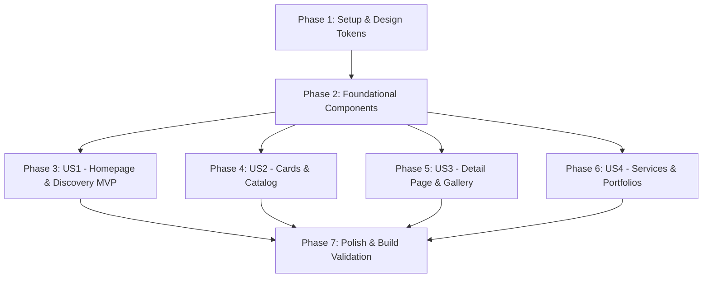

# Tasks: AF Motos Premium Visual Redesign

**Feature**: AF Motos – Premium Visual Redesign (`002-premium-redesign`)  
**Spec**: [specs/002-premium-redesign/spec.md](file:///c:/Users/Alexr/OneDrive/Ambiente%20de%20Trabalho/www/af-motos/specs/002-premium-redesign/spec.md)  
**Plan**: [specs/002-premium-redesign/plan.md](file:///c:/Users/Alexr/OneDrive/Ambiente%20de%20Trabalho/www/af-motos/specs/002-premium-redesign/plan.md)  
**Status**: Ready for Execution  

---

## Phase 1: Setup & Design System Tokens

**Purpose**: Establish the centralized Tailwind CSS v4 design tokens, color palette, and typography scale.

- [X] T001 Configure Tailwind CSS v4 theme variables and semantic tokens in `app/globals.css` with graphite (#0B0D0F), dark surface (#171A1D), neutral background (#F5F5F2), action accent (#D94832), and subtle border tokens.
- [X] T002 [P] Update typography scale and font declarations in `app/layout.tsx` to support display, heading, tabular figures, and body hierarchies.
- [X] T003 [P] Verify and update design system utility classes in `app/globals.css` for focus-visible ring, smooth transitions, and custom scrollbars.

---

## Phase 2: Foundational Components (Blocking Prerequisites)

**Purpose**: Core layout and base presentation components that all user stories depend on.

- [X] T004 Redesign the status badge component with luxury dealership indicators in `components/motorcycles/motorcycle-status-badge.tsx`.
- [X] T005 [P] Implement the premium sticky header with desktop navigation, WhatsApp direct action button, and mobile sheet menu in `components/layout/header.tsx`.
- [X] T006 [P] Redesign the dealership footer with company credentials, hours, navigation links, and social links in `components/layout/footer.tsx`.
- [X] T007 [P] Enhance floating WhatsApp widget with tooltips and pulse interaction in `components/layout/whatsapp-button.tsx`.

**Checkpoint**: Core design system and global navigation layout established.

---

## Phase 3: User Story 1 – Premium Discovery & Homepage (Priority: P1) 🎯 MVP

**Goal**: Deliver a high-impact homepage that immediately communicates trust, showcases inventory, and offers dual conversion paths.  
**Independent Test**: Load `http://localhost:3000` on mobile and desktop. Verify hero section, quick search widget, featured inventory grid, trust pillars, and service split sections.

- [X] T008 [US1] Create the quick search filter widget in `components/filters/quick-search.tsx` with Brand, Model, Year, and Max Price inputs.
- [X] T009 [US1] Build the homepage trust pillars & warranty section (Garantia de Procedência, Laudo Cautelar, Negociação Segura) in `app/page.tsx`.
- [X] T010 [US1] Build the split service feature blocks (Venda sua Moto, Consignação, Aluguel) with dedicated conversion CTAs in `app/page.tsx`.
- [X] T011 [US1] Redesign the hero section in `app/page.tsx` with high-contrast editorial typography, badge de procedência, and dual action buttons.
- [X] T012 [US1] Integrate the "Motos em Destaque" showcase with dynamic Supabase query and empty state in `app/page.tsx`.

**Checkpoint**: Homepage is fully functional and delivers a premium discovery experience.

---

## Phase 4: User Story 2 – High-Conversion Motorcycle Card & Catalog (Priority: P1)

**Goal**: Deliver an informative, attractive motorcycle card component and a refined catalog with desktop filters and mobile drawer.  
**Independent Test**: Visit `http://localhost:3000/motos`. Verify card hover effects, specs chips, price formatting, filter adjustments, and responsive mobile drawer.

- [X] T013 [P] [US2] Redesign the `MotorcycleCard` in `components/motorcycles/motorcycle-card.tsx` with fixed aspect ratio, status badges, specs pill row, and strikethrough promo pricing.
- [X] T014 [P] [US2] Redesign `MotorcycleGrid` in `components/motorcycles/motorcycle-grid.tsx` with premium skeleton loading states and helpful empty state.
- [X] T015 [US2] Redesign the filter sidebar & mobile drawer in `components/filters/motorcycle-filters.tsx` with range sliders, brand chips, and clear filters action.
- [X] T016 [US2] Update the main catalog page in `app/motos/page.tsx` with active results counter, search banner, and responsive layout.

**Checkpoint**: Catalog and motorcycle cards offer clear scanning and filtering.

---

## Phase 5: User Story 3 – Premium Motorcycle Details & Gallery (Priority: P1)

**Goal**: Deliver an editorial product details page that maximizes desire and drives WhatsApp inquiries.  
**Independent Test**: Visit `http://localhost:3000/motos/[slug]`. Verify interactive image gallery, full specifications grid, differentials badges, and fixed mobile WhatsApp CTA bar.

- [X] T017 [P] [US3] Redesign the image gallery component in `components/gallery/image-carousel.tsx` with thumbnail strip, active index indicator, and swipe gestures.
- [X] T018 [P] [US3] Redesign the technical specifications grid and vehicle differentials badges in `components/motorcycles/motorcycle-specs.tsx`.
- [X] T019 [P] [US3] Redesign the WhatsApp conversion CTA box and financing simulator callout in `components/motorcycles/whatsapp-cta.tsx`.
- [X] T020 [US3] Redesign the vehicle detail page in `app/motos/[slug]/page.tsx` with sticky mobile bottom contact bar and related motorcycles section.

**Checkpoint**: Motorcycle detail page is optimized for conversion.

---

## Phase 6: User Story 4 – Streamlined Services & Portfolios (Priority: P2)

**Goal**: Transform `/venda-sua-moto`, `/consignar-moto`, `/aluguel`, and `/motos-vendidas` into professional, high-trust landing pages with validated forms.  
**Independent Test**: Visit `/venda-sua-moto`, `/consignar-moto`, `/aluguel`, and `/motos-vendidas`. Verify step-by-step process cards, transparency indicators, and lead forms.

- [X] T021 [P] [US4] Redesign the sell form and step-by-step guidance in `components/forms/sell-form.tsx` and `app/venda-sua-moto/page.tsx`.
- [X] T022 [P] [US4] Redesign the consignment model explanation, commission preview, and proposal form in `components/forms/consignment-form.tsx` and `app/consignar-moto/page.tsx`.
- [X] T023 [P] [US4] Redesign the rental catalog presentation, rental terms, and booking request form in `components/forms/rental-form.tsx` and `app/aluguel/page.tsx`.
- [X] T024 [P] [US4] Redesign the sold motorcycles showcase in `app/motos-vendidas/page.tsx` with portfolio social proof badges.

**Checkpoint**: All secondary service funnels and lead forms have a consistent dealership appearance.

---

## Phase 7: Polish, Accessibility & Build Validation

**Purpose**: Cross-cutting verification, accessibility compliance, and build stability.

- [X] T025 [P] Audit and fix any missing ARIA attributes, image alt tags, and focus-visible states across all redesigned components.
- [X] T026 Audit responsive layouts on mobile viewport (320px to 425px) to ensure zero horizontal scroll or element clipping.
- [X] T027 Run TypeScript strict check (`npx tsc --noEmit`) and fix any type discrepancies.
- [X] T028 Run ESLint validation (`npm run lint`) and resolve all warnings.
- [X] T029 Execute full production build (`npm run build`) and confirm clean static/server generation.

---

## Dependencies & Execution Order

### Parallel Opportunities

- **Phase 1**: `T002` and `T003` can execute in parallel after `T001`.
- **Phase 2**: `T005`, `T006`, and `T007` can execute in parallel.
- **Phase 4 & 5**: Card components (`T013`, `T014`) and Detail components (`T017`, `T018`, `T019`) can execute in parallel.
- **Phase 6**: All service pages (`T021`, `T022`, `T023`, `T024`) can execute in parallel.
