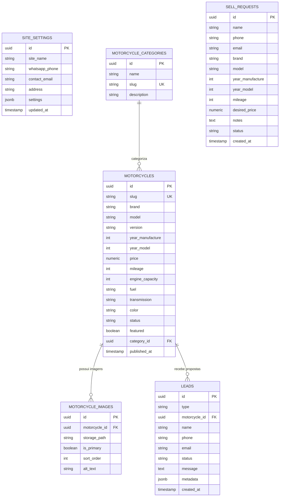

# Data Model: AF Motos — Evolução da Experiência Pública

**Feature**: `006-public-experience-evolution`
**Date**: 2026-08-22

---

## 1. Mapeamento de Entidades e Tabelas Supabase



---

## 2. Detalhamento de Entidades e Validações

### 2.1 `site_settings`
Configuração institucional única da AF Motos.

| Campo | Tipo | Descrição / Restrições | Fallback se Vazio |
| :--- | :--- | :--- | :--- |
| `id` | `uuid` | Chave primária | Auto-gerado |
| `site_name` | `string` | Nome da loja na interface | `"AF Motos"` |
| `whatsapp_phone` | `string` | Número oficial para links de WhatsApp | `"5511999999999"` |
| `contact_email` | `string` | E-mail para contato público | `"contato@afmotos.com.br"` |
| `address` | `string` | Endereço físico ou cidade de atendimento | `"Atendimento local pelo WhatsApp"` |
| `settings` | `jsonb` | Metadados extras (slogan, horários, hero) | `{}` |

### 2.2 `motorcycles`
Catálogo de motocicletas para visualização pública e filtros.

| Campo | Tipo | Descrição Pública / Validação |
| :--- | :--- | :--- |
| `id` | `uuid` | Identificador interno |
| `slug` | `string` | URL amigável (`/motos/[slug]`) |
| `brand` | `string` | Marca (ex.: "Honda", "Yamaha") |
| `model` | `string` | Modelo (ex.: "CB 500F", "MT-07") |
| `version` | `string?` | Versão/Edição (ex.: "ABS", "Special Edition") |
| `year_manufacture`| `int` | Ano de fabricação |
| `year_model` | `int` | Ano modelo (usado no filtro) |
| `price` | `numeric?` | Preço em Reais (`R$`). Oculto se nulo ("Consulte") |
| `mileage` | `int?` | Quilometragem atual |
| `engine_capacity` | `int?` | Cilindrada (`cc`) |
| `status` | `enum` | `'AVAILABLE'` \| `'RESERVED'` \| `'SOLD'` \| `'RENTED'` \| `'MAINTENANCE'` \| `'UNAVAILABLE'` \| `'HIDDEN'` |
| `featured` | `boolean` | Flag de destaque para vitrine da Home |

### 2.3 `leads` (Solicitações de Compra, Venda e Aluguel Personalizado)
Armazena os contatos comerciais de clientes gerados nos formulários públicos.

| Campo | Tipo | Regras de Negócio |
| :--- | :--- | :--- |
| `type` | `string` | `'MOTORCYCLE_INTEREST'` \| `'SELL_MOTORCYCLE'` \| `'CONSIGNMENT'` \| `'RENTAL'` \| `'GENERAL_CONTACT'` |
| `name` | `string` | Nome completo do solicitante (obrigatório, min 2 caracteres) |
| `phone` | `string` | WhatsApp do cliente com DDD (obrigatório, min 10 dígitos) |
| `email` | `string?` | E-mail de contato opcional |
| `message` | `text?` | Observações ou mensagem livre |
| `metadata` | `jsonb` | Dados específicos (ex.: `{ duration: '6 meses', start_date: '2026-09-01', custom_plan: true }`) |
| `status` | `string` | `'NEW'` (padrão) \| `'CONTACTED'` \| `'NEGOTIATING'` \| `'COMPLETED'` \| `'ARCHIVED'` |

---

## 3. Estados e Transições de Status

### Tradução Centralizada de Status (`lib/utils/translations.ts`)
```ts
export const MOTORCYCLE_STATUS_LABELS: Record<string, string> = {
  AVAILABLE: 'Disponível',
  RESERVED: 'Reservada',
  SOLD: 'Vendida',
  RENTED: 'Alugada',
  MAINTENANCE: 'Em revisão',
  UNAVAILABLE: 'Indisponível',
  HIDDEN: 'Oculta',
};

export const OPERATION_TYPE_LABELS: Record<string, string> = {
  SALE: 'Venda',
  RENTAL: 'Aluguel',
  SALE_AND_RENTAL: 'Venda e Aluguel',
};
```

---

## 4. Políticas de RLS (Row Level Security)

- **`site_settings`**: `SELECT` público habilitado para leitura anônima; `INSERT/UPDATE` restrito a administradores autenticados.
- **`motorcycles`**: `SELECT` público para registros com `status != 'HIDDEN'`; escrita restrita a administradores.
- **`motorcycle_images`**: `SELECT` público; escrita restrita a administradores.
- **`leads`**: `INSERT` público habilitado para envio anônimo de formulários; `SELECT/UPDATE` restrito a administradores.
- **`sell_requests`**: `INSERT` público habilitado para envio de motos de terceiros; `SELECT/UPDATE` restrito a administradores.
