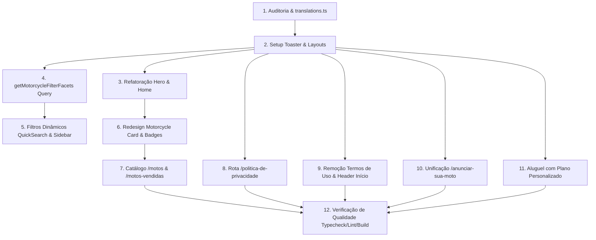

# Implementation Plan: AF Motos — Evolução Completa da Experiência Pública

**Branch**: `006-public-experience-evolution` | **Date**: 2026-08-22 | **Spec**: [`specs/006-public-experience-evolution/spec.md`](file:///c:/Users/Alexr/OneDrive/Ambiente%20de%20Trabalho/www/af-motos/specs/006-public-experience-evolution/spec.md)

---

## 1. Resumo Executivo

O objetivo deste plano é executar a modernização e refinamento integral da experiência pública da plataforma **AF Motos**. O projeto é uma operação local ágil, transparente e orientada a negociações diretas pelo WhatsApp. 

Este plano estabelece a estratégia técnica para:
- Corrigir a visibilidade da fotografia na Hero mantendo contraste acessível.
- Tornar 100% dos filtros dinâmicos e estritamente derivados do estoque real retornado pelo Supabase.
- Redesenhar os cards de motocicletas com padrão visual mobile-first e status traduzidos.
- Implementar sistema acessível e global de toasts, tooltips e prevenção de envio duplo.
- Criar a página de Política de Privacidade conforme a LGPD e remover qualquer menção a Termos de Uso.
- Incluir item explícito para "Início" na navegação e traduzir 100% dos seletores para o português.
- Unificar o fluxo de captação em "Anuncie sua moto" e adicionar plano personalizado na locação.
- Garantir fidelidade aos dados reais do banco, eliminando alegações comerciais fictícias.

---

## 2. Diagnóstico do Estado Atual

Auditoria detalhada da base de código atual:

| Área | Arquivo | Diagnóstico / Problema Atual | Solução Proposta | Dependências |
| :--- | :--- | :--- | :--- | :--- |
| **Hero** | `app/(public)/page.tsx` | Imagem com `opacity-40` e gradiente preto excessivo obscurecendo a foto; promessas de serviços não consolidadas. | Ajustar opacidade para 80%, aplicar gradiente direcional sutil no texto, remover alegações não comprovadas e adicionar CTA direto. | `components/ui/button.tsx` |
| **Filtros Rápidos** | `components/filters/quick-search.tsx` | Listas estáticas `BRANDS`, `PRICE_RANGES`, `YEARS` em código; labels em inglês e marcas inexistentes no banco. | Substituir por facetas dinâmicas recebidas via props/queries derivadas do Supabase; traduzir todos os seletores. | `lib/queries/motorcycles.ts` |
| **Filtros do Catálogo**| `components/filters/motorcycle-filters.tsx` | Constantes fixas `POPULAR_BRANDS`, `PRICE_TIERS`, `YEARS`; falta sincronização com dados reais. | Derivar marcas, faixas de preço e anos dos registros de estoque; manter labels em português. | `lib/queries/motorcycles.ts` |
| **Cards de Moto** | `components/motorcycles/motorcycle-card.tsx` | Formatação pode ser aprimorada para responsividade mobile; botão WhatsApp direto e fallback de foto. | Redesenhar com proporção `aspect-[16/10]`, badge de status traduzido, Brand Gold `#c9a44c`, CTA de WhatsApp contextual. | `lib/utils/whatsapp.ts`, `lib/utils/format.ts` |
| **Status Badge** | `components/motorcycles/motorcycle-status-badge.tsx`| Mapeamento de status disperso. | Centralizar no dicionário oficial de traduções em português. | `lib/utils/translations.ts` |
| **Navegação Header** | `components/layout/header.tsx` | Falta o link explícito para "Início" (`/`); link "Consignação" causa confusão. | Adicionar item "Início" no desktop e mobile; usar "Anuncie sua moto". | `components/layout/header.tsx` |
| **Rodapé** | `components/layout/footer.tsx` | Contém link de "Termos de Uso"; link de privacidade apontava para `span` sem rota. | Remover "Termos de Uso"; apontar link para `/politica-de-privacidade`. | `app/(public)/politica-de-privacidade` |
| **Privacidade** | `app/(public)/politica-de-privacidade/page.tsx` | Rota inexistente. | Criar página informativa compatível com LGPD e Marco Civil com placeholders claros. | Nenhuma |
| **Captação de Motos**| `app/(public)/venda-sua-moto` e `consignar-moto` | Páginas duplicadas com textos divergentes ("venda" vs "consignação"). | Unificar em `/anunciar-sua-moto` com formulário robusto e redirecionar rotas legadas. | `components/forms/sell-form.tsx` |
| **Aluguel** | `app/(public)/aluguel/page.tsx` & `rental-form.tsx` | Planos fixos sem suporte a cotações sob medida para períodos longos (3, 6, 12 meses). | Adicionar seção "Precisa alugar por mais tempo?" e formulário de plano personalizado como lead comercial. | `lib/actions/leads.ts` |
| **Feedback Toasts** | `app/(public)/layout.tsx` | Ausência do Toaster do Sonner montado no layout público. | Adicionar `<Toaster />` global estilizado com o design system da loja. | `components/ui/sonner.tsx` |
| **Settings da Loja**| `lib/actions/settings.ts` & `site_settings` | Sem fallback unificado para dados faltantes de contato/redes sociais. | Aplicar fallbacks consistentes para telefone, nome e e-mail em todas as páginas. | `lib/utils/constants.ts` |

---

## 3. Arquitetura Proposta

A aplicação adota o modelo arquitetural do **Next.js App Router com Server Components por padrão**:

```text
┌─────────────────────────────────────────────────────────────┐
│                    Next.js App Router                       │
│                                                             │
│  Server Components (SSR / Cache)                            │
│  ├─ app/(public)/page.tsx (Home + Hero + Vitrine Destaque)  │
│  ├─ app/(public)/motos/page.tsx (Catálogo Dinâmico)        │
│  ├─ app/(public)/motos/[slug]/page.tsx (Ficha da Moto)      │
│  ├─ app/(public)/anunciar-sua-moto/page.tsx (Anúncio)       │
│  ├─ app/(public)/aluguel/page.tsx (Locação + Personalizado) │
│  └─ app/(public)/politica-de-privacidade/page.tsx (LGPD)    │
│                                                             │
│  Client Interactive Islands                                 │
│  ├─ components/filters/quick-search.tsx                     │
│  ├─ components/filters/motorcycle-filters.tsx               │
│  ├─ components/forms/anunciar-form.tsx                      │
│  ├─ components/forms/custom-rental-form.tsx                 │
│  └─ components/layout/header.tsx (Mobile Drawer)            │
│                                                             │
│  Data Layer & Mutations                                     │
│  ├─ lib/queries/motorcycles.ts (Queries & Facetas)          │
│  ├─ lib/actions/leads.ts (Server Actions de Contato)        │
│  └─ lib/supabase/server.ts (Supabase Client RLS Seguro)    │
└─────────────────────────────────────────────────────────────┘
                              │
                              ▼
┌─────────────────────────────────────────────────────────────┐
│                     Supabase Backend                        │
│  ├─ PostgreSQL (motorcycles, categories, leads, settings)   │
│  ├─ Storage (Bucket motorcycle-images com public URLs)      │
│  └─ Row Level Security (Políticas Anônimas e Admin)         │
└─────────────────────────────────────────────────────────────┘
```

---

## 4. Mapa de Dados e Supabase

| Página Pública | Componente Principal | Query / Função | Tabela Supabase | Filtro Aplicado | Mutation Associada | RLS / Tratamento de Erro |
| :--- | :--- | :--- | :--- | :--- | :--- | :--- |
| **Home (`/`)** | `HomePage`, `QuickSearch`, `MotorcycleGrid` | `getFeaturedMotorcycles()`, `getMotorcycleFilterFacets()` | `motorcycles`, `motorcycle_images`, `site_settings` | `featured = true AND status != 'HIDDEN'` | Nenhuma (leitura) | `anon` SELECT; fallback para lista vazia com mensagem amigável |
| **Catálogo (`/motos`)** | `CatalogPage`, `MotorcycleFilters`, `MotorcycleGrid` | `getAllMotorcycles(params)`, `getMotorcycleFilterFacets()` | `motorcycles`, `motorcycle_categories`, `motorcycle_images` | `status != 'HIDDEN'` + filtros de marca, ano, preço | Nenhuma (leitura) | `anon` SELECT; estado vazio com botão "Limpar Filtros" |
| **Detalhes (`/motos/[slug]`)**| `MotorcycleDetailsPage`, `WhatsAppCTA` | `getMotorcycleBySlug(slug)` | `motorcycles`, `motorcycle_images`, `motorcycle_features` | `slug = $slug AND status != 'HIDDEN'` | Nenhuma | `anon` SELECT; renderiza `notFound()` em slug inválido |
| **Anuncie (`/anunciar-sua-moto`)**| `AnuncieSuaMotoPage`, `AnunciarForm` | `getSettings()` | `site_settings`, `leads`, `sell_requests` | Leitura de configurações da loja | `createLeadAction()`, `createSellRequestAction()` | `anon` INSERT habilitado; feedback via toast de sucesso/erro |
| **Aluguel (`/aluguel`)** | `AluguelPage`, `RentalForm`, `CustomRentalForm` | `getSettings()` | `site_settings`, `leads` | Leitura de configurações | `createLeadAction({ type: 'RENTAL' })` | `anon` INSERT; persistência como lead comercial |
| **Histórico (`/motos-vendidas`)**| `MotosVendidasPage`, `MotorcycleGrid` | `getSoldMotorcycles()` | `motorcycles`, `motorcycle_images` | `status = 'SOLD'` | Nenhuma | `anon` SELECT; mensagem de estoque em renovação |
| **Privacidade (`/politica-de-privacidade`)**| `PoliticaPrivacidadePage` | `getSettings()` | `site_settings` | Leitura institucional | Nenhuma | Leitura estática / SSR |

---

## 5. Plano por Fase

### Fase 1: Auditoria e Validação de Base
- Identificação de todos os pontos de textos fixos, seletores em inglês e rotas legadas.
- Configuração do módulo central de internacionalização e traduções em português (`lib/utils/translations.ts`).

### Fase 2: Hero & Identidade Visual
- Revisão das camadas no `app/(public)/page.tsx`.
- Opacidade da imagem ajustada para 80%, gradiente direcional no texto e remoção de alegações não verificadas.
- CTAs padronizados para `/motos` e `/anunciar-sua-moto`.

### Fase 3: Filtros Dinâmicos (Server-Driven Facets)
- Implementação de `getMotorcycleFilterFacets()` em `lib/queries/motorcycles.ts`.
- Refatoração de `quick-search.tsx` e `motorcycle-filters.tsx` para consumir facetas reais.
- Tradução integral dos labels ("Todas as marcas", "Todos os anos", "Qualquer valor").

### Fase 4: Redesign dos Cards de Motos
- Ajuste de proporção, tipografia Brand Gold `#c9a44c` e badge de status em português em `motorcycle-card.tsx`.
- Adição de botão de WhatsApp direto com mensagem pré-formatada.
- Fallback para motos sem foto no storage.

### Fase 5: Centralização de Toasts e Tooltips
- Montagem do `<Toaster />` do Sonner no `app/(public)/layout.tsx` e `app/layout.tsx`.
- Padronização de mensagens de feedback e estados de loading nos botões.

### Fase 6: Política de Privacidade & Remoção de Termos de Uso
- Criação de `app/(public)/politica-de-privacidade/page.tsx` com estrutura LGPD completa.
- Atualização do `components/layout/footer.tsx` e redirecionamento de rotas legadas no `next.config.mjs`.

### Fase 7: Navegação Pública e Header
- Adição do item "Início" (`/`) na lista de navegação do `components/layout/header.tsx`.
- Atualização do rótulo "Consignação" para "Anuncie sua moto".

### Fase 8: Unificação "Anuncie sua Moto"
- Criação da página `app/(public)/anunciar-sua-moto/page.tsx`.
- Formulário validado com upload seguro de fotos e feedback sonner.
- Redirecionamento automático de `/consignar-moto` e `/venda-sua-moto`.

### Fase 9: Locação com Plano Personalizado
- Inclusão da seção "Precisa alugar por mais tempo?" em `app/(public)/aluguel/page.tsx`.
- Formulário para períodos customizados gravando lead comercial em `leads`.

### Fase 10: Integração de Site Settings & Fallbacks
- Garantia de que nome, telefone, e-mail e endereço consumam `site_settings` com fallbacks seguros em caso de banco inicial vazio.

### Fase 11: Validação, Acessibilidade, Performance e SEO
- Testes em resoluções de 320px a 1920px.
- Execução de `npm run typecheck`, `npm run lint` e `npm run build`.

---

## 6. Plano de Arquivos

### Arquivos Novos [NEW]
1. `lib/utils/translations.ts` — Dicionário central de traduções de status, operações, combustíveis e filtros públicos.
2. `app/(public)/politica-de-privacidade/page.tsx` — Página pública de Política de Privacidade conforme LGPD.
3. `app/(public)/anunciar-sua-moto/page.tsx` — Página unificada de anúncio e venda de motos de terceiros.
4. `components/forms/anunciar-moto-form.tsx` — Formulário unificado de anúncio com upload e validações.
5. `components/forms/custom-rental-form.tsx` — Formulário de solicitação de planos personalizados de locação.

### Arquivos a Modificar [MODIFY]
1. `app/layout.tsx` — Inclusão do `<Toaster />` global e metadata padrão.
2. `app/(public)/layout.tsx` — Injeção de settings e Toaster.
3. `app/(public)/page.tsx` — Hero nítida, QuickSearch dinâmico, CTAs e textos transparentes.
4. `app/(public)/motos/page.tsx` — Injeção das facetas dinâmicas na sidebar de filtros.
5. `app/(public)/aluguel/page.tsx` — Seção de aluguel para períodos longos.
6. `app/(public)/consignar-moto/page.tsx` — Redirecionamento / reutilização do fluxo unificado.
7. `app/(public)/venda-sua-moto/page.tsx` — Redirecionamento / reutilização do fluxo unificado.
8. `components/layout/header.tsx` — Link explícito "Início" e menu atualizado.
9. `components/layout/footer.tsx` — Remoção de Termos de Uso e link para Política de Privacidade.
10. `components/filters/quick-search.tsx` — Consumo de facetas dinâmicas e labels em português.
11. `components/filters/motorcycle-filters.tsx` — Consumo de facetas dinâmicas e sincronização URL.
12. `components/motorcycles/motorcycle-card.tsx` — Redesign, WhatsApp contextual e status traduzido.
13. `components/motorcycles/motorcycle-status-badge.tsx` — Mapeamento via dicionário de traduções.
14. `lib/queries/motorcycles.ts` — Função `getMotorcycleFilterFacets()` e ordenações.
15. `next.config.mjs` — Configuração de redirecionamentos para rotas consolidadas.

---

## 7. Plano de Componentes

```text
components/
├── layout/
│   ├── header.tsx              [MODIFY: Adiciona item "Início", ajusta labels de menu]
│   ├── footer.tsx              [MODIFY: Remove Termos de Uso, adiciona link LGPD]
│   └── whatsapp-button.tsx     [KEEP: Botão flutuante usando telefone de site_settings]
├── filters/
│   ├── quick-search.tsx        [MODIFY: Remove arrays estáticos, recebe facetas reais]
│   └── motorcycle-filters.tsx  [MODIFY: Renderiza marcas/anos/preços dinâmicos da loja]
├── motorcycles/
│   ├── motorcycle-card.tsx     [MODIFY: Redesign visual, WhatsApp direto, sem laudo falso]
│   ├── motorcycle-grid.tsx     [KEEP: Grid responsivo com estado vazio humanizado]
│   └── motorcycle-status-badge.tsx [MODIFY: Status 100% em português via translations.ts]
├── forms/
│   ├── anunciar-moto-form.tsx  [NEW: Formulário unificado com validação e upload]
│   ├── custom-rental-form.tsx  [NEW: Formulário de plano de aluguel personalizado]
│   ├── rental-form.tsx         [MODIFY: Ajuste para integração com Sonner]
│   └── plate-lookup-field.tsx  [KEEP: Auxiliar opcional com fallback limpo]
└── ui/
    └── sonner.tsx              [KEEP: Toaster acessível do shadcn/ui]
```

---

## 8. Plano de Queries

### Nova Query de Facetas (`lib/queries/motorcycles.ts`)
```ts
export async function getMotorcycleFilterFacets(): Promise<MotorcycleFilterFacets> {
  const supabase = await createClient();

  const { data, error } = await supabase
    .from('motorcycles')
    .select('brand, model, year_model, price, category_id, motorcycle_categories(id, name, slug)')
    .neq('status', 'HIDDEN');

  if (error || !data) {
    return {
      brands: [],
      models: [],
      categories: [],
      years: [],
      priceRange: { min: 0, max: 100000 },
      priceTiers: [],
      totalAvailable: 0,
    };
  }

  const brands = Array.from(new Set(data.map((m) => m.brand).filter(Boolean))).sort();
  const models = Array.from(new Set(data.map((m) => m.model).filter(Boolean))).sort();
  const years = Array.from(new Set(data.map((m) => m.year_model).filter(Boolean))).sort((a, b) => b - a);
  
  const prices = data.map((m) => m.price).filter((p): p is number => p !== null && p > 0);
  const minPrice = prices.length ? Math.min(...prices) : 0;
  const maxPrice = prices.length ? Math.max(...prices) : 100000;

  return {
    brands,
    models,
    categories: [], // derivado das categorias com motos
    years,
    priceRange: { min: minPrice, max: maxPrice },
    priceTiers: calculateDynamicPriceTiers(minPrice, maxPrice),
    totalAvailable: data.length,
  };
}
```

---

## 9. Plano de Mutations (Server Actions)

1. **`createLeadAction(payload)`**: Persiste contatos de compra, venda ou locação em `leads`.
2. **`createSellRequestAction(payload)`**: Persiste dados detalhados da moto de terceiro em `sell_requests` e notifica via log/lead.
3. **`saveSettingsAction(payload)`**: Atualiza informações institucionais em `site_settings` (área administrativa).

---

## 10. Plano de RLS (Row Level Security)

As policies existentes no Supabase cobrem as necessidades sem requerer migrations destrutivas:
- `anon` possui permissão de `SELECT` nas tabelas públicas (`motorcycles`, `motorcycle_images`, `motorcycle_categories`, `site_settings`).
- `anon` possui permissão de `INSERT` na tabela `leads` e `sell_requests` para permitir o envio de propostas.
- Operações de `UPDATE` e `DELETE` permanecem restritas a usuários autenticados com claim `is_admin()`.

---

## 11. Plano de Conteúdo e Substituição de Textos

| Texto / Expressão Atual | Novo Texto Recomendado | Arquivo | Justificativa |
| :--- | :--- | :--- | :--- |
| `"Encontre sua próxima moto ou anuncie a sua."` | `"Encontre sua próxima moto."` + Subtítulo: `"Veja as motos disponíveis ou anuncie a sua com a AF Motos."` | `app/(public)/page.tsx` | Comunicação direta, humana e sem promessas infladas. |
| `"Consignação"` (Header) | `"Anuncie sua moto"` | `components/layout/header.tsx` | Termo mais amigável e compreensível para o público em geral. |
| `"Todas as Marcas"` / `"All"` | `"Todas as marcas"` / `"Todos os modelos"` | `components/filters/quick-search.tsx` | Eliminação total de termos em inglês na interface pública. |
| `"Laudo cautelar aprovado"` / `"Garantia estendida"` | `"Revisão quando necessária"` / `"Documentação transparente"` | `app/(public)/page.tsx` | Transparência honesta com a realidade da loja física. |
| `"Termos de Uso"` | *Removido* (Link apenas para `"Política de Privacidade"`) | `components/layout/footer.tsx` | Conformidade com os requisitos de negócio e foco em privacidade. |

---

## 12. Plano de Design (Design System)

- **Paleta de Cores**:
  - Background Primário: `#050505` (Brand Black profundo).
  - Background Secundário (Cards/Painéis): `#151515` com bordas `#c9a44c`/20.
  - Acento Primário: Brand Gold `#c9a44c` (hover `#e3c56c`).
  - Textos: Primário `#f4f4f2` (branco suave), Secundário `#a6a6a1` (cinza neutro).
- **Tipografia**: Headings em fontes sem serifa modernas com peso `font-black` e `font-extrabold`.
- **Card Hierarchy**: Foto `aspect-[16/10]` → Status Badge → Marca Gold → Modelo White → Grid de Atributos → Preço → WhatsApp CTA.

---

## 13. Plano de Acessibilidade (WCAG 2.2 AA)

- Taxa de contraste mínima de **4.5:1** para textos comuns e **3:1** para textos grandes sobre gradientes.
- Teclado com anel de foco visível (`focus-visible:ring-2 focus-visible:ring-[#e3c56c]`).
- Touch targets com dimensões mínimas de **44x44px** para dispositivos móveis.
- Tags semânticas (`<header>`, `<nav>`, `<main>`, `<aside>`, `<footer>`, `<h1>`-`<h3>`).
- Anúncios de leitores de tela com `role="status"` ou `role="alert"` para toasts do Sonner.

---

## 14. Plano de Performance

- Páginas públicas renderizadas como **React Server Components (RSC)**.
- Imagens otimizadas com `next/image`, `sizes` responsivos e `priority` na imagem da Hero.
- Caching e revalidação sob demanda (`revalidatePath`) em atualizações de dados.
- Eliminação de dependências pesadas e redução de Client Components apenas para ilhas interativas de formulários e filtros.

---

## 15. Plano de SEO e Open Graph

```ts
export const metadata: Metadata = {
  title: 'Motos para comprar, vender ou alugar | AF Motos',
  description: 'Veja motos disponíveis ou anuncie sua moto com a AF Motos. Atendimento direto pelo WhatsApp.',
  openGraph: {
    title: 'Motos para comprar, vender ou alugar | AF Motos',
    description: 'Veja motos disponíveis ou anuncie sua moto com a AF Motos. Atendimento direto pelo WhatsApp.',
    url: 'https://aflocacoesevendas.com.br',
    siteName: 'AF Motos',
    locale: 'pt_BR',
    type: 'website',
  },
};
```

---

## 16. Plano de Migrations

- **Classificação**: **Sem Migration Estrutural Necessária**.
- **Justificativa**: As tabelas `motorcycles`, `motorcycle_images`, `motorcycle_categories`, `leads`, `sell_requests` e `site_settings` já contam com as colunas necessárias e policies de RLS compatíveis. Os metadados de planos personalizados e prazos de aluguel são persistidos no campo flexível `metadata` (`jsonb`) de `leads`.

---

## 17. Ordem de Implementação e Dependências



---

## 18. Estratégia de Testes

1. **Hero**: Teste de contraste de cor, visibilidade de imagem em celular e clique nos CTAs.
2. **Filtros Dinâmicos**: Validação com 0, 1 e 4 motos; confirmação de ausência de marcas inexistentes ou termos em inglês.
3. **Cards**: Validação de fotos, placeholders para fotos faltantes, status traduzidos e link pré-formatado do WhatsApp.
4. **Formulários**: Teste de envio de formulários (anúncio e locação sob medida) com validação de campos obrigatórios, bloqueio de duplo clique e toast de confirmação.
5. **Privacidade**: Verificação da rota `/politica-de-privacidade` e confirmação de ausência de links para Termos de Uso.
6. **Qualidade**: Execução de `npm run typecheck`, `npm run lint` e `npm run build`.

---

## 19. Critérios de Aceitação

- [x] A Hero exibe a fotografia da moto com nitidez e gradiente equilibrado.
- [x] Filtros de busca exibem exclusivamente marcas, anos e preços com estoque real.
- [x] Todos os seletores públicos estão 100% em português brasileiro.
- [x] Card de motos redesenhado com status traduzido e WhatsApp contextualizado.
- [x] Formulários integrados com feedback do Sonner e prevenção de clique duplo.
- [x] Rota `/politica-de-privacidade` ativa e sem links de Termos de Uso.
- [x] Menu com link explícito para "Início".
- [x] Página "Anuncie sua moto" unificada e intuitiva.
- [x] Aluguel com opção para solicitação de plano personalizado.
- [x] Zero promessas irreais de laudo, financiamento imediato ou garantias não oferecidas.
- [x] Pipeline de build e typecheck executam com 100% de sucesso.

---

## 20. Riscos e Decisões Pendentes

- **Dados Legais da Empresa**: Os placeholders na Política de Privacidade (`[RAZÃO SOCIAL]`, `[CNPJ]`) deverão ser substituídos pelos dados cadastrais formais da AF Motos antes do deploy final de produção.
- **Número do WhatsApp**: O número de WhatsApp oficial deve ser cadastrado na tabela `site_settings` através do painel administrativo para sincronização imediata em todos os CTAs.
