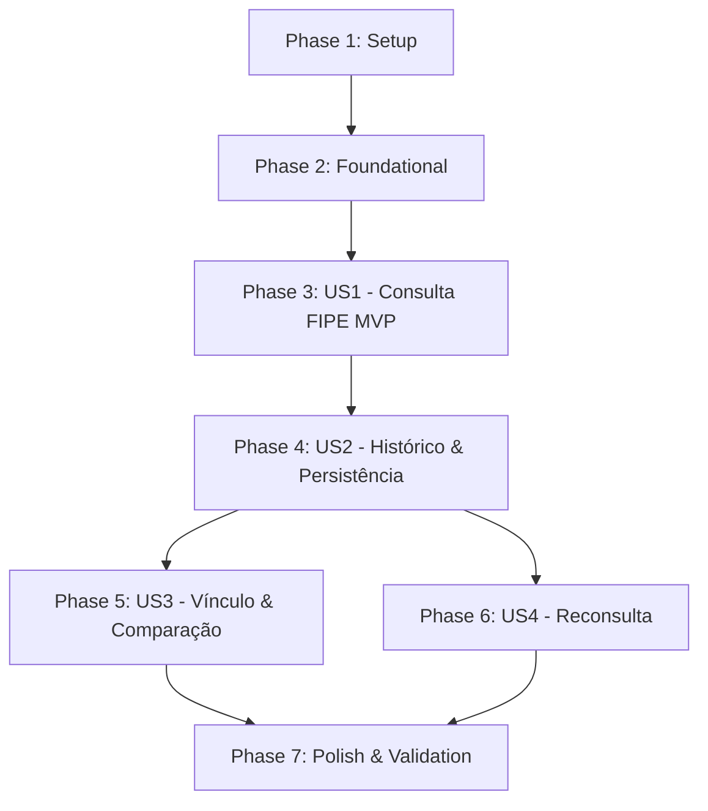

# Tasks: Consulta Tabela FIPE no Painel Administrativo

**Feature**: `007-fipe-consultation`  
**Input**: Design documents from `specs/007-fipe-consultation/` (`plan.md`, `spec.md`, `data-model.md`, `contracts/`, `research.md`, `quickstart.md`)

---

## Phase 1: Setup (Shared Infrastructure)

**Purpose**: Estrutura base de diretórios e contratos da feature

- [X] T001 [P] Criar diretórios da feature em `lib/fipex/`, `lib/domain/`, `components/admin/fipe/` e `app/admin/(protected)/fipe/`
- [X] T002 [P] Definir tipos TypeScript da API fipeX e tipos normalizados de domínio em `lib/fipex/types.ts`
- [X] T003 [P] Criar schemas Zod de validação runtime para respostas da API fipeX em `lib/fipex/schemas.ts`

---

## Phase 2: Foundational (Blocking Prerequisites)

**Purpose**: Camada base de integração externa, erros, cache e persistência que bloqueia as histórias de usuário

**⚠️ CRITICAL**: Nenhuma história de usuário pode ser finalizada sem a camada foundational

- [X] T004 Criar migration SQL com tabela `fipe_consultations`, constraints, índices, trigger `updated_at` e policies RLS em `supabase/migrations/00022_create_fipe_consultations.sql`
- [X] T005 [P] Atualizar definições de tipos do banco no arquivo `types/database.ts` para incluir a tabela `fipe_consultations`
- [X] T006 [P] Implementar classes de erro customizadas e dicionário de mensagens amigáveis em `lib/fipex/errors.ts`
- [X] T007 [P] Implementar mecanismo de cache em memória com TTL configurável por chave em `lib/fipex/cache.ts`
- [X] T008 Implementar cliente HTTP com timeout de 10s, retry para 5xx/429 e cancelamento via AbortController em `lib/fipex/client.ts`
- [X] T009 [P] Implementar mappers para transformar payloads raw da fipeX em entidades normalizadas de domínio em `lib/fipex/mappers.ts`
- [X] T010 [P] Implementar função pura `calculatePriceDifference` e formatadores de moeda/referência em `lib/domain/fipe-price.ts`

**Checkpoint**: Camada foundational pronta — tipos, cliente HTTP, mappers e persistência disponíveis.

---

## Phase 3: User Story 1 - Consultar valor de referência de uma motocicleta (Priority: P1) 🎯 MVP

**Goal**: O administrador pesquisa uma moto através de formulário progressivo (Tipo → Marca → Modelo → Ano → Combustível) e visualiza o card com o valor de referência FIPE e dados técnicos.

**Independent Test**: Acessar `/admin/fipe`, preencher os 5 campos dependentes em cascata, submeter a consulta e validar a exibição do card de resultado com valor em BRL, código FIPE, período de referência e avisos obrigatórios.

### Implementation for User Story 1

- [X] T011 [P] [US1] Criar componente de avisos de referência e fonte fipeX em `components/admin/fipe/fipe-source-notice.tsx`
- [X] T012 [P] [US1] Criar componente de exibição de resultado da consulta com dados técnicos e valor formatado em `components/admin/fipe/fipe-result-card.tsx`
- [X] T013 [US1] Criar formulário de busca progressivo com selects encadeados, loading states e reset de campos dependentes em `components/admin/fipe/fipe-search-form.tsx`
- [X] T014 [US1] Criar container client-side da página de consulta orquestrando estado do formulário e resultado em `components/admin/fipe/fipe-page-client.tsx`
- [X] T015 [US1] Criar página administrativa com metadata `robots: { index: false }` e breadcrumbs em `app/admin/(protected)/fipe/page.tsx`
- [X] T016 [US1] Adicionar item de navegação "Tabela FIPE" com ícone coerente na barra lateral em `components/admin/admin-sidebar.tsx`
- [X] T017 [US1] Adicionar tratamento visual para estados de erro de rede, timeout e veículo não encontrado no formulário e resultado em `components/admin/fipe/fipe-search-form.tsx`

**Checkpoint**: User Story 1 funcional de ponta a ponta (MVP concluído: pesquisa e visualização).

---

## Phase 4: User Story 2 - Salvar e consultar histórico de consultas (Priority: P2)

**Goal**: O administrador pode salvar qualquer consulta realizada no banco de dados, visualizar a listagem histórica ordenada por data decrescente e reabrir consultas anteriores.

**Independent Test**: Executar uma consulta, clicar em "Salvar consulta", verificar a inclusão do registro no histórico, recarregar a tela e abrir a consulta salva para visualização completa dos dados originais.

### Implementation for User Story 2

- [X] T018 [P] [US2] Criar validação de schema Zod para persistência e edição de notas de consultas em `lib/validations/fipe-consultation.ts`
- [X] T019 [US2] Implementar queries de leitura do histórico no Supabase (`getFipeConsultations`, `getFipeConsultationById`) em `lib/queries/fipe-consultations.ts`
- [X] T020 [US2] Implementar Server Actions (`saveFipeConsultation`, `updateFipeConsultationNotes`, `deleteFipeConsultation`) com validação de admin e `created_by = auth.uid()` em `lib/actions/fipe-consultations.ts`
- [X] T021 [US2] Criar componente de histórico com tabela para desktop, cards para mobile e modal/drawer de detalhes em `components/admin/fipe/fipe-history-section.tsx`
- [X] T022 [US2] Integrar ação de salvar consulta no card de resultado com feedback de loading e toast de sucesso em `components/admin/fipe/fipe-result-card.tsx`
- [X] T023 [US2] Integrar seção de histórico ao fluxo principal da página permitindo recarregar dados e abrir snapshots salvos em `components/admin/fipe/fipe-page-client.tsx`

**Checkpoint**: Histórico completo com persistência, auditoria de snapshot e reabertura de consultas.

---

## Phase 5: User Story 3 - Vincular consulta a uma motocicleta cadastrada (Priority: P3)

**Goal**: O administrador vincula uma consulta FIPE a uma motocicleta do inventário (`public.motorcycles`) e visualiza a comparação de preços (preço anunciado vs. valor FIPE) sem alteração automática de preços.

**Independent Test**: Com um resultado aberto, selecionar uma moto do inventário, confirmar o vínculo e verificar a exibição da comparação com valor anunciado, valor FIPE e diferença calculada (R$ e %).

### Implementation for User Story 3

- [X] T024 [P] [US3] Criar query para listar motocicletas ativas para vinculação no painel FIPE em `lib/queries/motorcycles.ts`
- [X] T025 [P] [US3] Implementar Server Action `linkFipeConsultationToMotorcycle` para associar consulta à moto em `lib/actions/fipe-consultations.ts`
- [X] T026 [P] [US3] Criar componente comparador de preços exibindo valor anunciado, valor FIPE e diferença percentual/absoluta em `components/admin/fipe/fipe-price-comparison.tsx`
- [X] T027 [US3] Criar componente modal/seletor de motocicleta para vincular consulta em `components/admin/fipe/fipe-motorcycle-linker.tsx`
- [X] T028 [US3] Integrar fluxo de vinculação e exibição de comparação de preço ao card de resultado e ao histórico em `components/admin/fipe/fipe-page-client.tsx`

**Checkpoint**: Vinculação a motos do estoque funcional com comparativo claro de margem e segurança contra alterações automáticas de preço.

---

## Phase 6: User Story 4 - Reconsultar dados atualizados (Priority: P4)

**Goal**: O administrador pode disparar uma nova consulta a partir de um registro antigo do histórico para obter a referência mais recente de mercado.

**Independent Test**: Clicar na ação "Consultar novamente" de um item do histórico, verificar o preenchimento automático dos parâmetros no formulário, a execução da nova chamada à API e a exibição do novo valor.

### Implementation for User Story 4

- [X] T029 [US4] Implementar função para repovoar o formulário a partir do `query_payload` de uma consulta histórica em `components/admin/fipe/fipe-search-form.tsx`
- [X] T030 [US4] Adicionar ação "Consultar novamente" nas linhas da tabela e nos cards do histórico em `components/admin/fipe/fipe-history-section.tsx`
- [X] T031 [US4] Conectar o evento de reconsulta do histórico com a trigger de execução imediata no formulário em `components/admin/fipe/fipe-page-client.tsx`

**Checkpoint**: Ciclo completo de atualização de dados históricos e novas cotações.

---

## Phase 7: Polish & Cross-Cutting Concerns

**Purpose**: Validação de acessibilidade, responsividade, segurança e integridade de build

- [X] T032 [P] Validar acessibilidade (labels pt-BR, contraste, navegação por teclado e aria-live nos loadings) em `components/admin/fipe/*`
- [X] T033 [P] Validar layout responsivo em mobile (320px+), tablet e desktop widescreen em `app/admin/(protected)/fipe/page.tsx` e componentes filhos
- [X] T034 Executar cenários de validação descritos no guia de teste em `specs/007-fipe-consultation/quickstart.md`
- [X] T035 Executar validação estática de tipagem e linting via `npm run lint` e checagem TypeScript
- [X] T036 Validar build de produção via `npm run build` garantindo zero erros de compilação

---

## Dependencies & Execution Order

### Story Dependencies

- **US1 (P1)**: Depende apenas da Phase 2 (Foundational). Representa o MVP.
- **US2 (P2)**: Depende de US1 (para salvar a consulta ativa) e da tabela criada na Phase 2.
- **US3 (P3)**: Depende de US1 e US2 para vincular uma consulta persistida ou recém-criada a uma moto.
- **US4 (P4)**: Depende de US2 para ler os parâmetros do histórico e de US1 para executar a nova consulta.

### Parallel Opportunities

- **Phase 1**: T001, T002, T003 podem ser executadas em paralelo.
- **Phase 2**: T005, T006, T007, T009, T010 podem ser implementadas em paralelo após T004.
- **Phase 3 (US1)**: T011 e T012 podem ser desenvolvidas em paralelo com T013.
- **Phase 4 (US2)**: T018 pode ser criada em paralelo com T019 e T020.
- **Phase 5 (US3)**: T024, T025 e T026 podem ser desenvolvidas em paralelo.
- **Phase 7**: T032 e T033 podem ser executadas em paralelo.

---

## Implementation Strategy

### 1. MVP First (Phase 1 + 2 + 3)
Entregar primeiro o formulário progressivo com integração direta à API fipeX e visualização imediata do valor de referência.

### 2. Incremental Delivery
- **Incremento 1**: Consulta FIPE ao vivo (`/admin/fipe`)
- **Incremento 2**: Persistência e histórico no banco (`public.fipe_consultations`)
- **Incremento 3**: Vinculação com o estoque e comparativo de preços
- **Incremento 4**: Reconsulta e polimento final
