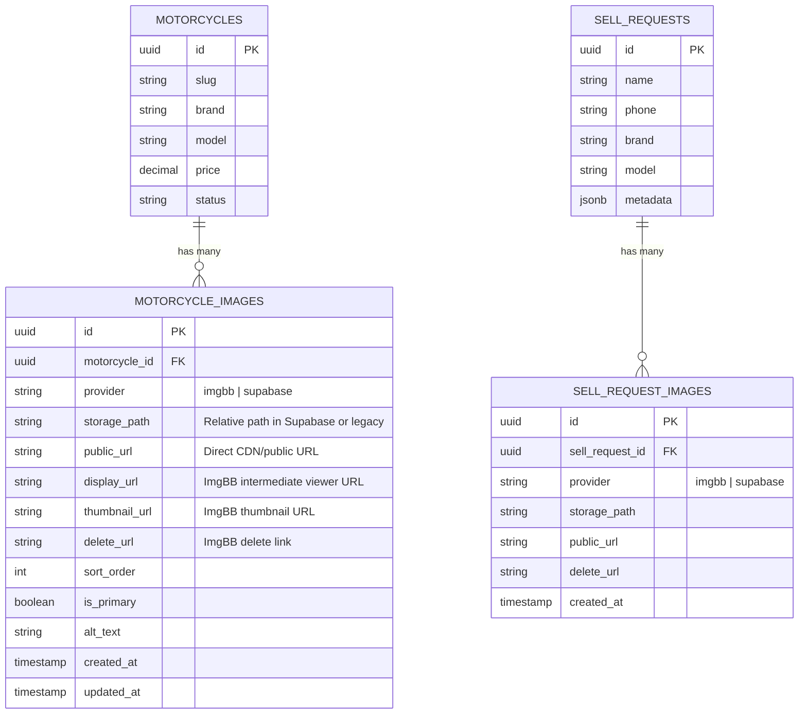

# Data Model & Storage Schema: Migração de Uploads para ImgBB com Fallback Supabase Storage

**Feature**: `008-imgbb-image-upload`  
**Date**: 2026-08-22  
**Status**: Ready

---

## 1. Modelo Relacional & Entidades de Imagens



---

## 2. Estrutura Detalhada dos Campos de `public.motorcycle_images`

| Coluna | Tipo | Nullable | Default | Descrição |
|---|---|---|---|---|
| `id` | `UUID` | NÃO | `gen_random_uuid()` | Identificador único da imagem |
| `motorcycle_id` | `UUID` | NÃO | - | Chave estrangeira para `public.motorcycles(id)` |
| `provider` | `TEXT` | NÃO | `'supabase'` | Provedor de armazenamento: `'imgbb'` ou `'supabase'` |
| `storage_path` | `TEXT` | SIM | `NULL` | Caminho relativo dentro do bucket Supabase (ex: `motorcycles/{id}/{uuid}.jpg`) |
| `public_url` | `TEXT` | SIM | `NULL` | URL pública direta retornada pelo ImgBB ou resolvida pelo Supabase |
| `display_url` | `TEXT` | SIM | `NULL` | URL de visualização da página da foto (ImgBB) |
| `thumbnail_url` | `TEXT` | SIM | `NULL` | URL de miniatura (ImgBB) |
| `delete_url` | `TEXT` | SIM | `NULL` | URL de exclusão administrativa (ImgBB) |
| `sort_order` | `INTEGER` | NÃO | `0` | Ordem de exibição na galeria da moto |
| `is_primary` | `BOOLEAN` | NÃO | `false` | Indica se é a foto de capa principal |
| `alt_text` | `TEXT` | SIM | `NULL` | Texto alternativo para acessibilidade e SEO |
| `created_at` | `TIMESTAMPTZ` | NÃO | `now()` | Data de criação do registro |
| `updated_at` | `TIMESTAMPTZ` | SIM | `now()` | Data de atualização do registro |

---

## 3. Migration SQL Idempotente

**Arquivo**: `supabase/migrations/00024_add_external_image_metadata.sql`

```sql
-- Migration: 00024_add_external_image_metadata.sql
-- Objetivo: Suportar imagens hospedadas no ImgBB com fallback no Supabase Storage

-- 1. motorcycle_images
ALTER TABLE public.motorcycle_images
  ADD COLUMN IF NOT EXISTS provider text NOT NULL DEFAULT 'supabase',
  ADD COLUMN IF NOT EXISTS public_url text,
  ADD COLUMN IF NOT EXISTS display_url text,
  ADD COLUMN IF NOT EXISTS thumbnail_url text,
  ADD COLUMN IF NOT EXISTS delete_url text;

-- Garantir valor default para registros antigos
UPDATE public.motorcycle_images
SET provider = 'supabase'
WHERE provider IS NULL;

-- 2. sell_request_images (se existir)
DO $$
BEGIN
  IF EXISTS (
    SELECT 1 FROM information_schema.tables 
    WHERE table_schema = 'public' AND table_name = 'sell_request_images'
  ) THEN
    ALTER TABLE public.sell_request_images
      ADD COLUMN IF NOT EXISTS provider text NOT NULL DEFAULT 'supabase',
      ADD COLUMN IF NOT EXISTS public_url text,
      ADD COLUMN IF NOT EXISTS delete_url text;
  END IF;
END $$;

-- 3. Índices para performance
CREATE INDEX IF NOT EXISTS idx_motorcycle_images_provider ON public.motorcycle_images(provider);
CREATE INDEX IF NOT EXISTS idx_motorcycle_images_moto_sort ON public.motorcycle_images(motorcycle_id, sort_order);
```

---

## 4. Políticas de RLS (Row Level Security)

- **`public.motorcycle_images`**:
  - `SELECT`: Público (`true`) - todos podem ver imagens ativas.
  - `INSERT`: Administrador autenticado (`auth.role() = 'authenticated' AND is_admin()`).
  - `UPDATE`: Administrador autenticado (`auth.role() = 'authenticated' AND is_admin()`).
  - `DELETE`: Administrador autenticado (`auth.role() = 'authenticated' AND is_admin()`).
- **`public.sell_requests` e `public.leads`**:
  - `INSERT`: Público (`true`) para receber cadastros externos.
  - `SELECT / UPDATE`: Administrador autenticado (`is_admin()`).
