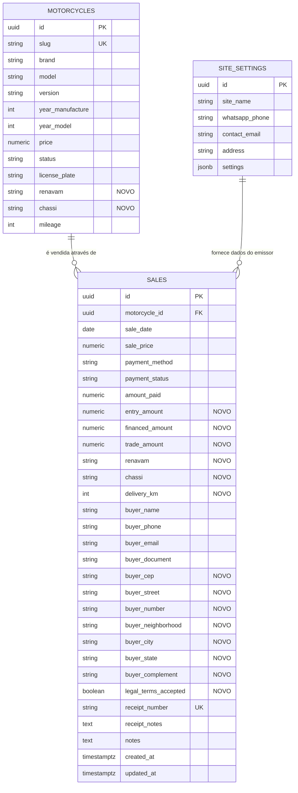

# Data Model: Refatoração de Venda de Veículos, Dados Fiscais/Cadastrais e Recibo Oficial A4

**Feature**: `010-venda-recibo-oficial` | **Date**: 2026-08-23

---

## 1. Diagrama de Entidades

---

## 2. Dicionário de Dados

### Tabela `sales` (Extensões Fiscais e Cadastrais)

| Coluna | Tipo SQL | Nulo? | Descrição / Validação |
|---|---|:---:|---|
| `renavam` | `text` | Sim | 11 dígitos numéricos do veículo no momento da venda |
| `chassi` | `text` | Sim | 17 caracteres alfanuméricos em caixa alta |
| `delivery_km` | `integer` | Sim | Quilometragem registrada no odômetro no ato da entrega |
| `entry_amount` | `numeric(12,2)` | Não (default 0) | Valor pago como entrada em moeda corrente |
| `financed_amount` | `numeric(12,2)` | Não (default 0) | Valor financiado via banco/instituição financeira |
| `trade_amount` | `numeric(12,2)` | Não (default 0) | Valor concedido por veículo/moto na troca |
| `legal_terms_accepted` | `boolean` | Não (default true) | Confirmação de aceite das cláusulas de vistoria e CTB |
| `buyer_cep` | `text` | Sim | CEP formatado (8 ou 9 dígitos com hífen) |
| `buyer_street` | `text` | Sim | Logradouro / Rua / Avenida |
| `buyer_number` | `text` | Sim | Número do endereço ou "S/N" |
| `buyer_complement` | `text` | Sim | Apartamento, bloco, sala ou referência |
| `buyer_neighborhood` | `text` | Sim | Bairro |
| `buyer_city` | `text` | Sim | Cidade / Município |
| `buyer_state` | `text` | Sim | UF (2 caracteres, ex.: "SP") |

### Tabela `motorcycles` (Extensões Fiscais de Estoque)

| Coluna | Tipo SQL | Nulo? | Descrição / Validação |
|---|---|:---:|---|
| `renavam` | `text` | Sim | 11 dígitos numéricos persistidos no cadastro da moto |
| `chassi` | `text` | Sim | 17 caracteres alfanuméricos do chassi da moto |

---

## 3. Regras de Transição de Estado

1. **Conclusão de Venda**:
   - `motorcycles.status` transita de `AVAILABLE` (ou `RESERVED`) para `SOLD`.
   - Se `renavam` ou `chassi` forem informados no formulário de venda e estiverem em branco na moto, a tabela `motorcycles` é atualizada automaticamente para manter o cadastro completo.
   - A venda é registrada com `payment_status` (`PAID` ou `PARTIAL`) e número de recibo gerado no formato `AFM-YYYY-NNNN`.
2. **Reversão / Exclusão de Venda**:
   - Ao deletar o registro de venda, o `motorcycles.status` pode ser revertido opcionalmente para `AVAILABLE`.
