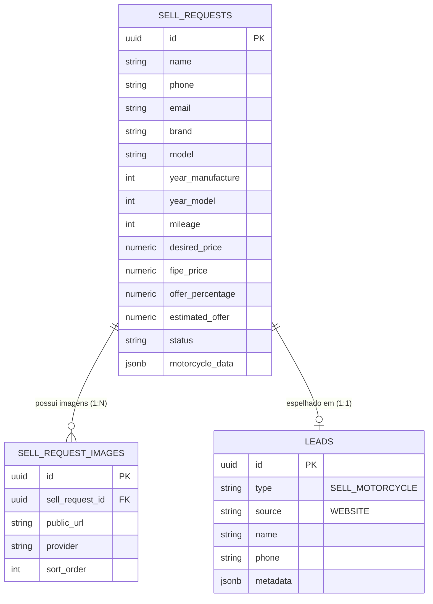

# Data Model: Página "Venda sua Moto para a AF Motos"

**Feature**: `013-venda-sua-moto`  
**Date**: 2026-08-23  
**Status**: Ready

## 1. Entidades do Banco de Dados

### Tabela `public.sell_requests` (Estendida)

Armazena os registros de solicitações de venda de motos enviadas pelo público.

```sql
-- Migration: 20260823000000_add_offer_simulation_to_sell_requests.sql
ALTER TABLE public.sell_requests
  ADD COLUMN IF NOT EXISTS offer_percentage numeric(5, 2),
  ADD COLUMN IF NOT EXISTS estimated_offer numeric(12, 2);

-- Constraint para limitar percentual entre 0 e 100
DO $$
BEGIN
  IF NOT EXISTS (
    SELECT 1 FROM pg_constraint WHERE conname = 'sell_requests_offer_percentage_range'
  ) THEN
    ALTER TABLE public.sell_requests
      ADD CONSTRAINT sell_requests_offer_percentage_range
      CHECK (offer_percentage IS NULL OR (offer_percentage >= 0 AND offer_percentage <= 100));
  END IF;

  IF NOT EXISTS (
    SELECT 1 FROM pg_constraint WHERE conname = 'sell_requests_estimated_offer_nonnegative'
  ) THEN
    ALTER TABLE public.sell_requests
      ADD CONSTRAINT sell_requests_estimated_offer_nonnegative
      CHECK (estimated_offer IS NULL OR estimated_offer >= 0);
  END IF;
END $$;
```

#### Estrutura de Campos Relevantes

| Campo | Tipo | Nulo? | Descrição |
|---|---|:---:|---|
| `id` | UUID | Não | Chave primária gerada por `gen_random_uuid()` |
| `name` | TEXT | Não | Nome completo do proprietário |
| `phone` | TEXT | Não | WhatsApp com DDD (somente dígitos) |
| `email` | TEXT | Sim | E-mail opcional de contato |
| `brand` | TEXT | Não | Marca da moto (ex: Honda, Yamaha) |
| `model` | TEXT | Não | Modelo da moto (ex: CG 160 Fan) |
| `year_manufacture`| INT | Não | Ano de fabricação |
| `year_model` | INT | Não | Ano do modelo |
| `color` | TEXT | Sim | Cor predominante |
| `mileage` | INT | Sim | Quilometragem atual do odômetro |
| `city` | TEXT | Não | Município de Pernambuco |
| `state` | TEXT | Não | Padrão `'PE'` |
| `desired_price` | NUMERIC(12,2) | Sim | Expectativa de valor do proprietário |
| `fipe_code` | TEXT | Sim | Código oficial FIPE (ex: `811166-5`) |
| `fipe_price` | NUMERIC(12,2) | Sim | Valor oficial FIPE no momento da cotação |
| `fipe_reference_period`| TEXT | Sim | Período de referência FIPE (ex: `Agosto de 2026`) |
| `fipe_snapshot` | JSONB | Sim | Snapshot integral sanitizado retornado da consulta |
| `offer_percentage` | NUMERIC(5,2) | Sim | Percentual selecionado na simulação (ex: `90.00`) |
| `estimated_offer` | NUMERIC(12,2) | Sim | Valor estimado calculado no servidor (`fipe_price * offer_percentage / 100`) |
| `notes` | TEXT | Sim | Observações adicionais do cliente |
| `status` | TEXT | Não | Status comercial (Padrão: `'NEW'`) |
| `motorcycle_data` | JSONB | Sim | Metadados complementares e cópia estruturada da simulação |
| `created_at` | TIMESTAMPTZ | Não | Data/hora de submissão |

---

### Tabela `public.sell_request_images`

Armazena as fotos associadas à proposta de compra.

| Campo | Tipo | Nulo? | Descrição |
|---|---|:---:|---|
| `id` | UUID | Não | Chave primária |
| `sell_request_id` | UUID | Não | Foreign Key -> `public.sell_requests(id)` ON DELETE CASCADE |
| `public_url` | TEXT | Não | URL pública segura da imagem (ImgBB / Supabase) |
| `provider` | TEXT | Não | `'imgbb'` ou `'supabase'` |
| `storage_path` | TEXT | Sim | Caminho interno no storage quando aplicável |
| `delete_url` | TEXT | Sim | URL de remoção quando provida pelo ImgBB |
| `sort_order` | INT | Não | Ordem de exibição (0 a 4) |
| `created_at` | TIMESTAMPTZ | Não | Data de inserção |

---

## 2. Tipagens TypeScript

```typescript
// Estrutura de Simulação no JSONB
export interface OfferSimulationData {
  fipe_price: number;
  percentage: number;
  estimated_offer: number;
  currency: 'BRL';
  calculated_at: string;
}

// Payload expandido para Server Action
export interface VendaSuaMotoPayload {
  name: string;
  phone: string;
  email?: string | null;
  brand: string;
  brand_id?: string | null;
  model: string;
  model_id?: string | null;
  year_manufacture: number;
  year_model: number;
  year_id?: string | null;
  fuel_id?: string | null;
  fuel_name?: string | null;
  color?: string | null;
  mileage?: number | null;
  desired_price?: number | null;
  state: 'PE';
  city: string;
  notes?: string | null;
  offer_percentage?: number | null;
  fipe_code?: string | null;
  fipe_price?: number | null;
  fipe_reference_period?: string | null;
  fipe_snapshot?: Record<string, unknown> | null;
  images?: Array<{
    url: string;
    provider?: string;
    storage_path?: string | null;
    delete_url?: string | null;
  }>;
}
```

---

## 3. Diagrama de Relacionamento (Mermaid)


