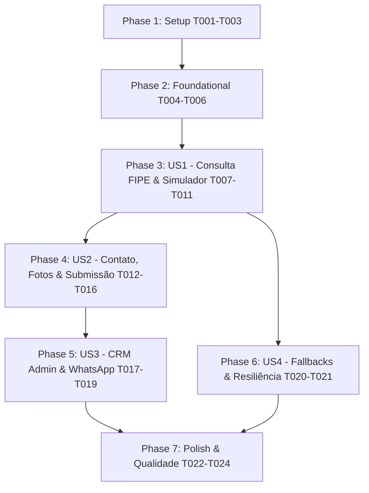

# Tasks: Página "Venda sua Moto para a AF Motos"

**Branch**: `013-venda-sua-moto` | **Date**: 2026-08-23 | **Spec**: [spec.md](./spec.md) | **Plan**: [plan.md](./plan.md)

---

## Phase 1: Setup (Shared Infrastructure)

**Purpose**: Criação da migration de banco de dados, atualização de schemas de validação Zod e tipagens TypeScript compartilhadas.

- [X] T001 Criar migration idempotente para adicionar `offer_percentage` e `estimated_offer` com CHECK constraints em `supabase/migrations/20260823000000_add_offer_simulation_to_sell_requests.sql`
- [X] T002 [P] Atualizar schemas de validação Zod para suportar os campos da simulação FIPE e persistência em `lib/validations/sell-request.ts`
- [X] T003 [P] Atualizar definições de tipos do Supabase Database para refletir as novas colunas em `types/database.ts`

---

## Phase 2: Foundational (Blocking Prerequisites)

**Purpose**: Infraestrutura de backend, Server Actions seguras e ponto de entrada da rota pública.

**⚠️ CRITICAL**: Nenhuma etapa do formulário de usuário pode ser finalizada sem a Server Action estruturada.

- [X] T004 Atualizar `createSellRequestAction` em `lib/actions/leads.ts` com recálculo obrigatório de `estimated_offer` no servidor, status forçado para `NEW`, persistência em `sell_requests`, `sell_request_images` e sincronização com `leads`
- [X] T005 [P] Atualizar o link do card "Venda sua Moto pra Nós" de `/anunciar-sua-moto` para `/venda-sua-moto` em `app/(public)/page.tsx`
- [X] T006 [P] Criar esqueleto da rota pública `app/(public)/venda-sua-moto/page.tsx` com metadata SEO, Hero de compra direta e Trust Bar institucional

**Checkpoint**: Fundação pronta — implementação dos componentes de interface e simulação pode começar.

---

## Phase 3: User Story 1 - Consulta FIPE e Simulação de Proposta de Compra (Priority: P1) 🎯 MVP

**Goal**: Permitir que o proprietário selecione a moto, consulte o valor oficial FIPE e visualize a simulação da estimativa percentual (70% a 100%) em tempo real.

**Independent Test**: Acessar `/venda-sua-moto`, selecionar marca, modelo e ano, verificar valor FIPE retornado, alternar os percentuais da simulação e validar o cálculo dinâmico da estimativa com advertência legal visível.

### Implementation for User Story 1

- [X] T007 [P] [US1] Criar componente visual de progresso e navegação responsiva em `components/forms/venda-moto-form/venda-moto-stepper.tsx`
- [X] T008 [P] [US1] Criar componente de resumo lateral Desktop (Sticky Summary Card) em `components/forms/venda-moto-form/venda-moto-summary-card.tsx`
- [X] T009 [US1] Implementar Etapa 1 (Dados da Moto: Marca, Modelo, Ano Fabricação/Modelo, Km, Cor) com comboboxes FIPE em `components/forms/venda-moto-form/steps/step-1-motorcycle-data.tsx`
- [X] T010 [US1] Implementar Etapa 2 (Consulta FIPE, Simulador de Proposta Percentual 70%-100%, Cálculo em BRL e Expectativa Opcional) em `components/forms/venda-moto-form/steps/step-2-fipe-simulator.tsx`
- [X] T011 [US1] Criar o container do Wizard com React Hook Form e sincronização de estado em `components/forms/venda-moto-form/index.tsx`

**Checkpoint**: User Story 1 funcional — usuário consegue selecionar o veículo e simular a estimativa de compra.

---

## Phase 4: User Story 2 - Cadastro do Proprietário, Envio de Fotos e Submissão da Proposta (Priority: P2)

**Goal**: Permitir o preenchimento dos dados de contato, upload de até 5 fotos reais, revisão final de dados e submissão com tela de sucesso.

**Independent Test**: Preencher dados de contato com município de PE, anexar fotos reais com visualização de miniaturas, revisar dados na etapa 5, submeter a proposta e verificar a tela de sucesso com número de protocolo.

### Implementation for User Story 2

- [X] T012 [P] [US2] Implementar Etapa 3 (Dados do Proprietário: Nome, WhatsApp com DDD, E-mail opcional, Combobox de Cidades de PE e Observações) em `components/forms/venda-moto-form/steps/step-3-owner-contact.tsx`
- [X] T013 [P] [US2] Implementar Etapa 4 (Upload de Fotos: Drag & Drop, limite de 5 fotos, validação de 5MB por arquivo e miniaturas com exclusão) em `components/forms/venda-moto-form/steps/step-4-photos-upload.tsx`
- [X] T014 [US2] Implementar Etapa 5 (Revisão Completa: resumo da moto, FIPE, simulação, contato, galeria e checkbox de consentimento) em `components/forms/venda-moto-form/steps/step-5-review-submit.tsx`
- [X] T015 [P] [US2] Criar componente de tela de confirmação e próximos passos pós-submissão em `components/forms/venda-moto-form/venda-moto-success-view.tsx`
- [X] T016 [US2] Integrar a submissão com `createSellRequestAction`, proteção contra duplo clique e transição para tela de sucesso em `components/forms/venda-moto-form/index.tsx`

**Checkpoint**: User Story 2 funcional — proposta completa de venda direta gravada no banco com fotos e dados íntegros.

---

## Phase 5: User Story 3 - Recepção e Gestão Comercial no Painel Administrativo (Priority: P3)

**Goal**: Exibir a proposta com badge específico no CRM `/admin/propostas`, permitindo inspecionar simulação, fotos, iniciar WhatsApp contextual e atualizar status.

**Independent Test**: Logar como admin em `/admin/propostas`, filtrar por propostas de "Venda de moto", inspecionar a gaveta de detalhes com FIPE e simulação, clicar no link do WhatsApp e atualizar o status para `CONTACTED`.

### Implementation for User Story 3

- [X] T017 [P] [US3] Atualizar `lib/admin/proposal-view-model.ts` para mapear `offer_percentage`, `estimated_offer`, `fipe_snapshot` e fotos associadas aos registros de `sell_requests`
- [X] T018 [US3] Enriquecer o drawer de detalhes `components/admin/proposal-detail-drawer.tsx` com card dedicado de simulação de compra, comparativo FIPE vs estimativa vs expectativa do cliente
- [X] T019 [US3] Atualizar o gerador de mensagens em `lib/utils/whatsapp.ts` com template específico para propostas de compra direta da loja

**Checkpoint**: User Story 3 funcional — administradores gerenciam propostas recebidas com agilidade e contexto comercial completo.

---

## Phase 6: User Story 4 - Resiliência e Fallbacks (Priority: P4)

**Goal**: Garantir que o usuário consiga concluir o envio mesmo em caso de indisponibilidade da API FIPE ou falha de rede temporária no upload de imagens.

**Independent Test**: Simular falha da FIPE, acionar "Digitar manualmente", preencher dados e enviar a proposta normalmente.

### Implementation for User Story 4

- [X] T020 [P] [US4] Implementar fallback para digitação manual de marca, modelo e ano com aviso no simulador em `components/forms/venda-moto-form/steps/step-1-motorcycle-data.tsx` e `step-2-fipe-simulator.tsx`
- [X] T021 [P] [US4] Implementar retry e tratamento de erro amigável no upload de imagens em `components/forms/venda-moto-form/steps/step-4-photos-upload.tsx`

**Checkpoint**: User Story 4 funcional — resiliência garantida contra instabilidades de rede e fornecedores externos.

---

## Phase 7: Polish & Cross-Cutting Concerns

**Purpose**: Acessibilidade, responsividade e validação estrita de build.

- [X] T022 [P] Auditar conformidade de acessibilidade (ARIA labels, focus-visible, contraste, navegação por teclado) em `components/forms/venda-moto-form/`
- [X] T023 [P] Validar responsividade em dispositivos móveis (320px, 375px, 390px, 430px) e desktop (1024px, 1440px)
- [X] T024 Executar validações de qualidade de código (`npm run lint`, `npm run typecheck`, `npm run build`) e validar os cenários do [quickstart.md](./quickstart.md)

---

## Dependencies & Execution Order

---

## Parallel Opportunities

- **Na Phase 1**: T002 e T003 podem ser executados em paralelo.
- **Na Phase 2**: T005 e T006 podem ser executados em paralelo.
- **Na Phase 3**: T007 e T008 podem ser criados em paralelo antes de T009 e T010.
- **Na Phase 4**: T012, T013 e T015 podem ser desenvolvidos em paralelo.
- **Na Phase 5**: T017 e T019 podem ser desenvolvidos em paralelo.
- **Na Phase 6**: T020 e T021 podem ser desenvolvidos em paralelo.
- **Na Phase 7**: T022 e T023 podem rodar em paralelo antes de T024.

---

## Implementation Strategy (MVP First)

1. **Setup & Foundation**: Executar T001 até T006.
2. **MVP**: Implementar US1 (T007 a T011) e US2 (T012 a T016). Validar envio ponta a ponta.
3. **Gestão Comercial**: Implementar US3 (T017 a T019).
4. **Resiliência & Polish**: Implementar US4 (T020 a T021) e finalizar com T022 a T024.
