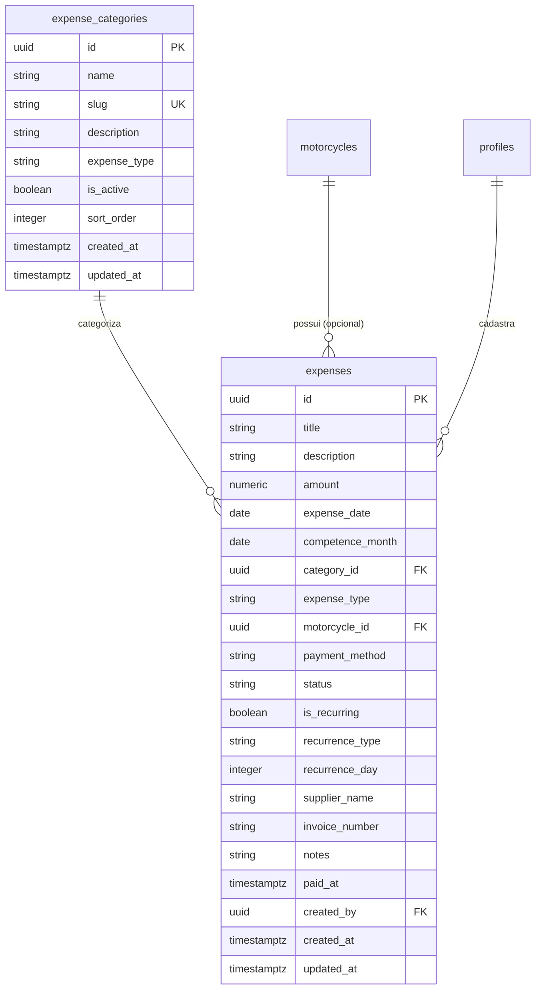

# Data Model: Módulo Financeiro de Gastos

**Feature Branch**: `015-modulo-financeiro-gastos`

**Date**: 2026-08-24

## 1. Relacionamento de Entidades (ERD)



## 2. Definição das Tabelas

### Table: `public.expense_categories`

Representa a classificação de despesas (separadas por tipo Moto ou Loja).

```sql
CREATE TABLE IF NOT EXISTS public.expense_categories (
  id UUID PRIMARY KEY DEFAULT gen_random_uuid(),
  name TEXT NOT NULL,
  slug TEXT NOT NULL UNIQUE,
  description TEXT NULL,
  expense_type TEXT NOT NULL CHECK (expense_type IN ('MOTO', 'LOJA')),
  is_active BOOLEAN NOT NULL DEFAULT true,
  sort_order INTEGER NOT NULL DEFAULT 0,
  created_at TIMESTAMPTZ NOT NULL DEFAULT now(),
  updated_at TIMESTAMPTZ NOT NULL DEFAULT now()
);
```

### Table: `public.expenses`

Representa os lançamentos de gastos efetuados ou agendados.

```sql
CREATE TABLE IF NOT EXISTS public.expenses (
  id UUID PRIMARY KEY DEFAULT gen_random_uuid(),
  title TEXT NOT NULL,
  description TEXT NULL,
  amount NUMERIC(12, 2) NOT NULL CHECK (amount > 0),
  expense_date DATE NOT NULL,
  competence_month DATE NOT NULL,
  category_id UUID NOT NULL REFERENCES public.expense_categories(id) ON DELETE RESTRICT,
  expense_type TEXT NOT NULL CHECK (expense_type IN ('MOTO', 'LOJA')),
  motorcycle_id UUID NULL REFERENCES public.motorcycles(id) ON DELETE SET NULL,
  payment_method TEXT NULL CHECK (payment_method IS NULL OR payment_method IN ('PIX', 'CASH', 'DEBIT_CARD', 'CREDIT_CARD', 'TRANSFER', 'BOLETO', 'DIRECT_DEBIT', 'OTHER')),
  status TEXT NOT NULL DEFAULT 'PAID' CHECK (status IN ('PAID', 'PENDING', 'CANCELLED')),
  is_recurring BOOLEAN NOT NULL DEFAULT false,
  recurrence_type TEXT NULL CHECK (recurrence_type IS NULL OR recurrence_type IN ('NONE', 'MONTHLY', 'YEARLY')),
  recurrence_day INTEGER NULL CHECK (recurrence_day IS NULL OR (recurrence_day >= 1 AND recurrence_day <= 31)),
  supplier_name TEXT NULL,
  invoice_number TEXT NULL,
  notes TEXT NULL,
  paid_at TIMESTAMPTZ NULL,
  created_by UUID NULL REFERENCES auth.users(id) ON DELETE SET NULL,
  created_at TIMESTAMPTZ NOT NULL DEFAULT now(),
  updated_at TIMESTAMPTZ NOT NULL DEFAULT now(),
  CONSTRAINT chk_expense_type_moto CHECK (expense_type != 'LOJA' OR motorcycle_id IS NULL)
);
```

## 3. Índices de Performance

```sql
CREATE INDEX IF NOT EXISTS idx_expenses_competence_month ON public.expenses(competence_month);
CREATE INDEX IF NOT EXISTS idx_expenses_expense_date ON public.expenses(expense_date);
CREATE INDEX IF NOT EXISTS idx_expenses_category_id ON public.expenses(category_id);
CREATE INDEX IF NOT EXISTS idx_expenses_motorcycle_id ON public.expenses(motorcycle_id);
CREATE INDEX IF NOT EXISTS idx_expenses_status ON public.expenses(status);
CREATE INDEX IF NOT EXISTS idx_expenses_expense_type ON public.expenses(expense_type);
```

## 4. Políticas de Segurança (RLS)

```sql
ALTER TABLE public.expense_categories ENABLE ROW LEVEL SECURITY;
ALTER TABLE public.expenses ENABLE ROW LEVEL SECURITY;

-- Admins podem ler e gerenciar categorias
CREATE POLICY "Admins can manage expense categories"
ON public.expense_categories
FOR ALL
TO authenticated
USING (
  EXISTS (
    SELECT 1 FROM public.profiles
    WHERE profiles.id = auth.uid() AND profiles.role = 'ADMIN'
  )
)
WITH CHECK (
  EXISTS (
    SELECT 1 FROM public.profiles
    WHERE profiles.id = auth.uid() AND profiles.role = 'ADMIN'
  )
);

-- Admins podem ler e gerenciar gastos
CREATE POLICY "Admins can manage expenses"
ON public.expenses
FOR ALL
TO authenticated
USING (
  EXISTS (
    SELECT 1 FROM public.profiles
    WHERE profiles.id = auth.uid() AND profiles.role = 'ADMIN'
  )
)
WITH CHECK (
  EXISTS (
    SELECT 1 FROM public.profiles
    WHERE profiles.id = auth.uid() AND profiles.role = 'ADMIN'
  )
);
```

## 5. Seed Inicial de Categorias Idempotente

Categorias padronizadas pré-cadastradas:

```sql
INSERT INTO public.expense_categories (name, slug, expense_type, sort_order)
VALUES
  ('Manutenção', 'manutencao', 'MOTO', 1),
  ('Revisão', 'revisao', 'MOTO', 2),
  ('Óleo e Filtros', 'oleo-filtros', 'MOTO', 3),
  ('Pneus', 'pneus', 'MOTO', 4),
  ('Bateria', 'bateria', 'MOTO', 5),
  ('Peças', 'pecas', 'MOTO', 6),
  ('Combustível Moto', 'combustivel-moto', 'MOTO', 7),
  ('Estética e Lavagem', 'estetica-lavagem', 'MOTO', 8),
  ('Documentação Moto', 'documentacao-moto', 'MOTO', 9),
  ('Seguro Moto', 'seguro-moto', 'MOTO', 10),
  ('Guincho', 'guincho', 'MOTO', 11),
  ('Preparação Venda', 'preparacao-venda', 'MOTO', 12),
  ('Preparação Aluguel', 'preparacao-aluguel', 'MOTO', 13),
  ('Outros Gastos Moto', 'outros-moto', 'MOTO', 14),
  ('Aluguel da Loja', 'aluguel-loja', 'LOJA', 15),
  ('Energia Elétrica', 'energia-eletrica', 'LOJA', 16),
  ('Água', 'agua', 'LOJA', 17),
  ('Internet e Telefone', 'internet-telefone', 'LOJA', 18),
  ('Ar-Condicionado', 'ar-condicionado', 'LOJA', 19),
  ('Limpeza e Conservação', 'limpeza-conservacao', 'LOJA', 20),
  ('Material de Escritório', 'material-escritorio', 'LOJA', 21),
  ('Marketing e Anúncios', 'marketing-anuncios', 'LOJA', 22),
  ('Contabilidade', 'contabilidade', 'LOJA', 23),
  ('Impostos e Taxas', 'impostos-taxas', 'LOJA', 24),
  ('Salários e Comissões', 'salarios-comissoes', 'LOJA', 25),
  ('Taxas Bancárias', 'taxas-bancarias', 'LOJA', 26),
  ('Software e Assinaturas', 'software-assinaturas', 'LOJA', 27),
  ('Manutenção da Loja', 'manutencao-loja', 'LOJA', 28),
  ('Outros Gastos Gerais', 'outros-gerais', 'LOJA', 29)
ON CONFLICT (slug) DO NOTHING;
```
