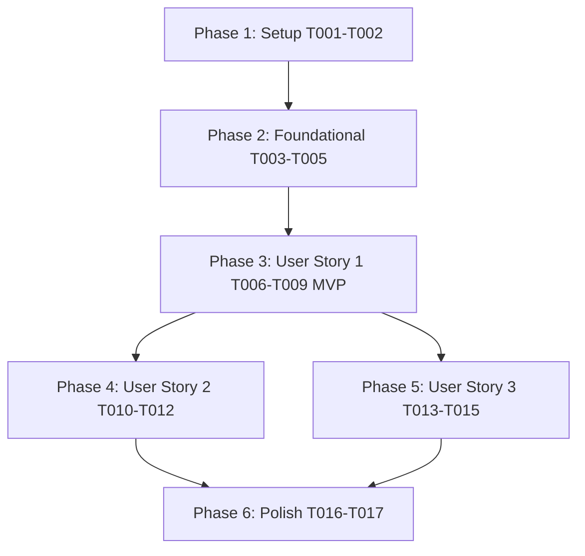

# Tasks: Módulo Financeiro de Gastos

**Feature Branch**: `015-modulo-financeiro-gastos`
**Spec**: [spec.md](./spec.md) | **Plan**: [plan.md](./plan.md) | **Data Model**: [data-model.md](./data-model.md)

---

## Phase 1: Setup (Shared Infrastructure)

**Purpose**: Definição de tipos TypeScript, esquemas de validação Zod e migration do banco de dados PostgreSQL com RLS.

- [x] T001 [P] Create TypeScript interfaces and Zod validation schemas for expenses and categories in `types/expenses.ts`
- [x] T002 [P] Create Supabase database migration for `public.expense_categories` and `public.expenses` with RLS policies, FKs, constraints, indexes, and idempotent seed in `supabase/migrations/20260824200000_create_expenses_table.sql`

---

## Phase 2: Foundational (Blocking Prerequisites)

**Purpose**: Infraestrutura de acesso a dados server-side, Server Actions e navegação do painel admin.

- [x] T003 [P] Implement server-side data access layer queries (`getExpensesQuery`, `getExpenseSummaryQuery`, `getExpenseCategoriesQuery`) in `lib/expenses.ts`
- [x] T004 [P] Implement Server Actions (`createExpenseAction`, `updateExpenseAction`, `deleteExpenseAction`, `updateExpenseStatusAction`) in `app/admin/(protected)/gastos/actions.ts`
- [x] T005 Add 'Gastos' menu entry (`/admin/gastos`) with Lucide `Receipt` icon in `components/admin/admin-sidebar.tsx`

**Checkpoint**: Infraestrutura pronta. As histórias de usuário podem ser iniciadas.

---

## Phase 3: User Story 1 - Lançamento e Controle de Gastos por Competência Mensal (Priority: P1) 🎯 MVP

**Goal**: Permitir ao proprietário da loja cadastrar e consultar despesas (Motos vs Loja) filtradas por mês de competência, com controle de status Pago/Pendente e totais em tempo real no dashboard.

**Independent Test**: Acessar `/admin/gastos`, adicionar um gasto de moto (ex: Troca de óleo) e um gasto da loja (ex: Aluguel), alternar mês de competência e verificar atualização imediata dos cards e da listagem.

- [x] T006 [P] [US1] Implement summary metric cards component (Total do Mês, Pago, Pendente, Gastos de Motos, Gastos da Loja, Lançamentos) in `components/admin/expenses/expense-dashboard-summary.tsx`
- [x] T007 [P] [US1] Implement desktop table and mobile cards list component with status badges in `components/admin/expenses/expense-list.tsx`
- [x] T008 [P] [US1] Implement responsive Dialog (desktop) and Drawer (mobile) form component for creating and editing expenses in `components/admin/expenses/expense-form-modal.tsx`
- [x] T009 [US1] Implement main admin page layout, competence month selector, and server data fetching in `app/admin/(protected)/gastos/page.tsx`

**Checkpoint**: O MVP da User Story 1 está 100% funcional e testável de forma independente.

---

## Phase 4: User Story 2 - Gestão Visual, Filtros Avançados e Recorrência (Priority: P2)

**Goal**: Fornecer busca textual e filtros avançados (categoria, tipo, status, forma de pagamento, moto) e suporte a gastos recorrentes mensais.

**Independent Test**: Filtrar por palavra-chave e por categoria no drawer mobile/bar desktop, alterar status rapidamente para pago e testar o indicador de recorrência.

- [x] T010 [P] [US2] Implement filter bar (desktop) and filter drawer (mobile) component with search input and category/type/status/payment selectors in `components/admin/expenses/expense-filters.tsx`
- [x] T011 [P] [US2] Implement expense detail modal/drawer component with financial summary, classification, payment details, and supplier info in `components/admin/expenses/expense-detail-modal.tsx`
- [x] T012 [US2] Implement quick status toggle, expense duplication, and recurrence flags handling in `app/admin/(protected)/gastos/actions.ts` and `components/admin/expenses/expense-list.tsx`

**Checkpoint**: As User Stories 1 e 2 funcionam de forma independente e integrada.

---

## Phase 5: User Story 3 - Análise de Gastos e Custo Acumulado da Moto (Priority: P3)

**Goal**: Exibir gráficos visuais de distribuição por categoria e evolução mensal, além do cálculo de custo acumulado por motocicleta no painel administrativo.

**Independent Test**: Verificar renderização dos gráficos no desktop/mobile e confirmar a soma exata de gastos acumulados na visualização de motos no admin.

- [x] T013 [P] [US3] Implement category distribution chart and monthly evolution chart component in `components/admin/expenses/expense-charts.tsx`
- [x] T014 [P] [US3] Implement expense category manager modal component in `components/admin/expenses/category-manager-modal.tsx`
- [x] T015 [US3] Integrate accumulated motorcycle expense calculation and history section in motorcycle admin views in `lib/expenses.ts` and `app/admin/(protected)/motos/page.tsx`

---

## Phase 6: Polish & Cross-Cutting Concerns

**Purpose**: Validação de código, acessibilidade, responsividade e build final.

- [x] T016 [P] Run static analysis and build verification (`npm run lint`, `npm run typecheck`, `npm run build`)
- [x] T017 Execute manual validation script scenarios from `specs/015-modulo-financeiro-gastos/quickstart.md`

---

## Dependencies & Execution Order

---

## Implementation Strategy

### MVP Scope (User Story 1)
1. Completar Fase 1 (Setup: Tipos + Migration).
2. Completar Fase 2 (Foundational: Queries + Actions + Sidebar).
3. Completar Fase 3 (User Story 1: Dashboard + Lista + Formulário + Rota).
4. **Validar MVP**: Testar lançamento de gastos de moto e gastos da loja.

### Entregas Incrementais
- Incremente com User Story 2 (Filtros avançados, detalhe em modal e recorrência).
- Incremente com User Story 3 (Gráficos visuais e cálculo acumulado por moto).
- Execute verificação final com ESLint, TypeScript e Next build.
