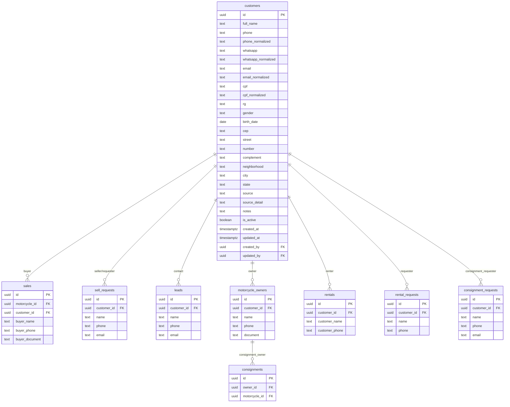

# Data Model: Cadastro e CRM de Clientes

**Feature**: 016-cadastro-clientes-crm
**Created**: 2026-08-29

## Entity Relationship Diagram



## Table: `customers`

### Columns

| Column | Type | Nullable | Default | Constraint | Notes |
| --- | --- | --- | --- | --- | --- |
| `id` | uuid | NO | `gen_random_uuid()` | PRIMARY KEY | |
| `full_name` | text | NO | — | `CHECK (length(trim(full_name)) >= 2)` | Trimmed, collapsed spaces |
| `phone` | text | NO | — | — | Display format: `(81) 99999-1234` |
| `phone_normalized` | text | NO | — | — | Digits only: `81999991234` |
| `whatsapp` | text | YES | NULL | — | Separate field if different from phone |
| `whatsapp_normalized` | text | YES | NULL | — | Digits only |
| `email` | text | YES | NULL | — | Display format as entered |
| `email_normalized` | text | YES | NULL | — | `trim().toLowerCase()` |
| `cpf` | text | YES | NULL | — | Display format: `123.456.789-09` |
| `cpf_normalized` | text | YES | NULL | — | Digits only: `12345678909`. Validated digits. |
| `rg` | text | YES | NULL | — | Alphanumeric, no strict validation |
| `gender` | text | YES | NULL | `CHECK (gender IN ('male', 'female', 'other', 'prefer_not_to_say'))` | NULL = não informado |
| `birth_date` | date | YES | NULL | `CHECK (birth_date <= CURRENT_DATE)` | No future dates |
| `cep` | text | YES | NULL | — | Display: `50000-000`, stored as entered |
| `street` | text | YES | NULL | — | Logradouro |
| `number` | text | YES | NULL | — | Número do endereço |
| `complement` | text | YES | NULL | — | Complemento |
| `neighborhood` | text | YES | NULL | — | Bairro |
| `city` | text | YES | NULL | — | Cidade |
| `state` | text | YES | NULL | `CHECK (state IS NULL OR length(state) = 2)` | UF: PE, SP, etc. |
| `source` | text | NO | `'manual'` | `CHECK (source IN ('manual', 'website_sell_request', 'website_consignment_request', 'website_contact', 'sale_registration', 'rental_registration', 'admin_proposal', 'imported', 'other'))` | Never overwritten |
| `source_detail` | text | YES | NULL | — | Free text for extra context |
| `notes` | text | YES | NULL | — | Internal admin notes |
| `is_active` | boolean | NO | `true` | — | Soft delete flag |
| `created_at` | timestamptz | NO | `now()` | — | |
| `updated_at` | timestamptz | NO | `now()` | — | Updated via trigger or application |
| `created_by` | uuid | YES | NULL | `REFERENCES auth.users(id)` | Admin who created. NULL for automated. |
| `updated_by` | uuid | YES | NULL | `REFERENCES auth.users(id)` | Admin who last updated. |

### Indexes

| Index | Columns | Type | Condition |
| --- | --- | --- | --- |
| `pk_customers` | `id` | PRIMARY KEY | — |
| `idx_customers_cpf_unique` | `cpf_normalized` | UNIQUE | `WHERE cpf_normalized IS NOT NULL` |
| `idx_customers_phone_normalized` | `phone_normalized` | B-TREE | — |
| `idx_customers_email_normalized` | `email_normalized` | B-TREE | `WHERE email_normalized IS NOT NULL` |
| `idx_customers_created_at` | `created_at` | B-TREE DESC | — |
| `idx_customers_is_active` | `is_active` | B-TREE | — |
| `idx_customers_source` | `source` | B-TREE | — |
| `idx_customers_full_name_trgm` | `full_name` | GIN (pg_trgm) | Optional — only if accent-insensitive/fuzzy search is needed. Can defer. |

### RLS Policies

```sql
ALTER TABLE customers ENABLE ROW LEVEL SECURITY;

-- No public access
CREATE POLICY "Admins can view customers" ON customers
  FOR SELECT TO authenticated
  USING (public.is_admin());

CREATE POLICY "Admins can insert customers" ON customers
  FOR INSERT TO authenticated
  WITH CHECK (public.is_admin());

CREATE POLICY "Admins can update customers" ON customers
  FOR UPDATE TO authenticated
  USING (public.is_admin())
  WITH CHECK (public.is_admin());

-- No DELETE policy — soft-delete only via UPDATE
```

## FK Additions to Existing Tables

### `sales` — Add `customer_id`

```sql
ALTER TABLE public.sales
  ADD COLUMN IF NOT EXISTS customer_id uuid REFERENCES public.customers(id) ON DELETE SET NULL;

CREATE INDEX IF NOT EXISTS idx_sales_customer_id
  ON public.sales(customer_id)
  WHERE customer_id IS NOT NULL;
```

**Impact**: Existing sales rows get `customer_id = NULL`. No breaking change. The `buyer_name`, `buyer_phone`, `buyer_document`, `buyer_address`, etc. fields remain as snapshot — they are NOT removed.

### `sell_requests` — Add `customer_id`

```sql
ALTER TABLE public.sell_requests
  ADD COLUMN IF NOT EXISTS customer_id uuid REFERENCES public.customers(id) ON DELETE SET NULL;

CREATE INDEX IF NOT EXISTS idx_sell_requests_customer_id
  ON public.sell_requests(customer_id)
  WHERE customer_id IS NOT NULL;
```

**Impact**: Existing sell_requests get `customer_id = NULL`. The `name`, `phone`, `email` fields remain.

### `leads` — Add `customer_id`

```sql
ALTER TABLE public.leads
  ADD COLUMN IF NOT EXISTS customer_id uuid REFERENCES public.customers(id) ON DELETE SET NULL;

CREATE INDEX IF NOT EXISTS idx_leads_customer_id
  ON public.leads(customer_id)
  WHERE customer_id IS NOT NULL;
```

**Impact**: Existing leads get `customer_id = NULL`. The `name`, `phone`, `email` fields remain.

### `motorcycle_owners` — Add `customer_id`

```sql
ALTER TABLE public.motorcycle_owners
  ADD COLUMN IF NOT EXISTS customer_id uuid REFERENCES public.customers(id) ON DELETE SET NULL;

CREATE INDEX IF NOT EXISTS idx_motorcycle_owners_customer_id
  ON public.motorcycle_owners(customer_id)
  WHERE customer_id IS NOT NULL;
```

**Impact**: Existing motorcycle_owners get `customer_id = NULL`. Consignment data flows through `motorcycle_owners.customer_id`.

### `consignment_requests` — Add `customer_id`

```sql
ALTER TABLE public.consignment_requests
  ADD COLUMN IF NOT EXISTS customer_id uuid REFERENCES public.customers(id) ON DELETE SET NULL;

CREATE INDEX IF NOT EXISTS idx_consignment_requests_customer_id
  ON public.consignment_requests(customer_id)
  WHERE customer_id IS NOT NULL;
```

**Impact**: Existing consignment_requests get `customer_id = NULL`. The `name`, `phone`, `email` fields remain.

### `rentals` — Add `customer_id`

```sql
ALTER TABLE public.rentals
  ADD COLUMN IF NOT EXISTS customer_id uuid REFERENCES public.customers(id) ON DELETE SET NULL;

CREATE INDEX IF NOT EXISTS idx_rentals_customer_id
  ON public.rentals(customer_id)
  WHERE customer_id IS NOT NULL;
```

**Impact**: Existing rentals get `customer_id = NULL`. The `customer_name`, `customer_phone`, `customer_email` fields remain.

### `rental_requests` — Add `customer_id`

```sql
ALTER TABLE public.rental_requests
  ADD COLUMN IF NOT EXISTS customer_id uuid REFERENCES public.customers(id) ON DELETE SET NULL;

CREATE INDEX IF NOT EXISTS idx_rental_requests_customer_id
  ON public.rental_requests(customer_id)
  WHERE customer_id IS NOT NULL;
```

**Impact**: Existing rental_requests get `customer_id = NULL`. The `name`, `phone` fields remain.

## Data Migration Strategy (Planned, Not Auto-Executed)

### Phase 1: Migrate from `sales` (highest priority)

```sql
-- For each sale with buyer_document (CPF) and buyer_phone:
-- 1. Normalize CPF and phone
-- 2. Check if customer exists by cpf_normalized
-- 3. If not, check by phone_normalized
-- 4. If not found, create customer with source = 'sale_registration'
-- 5. Link sales.customer_id
```

**Rules**:
- Only migrate sales with `buyer_name IS NOT NULL AND buyer_phone IS NOT NULL`.
- Use `cpf_normalized` as primary dedup key.
- Skip ambiguous records (no phone, no CPF, only name).
- Generate a report of unlinked sales for manual review.
- Script must be idempotent (re-running doesn't duplicate).

### Phase 2: Migrate from `sell_requests`

- Match by phone_normalized → existing customer or create with source `website_sell_request`.
- Only process records where `name IS NOT NULL AND phone IS NOT NULL`.

### Phase 3: Migrate from `leads`

- Match by phone_normalized → existing customer or create with source based on lead type.

### Phase 4: Migrate from `motorcycle_owners`

- Match by document (CPF) or phone → existing customer or create with source `imported`.

### Phase 5: Migrate from `rentals` / `rental_requests`

- Match by phone → existing customer or create.

### Important Notes
- Migration scripts should be run manually, reviewed, and validated.
- Each phase produces a CSV/JSON report of: created, linked, skipped records.
- No destructive changes — original fields are preserved.
- Script must support dry-run mode.

## Historical Snapshot Integrity

### Sales Table Contract

After this feature, the `sales` table will have:

| Field | Purpose | Mutability |
| --- | --- | --- |
| `customer_id` | Link to customer profile | Set on creation, updatable |
| `buyer_name` | Snapshot at time of sale | Frozen after sale creation |
| `buyer_phone` | Snapshot at time of sale | Frozen after sale creation |
| `buyer_email` | Snapshot at time of sale | Frozen after sale creation |
| `buyer_document` | Snapshot at time of sale (CPF) | Frozen after sale creation |
| `buyer_cep` | Snapshot at time of sale | Frozen after sale creation |
| `buyer_street` | Snapshot at time of sale | Frozen after sale creation |
| `buyer_number` | Snapshot at time of sale | Frozen after sale creation |
| `buyer_complement` | Snapshot at time of sale | Frozen after sale creation |
| `buyer_neighborhood` | Snapshot at time of sale | Frozen after sale creation |
| `buyer_city` | Snapshot at time of sale | Frozen after sale creation |
| `buyer_state` | Snapshot at time of sale | Frozen after sale creation |
| `buyer_address` | Formatted composite snapshot | Frozen after sale creation |

The receipt PDF (`official-receipt-print.tsx`) will continue reading from these snapshot fields, NOT from the `customers` table.
