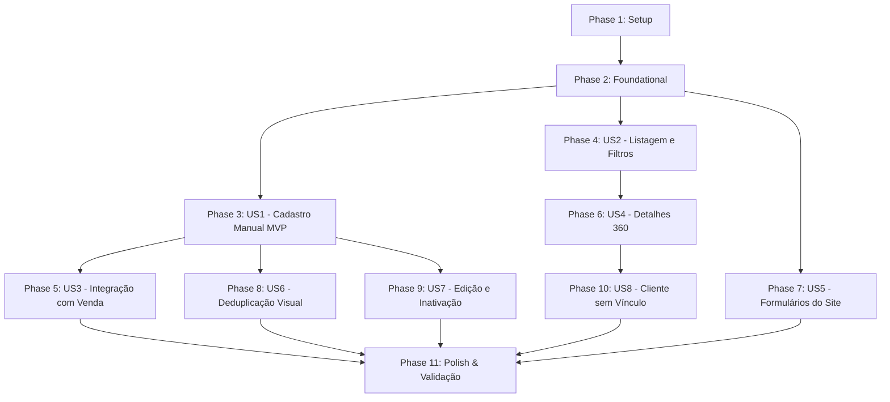

# Tasks: Cadastro e CRM de Clientes

**Feature Branch**: `016-cadastro-clientes-crm`  
**Specification**: [spec.md](file:///c:/Users/Alexr/OneDrive/Ambiente%20de%20Trabalho/www/af-motos/specs/016-cadastro-clientes-crm/spec.md)  
**Implementation Plan**: [plan.md](file:///c:/Users/Alexr/OneDrive/Ambiente%20de%20Trabalho/www/af-motos/specs/016-cadastro-clientes-crm/plan.md)  
**Data Model**: [data-model.md](file:///c:/Users/Alexr/OneDrive/Ambiente%20de%20Trabalho/www/af-motos/specs/016-cadastro-clientes-crm/data-model.md)  

---

## Phase 1: Setup (Shared Infrastructure)

**Purpose**: Estrutura base de tipos, utilitários e constantes para o módulo de clientes.

- [ ] T001 [P] Create customer TypeScript types in `types/customer.ts`
- [ ] T002 [P] Update database interface types in `types/database.ts` to include `customers` and `customer_id` columns across related tables
- [ ] T003 [P] Implement customer normalizers and CPF validator in `lib/utils/customer-normalizers.ts`
- [ ] T004 [P] Implement customer Zod validation schemas in `lib/validations/customer.ts`

---

## Phase 2: Foundational (Blocking Prerequisites)

**Purpose**: Infraestrutura de banco de dados, migrações, RLS, navegação e deduplicação no servidor.

> ⚠️ **CRITICAL**: Nenhuma user story de interface ou integração pode iniciar antes da conclusão desta fase.

- [ ] T005 Create `customers` table migration with indexes and RLS policies in `supabase/migrations/20260830000000_create_customers.sql`
- [ ] T006 Add `customer_id` nullable foreign keys with partial indexes to `sales`, `sell_requests`, `leads`, `motorcycle_owners`, `consignment_requests`, `rentals`, `rental_requests` in `supabase/migrations/20260830000100_add_customer_fks.sql`
- [ ] T007 Implement server-side deduplication engine in `lib/domain/customer-dedup.ts`
- [ ] T008 Implement customer query service (`getCustomers`, `getCustomerById`, `searchCustomersForSale`) in `lib/queries/customers.ts`
- [ ] T009 Implement core customer server actions (`createCustomerAction`, `updateCustomerAction`, `findOrCreateCustomer`) in `lib/actions/customers.ts`
- [ ] T010 [P] Add "Clientes" navigation link with `Users` icon to desktop sidebar in `components/admin/admin-sidebar.tsx`
- [ ] T011 [P] Ensure "Clientes" is accessible in mobile navigation drawer in `components/admin/admin-bottom-nav.tsx`

**Checkpoint**: Base de dados, RLS, queries, actions e navegação prontos. Implementação das user stories liberada.

---

## Phase 3: User Story 1 — Cadastro Manual de Cliente (Priority: P1) 🎯 MVP

**Goal**: Permitir ao administrador criar um cliente avulso com nome e telefone (mínimos) e dados complementares opcionais (endereço, CPF, e-mail, notas), com validações inline e feedback visual.

**Independent Test**: Acessar `/admin/clientes/novo`, preencher nome e telefone válidos, submeter e verificar o redirecionamento para `/admin/clientes/[id]` com toast de sucesso.

- [ ] T012 [P] [US1] Create customer status and source badge components in `components/admin/customers/customer-status-badge.tsx` and `components/admin/customers/customer-source-badge.tsx`
- [ ] T013 [US1] Create unified customer form component with ViaCEP integration in `components/admin/customers/customer-form.tsx`
- [ ] T014 [US1] Create new customer page in `app/admin/(protected)/clientes/novo/page.tsx`

**Checkpoint**: Cadastro manual de cliente totalmente funcional e testável de forma independente.

---

## Phase 4: User Story 2 — Listagem, Busca e Filtros (Priority: P1)

**Goal**: Exibir a carteira de clientes com busca textual debounced (nome, telefone, e-mail, CPF), filtros estruturados (sexo, origem, status, vínculos), paginação server-side e visualização responsiva (tabela desktop / cards mobile).

**Independent Test**: Acessar `/admin/clientes`, testar busca textual, aplicar filtros por origem/status, recarregar a página e confirmar preservação via URL query params.

- [ ] T015 [P] [US2] Create desktop customer table component in `components/admin/customers/customer-list.tsx`
- [ ] T016 [P] [US2] Create mobile customer card component in `components/admin/customers/customer-mobile-card.tsx`
- [ ] T017 [US2] Create customer filters component with URL sync and sheet drawer for mobile in `components/admin/customers/customer-filters.tsx`
- [ ] T018 [US2] Create customer listing page with SSR data fetching, pagination, and skeleton loading in `app/admin/(protected)/clientes/page.tsx`

**Checkpoint**: Listagem e filtros operacionais em desktop e mobile com sincronização de query params.

---

## Phase 5: User Story 3 — Seleção e Criação de Cliente na Venda (Priority: P1)

**Goal**: Integrar a seleção e criação rápida de clientes ao fluxo de nova venda (`/admin/vendas/nova`), preenchendo automaticamente o snapshot do comprador sem sobrescrever o histórico de vendas antigas.

**Independent Test**: Acessar `/admin/vendas/nova`, buscar um cliente existente (ou criar via modal rápido), conferir preenchimento dos campos de comprador, concluir a venda e verificar `sales.customer_id` preenchido no banco enquanto campos de snapshot são preservados.

- [ ] T019 [P] [US3] Create asynchronous customer search combobox for sales in `components/admin/customers/customer-search-combobox.tsx`
- [ ] T020 [P] [US3] Create quick-create customer modal for sales in `components/admin/customers/customer-quick-create-dialog.tsx`
- [ ] T021 [US3] Update sale Zod schema to include optional `customer_id` in `lib/validations/sale.ts`
- [ ] T022 [US3] Integrate customer search, quick-create modal, and snapshot autofill into `components/admin/sales/sale-form.tsx`
- [ ] T023 [US3] Update `createSaleAction` in `lib/actions/sales.ts` to link `customer_id` and execute fallback deduplication for manual entries

**Checkpoint**: Fluxo de venda integrado ao CRM com preservação integral dos snapshots e recibos comerciais.

---

## Phase 6: User Story 4 — Detalhes e Histórico do Cliente (Priority: P2)

**Goal**: Oferecer visão 360° do cliente em `/admin/clientes/[id]`, consolidando cabeçalho com ações de contato (WhatsApp/ligação), cards de resumo de vínculos, abas de vendas, propostas/anúncios, locações e linha do tempo agregada.

**Independent Test**: Acessar `/admin/clientes/[id]` de um cliente com vendas e propostas e conferir exibição correta dos vínculos e links para os módulos correspondentes.

- [ ] T024 [P] [US4] Create customer details header with quick contact actions in `components/admin/customers/customer-details-header.tsx`
- [ ] T025 [P] [US4] Create relationship count summary cards in `components/admin/customers/customer-summary-cards.tsx`
- [ ] T026 [US4] Create customer relationship tabs (Visão Geral, Vendas, Anúncios/Propostas, Locações, Histórico) in `components/admin/customers/customer-relations-tabs.tsx`
- [ ] T027 [US4] Create customer details page in `app/admin/(protected)/clientes/[id]/page.tsx`

**Checkpoint**: Perfil 360° do cliente exibindo histórico agregado e relacionamentos com a loja.

---

## Phase 7: User Story 5 — Associação de Clientes de Formulários do Site (Priority: P2)

**Goal**: Vincular automaticamente novos envios de formulários públicos do site (venda de moto, contato geral, aluguel) à base de clientes usando `findOrCreateCustomer`, preservando a origem inicial.

**Independent Test**: Submeter o formulário público "Venda sua moto", acessar o painel admin e verificar que o cliente foi criado/vinculado à solicitação com origem `website_sell_request`.

- [ ] T028 [US5] Update `createSellRequestAction` in `lib/actions/leads.ts` to execute `findOrCreateCustomer` and link `sell_requests.customer_id`
- [ ] T029 [US5] Update `createLeadAction` in `lib/actions/leads.ts` to link `leads.customer_id` on contact submissions
- [ ] T030 [US5] Update `createRentalRequestAction` in `lib/actions/rental-requests.ts` to link `rental_requests.customer_id`
- [ ] T031 [US5] Update proposal detail drawer in `components/admin/proposal-detail-drawer.tsx` to display linked customer profile or offer manual linking action

**Checkpoint**: Captação automatizada e idempotente de formulários públicos integrada ao CRM.

---

## Phase 8: User Story 6 — Proteção contra Duplicidade (Priority: P2)

**Goal**: Proteger a base contra duplicidades acidentais com alerta inline no formulário (CPF bloqueante com link para cliente existente, telefone e e-mail com aviso de confirmação).

**Independent Test**: Tentar cadastrar um cliente com CPF existente (verificar bloqueio) e com telefone existente (verificar alerta com opção de continuar ou ver cadastro existente).

- [ ] T032 [US6] Create deduplication alert banner component in `components/admin/customers/customer-dedup-alert.tsx`
- [ ] T033 [US6] Integrate pre-check deduplication alerts into `customer-form.tsx` and `customer-quick-create-dialog.tsx`

**Checkpoint**: Alertas visuais e validações no servidor impedem duplicações indevidas.

---

## Phase 9: User Story 7 — Edição e Inativação de Clientes (Priority: P3)

**Goal**: Permitir edição dos dados cadastrais do cliente e inativação/reativação lógica (`is_active = false`) sem exclusão física nem impacto nos registros históricos.

**Independent Test**: Editar telefone de um cliente existente (verificar atualização sem alterar vendas passadas) e inativar cliente (verificar que deixa de aparecer na seleção padrão de venda).

- [ ] T034 [US9] Implement `setCustomerActiveStatusAction` in `lib/actions/customers.ts`
- [ ] T035 [US9] Create customer edit page in `app/admin/(protected)/clientes/[id]/editar/page.tsx`

**Checkpoint**: Edição e soft-delete operacionais com proteção do histórico de transações.

---

## Phase 10: User Story 8 — Cliente sem Vínculo (Priority: P3)

**Goal**: Garantir que clientes avulsos sem qualquer venda, proposta ou aluguel possuam experiência completa e empty state amigável em todas as abas.

**Independent Test**: Criar cliente apenas com nome e telefone, abrir sua página de detalhes e verificar a exibição do empty state informativo com CTAs de ação.

- [ ] T036 [US8] Create empty relations state component in `components/admin/customers/customer-empty-relations.tsx`
- [ ] T037 [US8] Integrate empty state handling into `customer-relations-tabs.tsx`

**Checkpoint**: Tratamento consistente e polido para clientes em prospecção sem vínculos comerciais.

---

## Phase 11: Polish & Cross-Cutting Concerns

**Purpose**: Refinamentos de responsividade, segurança de dados sensíveis (PII), acessibilidade e validação final.

- [ ] T038 [P] Audit CPF masking across all tables and cards ensuring full CPF is never exposed in URLs or client logs
- [ ] T039 [P] Perform mobile responsiveness verification (320px, 375px, 414px) across `/admin/clientes`, `/admin/clientes/novo` and `/admin/clientes/[id]`
- [ ] T040 [P] Implement skeleton and error boundary states for customer routes in `app/admin/(protected)/clientes/loading.tsx` and `app/admin/(protected)/clientes/error.tsx`
- [ ] T041 Run end-to-end validation checklist per `specs/016-cadastro-clientes-crm/quickstart.md`

---

## Dependencies & Execution Order

### Phase Dependencies



### User Story Execution Order

1. **Setup & Foundational (Phases 1-2)**: Migrations, tipos, RLS, queries e actions.
2. **User Story 1 (Phase 3 - MVP)**: Formulário e criação manual de clientes avulsos.
3. **User Story 2 (Phase 4)**: Tabela e cards de listagem com busca e filtros.
4. **User Story 3 (Phase 5)**: Integração com o formulário de venda e autofill.
5. **User Story 4 (Phase 6)**: Perfil de detalhes 360° e abas de relacionamentos.
6. **User Story 5 (Phase 7)**: Captação automática de formulários públicos.
7. **User Story 6 (Phase 8)**: Alertas e proteção avançada de duplicidades.
8. **User Story 7 (Phase 9)**: Edição e inativação lógica.
9. **User Story 8 (Phase 10)**: Empty states para clientes sem vínculos.
10. **Polish (Phase 11)**: PII masking, acessibilidade, responsividade e quickstart.

---

## Parallel Execution Opportunities

```bash
# Executar Setup em paralelo (Fase 1):
Task: T001 "Create customer TypeScript types in types/customer.ts"
Task: T002 "Update database interface types in types/database.ts"
Task: T003 "Implement customer normalizers in lib/utils/customer-normalizers.ts"
Task: T004 "Implement customer Zod schemas in lib/validations/customer.ts"

# Executar componentes de listagem em paralelo (Fase 4):
Task: T015 "Create desktop customer table in components/admin/customers/customer-list.tsx"
Task: T016 "Create mobile customer card in components/admin/customers/customer-mobile-card.tsx"

# Executar componentes do detalhe em paralelo (Fase 6):
Task: T024 "Create customer details header in components/admin/customers/customer-details-header.tsx"
Task: T025 "Create relationship count summary cards in components/admin/customers/customer-summary-cards.tsx"
```

---

## Implementation Strategy

### MVP First (User Story 1 Only)
1. Concluir **Fase 1 (Setup)** e **Fase 2 (Foundational)**.
2. Implementar **Fase 3 (User Story 1 - Cadastro Manual)**.
3. **Validar MVP**: Criar um cliente manual em `/admin/clientes/novo` e verificar persistência segura no Supabase com RLS.

### Entrega Incremental
1. **Incremento 1**: Listagem e filtros (`/admin/clientes`).
2. **Incremento 2**: Seleção de clientes no formulário de venda (`/admin/vendas/nova`).
3. **Incremento 3**: Página de detalhes 360° (`/admin/clientes/[id]`).
4. **Incremento 4**: Integração com formulários públicos e propostas.
5. **Incremento 5**: Deduplicação inline, edição e inativação.
