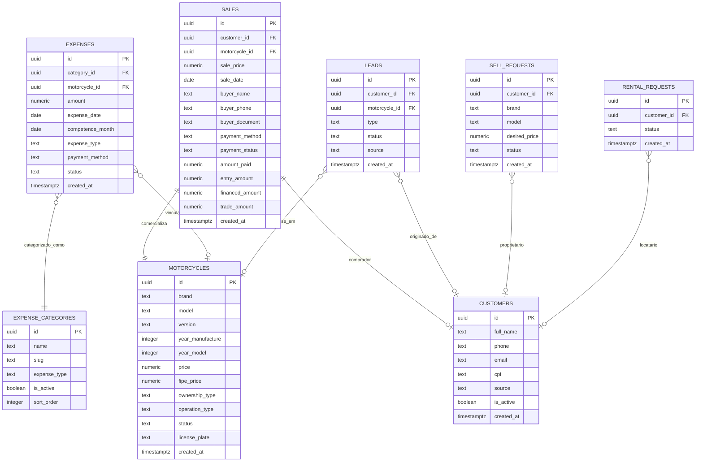

# Data Model & Schema Specification: Central de Relatórios Gerenciais

**Feature**: `017-central-relatorios-gerenciais`  
**Date**: 2026-08-30  
**Status**: Specification Phase (No schema modifications applied)

---

## 1. Mapeamento de Entidades Existentes Utilizadas



---

## 2. Tipos de Domínio & Interfaces TypeScript (`lib/reports/types.ts`)

```typescript
export type ReportPeriodPreset =
  | 'today'
  | 'last_7_days'
  | 'this_month'
  | 'last_month'
  | 'this_quarter'
  | 'last_3_months'
  | 'this_semester'
  | 'last_6_months'
  | 'this_year'
  | 'last_12_months'
  | 'custom';

export type MetricConfidence = 'confirmed' | 'estimated' | 'unavailable';

export interface ReportDateRange {
  startDate: string; // ISO format: YYYY-MM-DD
  endDate: string;   // ISO format: YYYY-MM-DD
  label: string;
  preset: ReportPeriodPreset;
  previousStartDate?: string;
  previousEndDate?: string;
}

export interface ReportMetric<T = number> {
  value: T;
  formattedValue: string;
  confidence: MetricConfidence;
  confidenceReason?: string;
  comparisonPercentage?: number | null;
  previousValue?: T | null;
}

export interface OverviewReportData {
  dateRange: ReportDateRange;
  grossRevenue: ReportMetric<number>;
  salesCount: ReportMetric<number>;
  averageTicket: ReportMetric<number>;
  totalExpenses: ReportMetric<number>;
  estimatedOperatingResult: ReportMetric<number>;
  estimatedMarginPercentage: ReportMetric<number>;
  newCustomersCount: ReportMetric<number>;
  totalLeadsCount: ReportMetric<number>;
  activeInventoryCount: ReportMetric<number>;
  totalInventoryAnnouncedValue: ReportMetric<number>;
  averageDaysToSell: ReportMetric<number | null>;
  
  revenueVsExpenseEvolution: Array<{
    periodKey: string;
    label: string;
    revenue: number;
    expenses: number;
    operatingResult: number;
  }>;
  
  paymentDistribution: Array<{
    method: string;
    label: string;
    count: number;
    totalAmount: number;
    percentage: number;
  }>;
}

export interface SalesReportData {
  dateRange: ReportDateRange;
  totalSalesValue: number;
  salesCount: number;
  averageTicket: number;
  highestSale: { id: string; model: string; value: number; date: string } | null;
  lowestSale: { id: string; model: string; value: number; date: string } | null;
  salesByBrand: Array<{ brand: string; count: number; totalRevenue: number }>;
  salesByCategory: Array<{ category: string; count: number; totalRevenue: number }>;
  salesByOperationType: Array<{ type: string; count: number; totalRevenue: number }>;
  detailedSalesList: Array<{
    id: string;
    saleDate: string;
    motorcycleId: string;
    motorcycleLabel: string;
    customerId?: string | null;
    buyerName: string | null;
    salePrice: number;
    paymentMethod: string | null;
    paymentStatus: string | null;
    linkedExpensesTotal: number;
    estimatedMargin: number;
  }>;
}

export interface FinancialReportData {
  dateRange: ReportDateRange;
  totalRevenue: number;
  totalExpensesPaid: number;
  totalExpensesPending: number;
  expensesByVehicle: number;
  expensesByStore: number;
  estimatedOperatingResult: number;
  expensesByCategory: Array<{
    categoryId: string;
    categoryName: string;
    expenseType: 'MOTO' | 'LOJA';
    totalAmount: number;
    count: number;
    percentageOfTotal: number;
  }>;
  expensesByMotorcycleRanking: Array<{
    motorcycleId: string;
    motorcycleLabel: string;
    totalExpenses: number;
    expensesCount: number;
  }>;
}

export interface InventoryReportData {
  activeCount: number;
  reservedCount: number;
  soldInPeriodCount: number;
  totalAnnouncedValue: number;
  totalFipeValue: number;
  fipeDifferencePercentage: number | null;
  averageInventoryAgeDays: number;
  ageDistribution: {
    under30Days: number;
    between31And60Days: number;
    between61And90Days: number;
    over90Days: number;
  };
  motosRequiringAttention: Array<{
    id: string;
    internalCode: string;
    brand: string;
    model: string;
    yearModel: number;
    price: number;
    fipePrice: number | null;
    daysInStock: number;
    linkedExpensesAmount: number;
    status: string;
    suggestedAction: string;
  }>;
}

export interface CustomersReportData {
  dateRange: ReportDateRange;
  newCustomersCount: number;
  totalLeadsCount: number;
  sellRequestsCount: number;
  rentalRequestsCount: number;
  customersBySource: Array<{
    source: string;
    label: string;
    count: number;
    percentage: number;
  }>;
  leadsBySource: Array<{
    source: string;
    label: string;
    count: number;
  }>;
  conversionFunnel: {
    totalLeads: number;
    contactedLeads: number;
    convertedSales: number;
    conversionRate: number | null;
    confidence: MetricConfidence;
  };
}

export interface AccountantExportOptions {
  exportType: 'vendas' | 'despesas' | 'estoque' | 'clientes' | 'consolidado';
  format: 'csv' | 'xlsx' | 'pdf';
  startDate: string;
  endDate: string;
  includeSensitiveCadastralData?: boolean;
}
```

---

## 3. Índices Recomendados para Otimização (Não Aplicados Nesta Etapa)

Para garantir resposta de agregação instantânea mesmo com dezenas de milhares de registros no futuro, recomenda-se a seguinte migração incremental:

```sql
-- Migration: Add Performance Indexes for Management Reports
-- Feature: 017-central-relatorios-gerenciais

-- 1. Otimização de busca por período em vendas
CREATE INDEX IF NOT EXISTS idx_sales_date_status ON public.sales(sale_date, payment_status);

-- 2. Otimização de busca por período e tipo em despesas
CREATE INDEX IF NOT EXISTS idx_expenses_date_status_type ON public.expenses(expense_date, status, expense_type);
CREATE INDEX IF NOT EXISTS idx_expenses_comp_month_status ON public.expenses(competence_month, status);

-- 3. Otimização de status e data de cadastro no estoque
CREATE INDEX IF NOT EXISTS idx_motorcycles_status_created ON public.motorcycles(status, created_at);

-- 4. Otimização de contatos e leads por período e tipo
CREATE INDEX IF NOT EXISTS idx_leads_created_at_status ON public.leads(created_at, status);
CREATE INDEX IF NOT EXISTS idx_customers_created_at_source ON public.customers(created_at, source);
CREATE INDEX IF NOT EXISTS idx_sell_requests_created_status ON public.sell_requests(created_at, status);
```

---

## 4. Política de Retenção & Privacidade de Exportações

1. **Geração On-the-fly (Sem Persistência de Arquivos)**:
   - CSVs e XLSXs são gerados na memória do servidor e transmitidos diretamente na resposta HTTP (`Transfer-Encoding: chunked` ou `Buffer`).
   - PDFs são compilados pelo motor de renderização `@react-pdf/renderer` em buffer transitório.
   - Nenhum arquivo com dados cadastrais de clientes permanece salvo em buckets públicos ou pastas temporárias do disco.
2. **Autorização RLS**:
   - Todas as queries da camada `lib/reports/queries.ts` utilizam a sessão autenticada do admin via `createClient()` de servidor, respeitando a função `public.is_admin()`.
