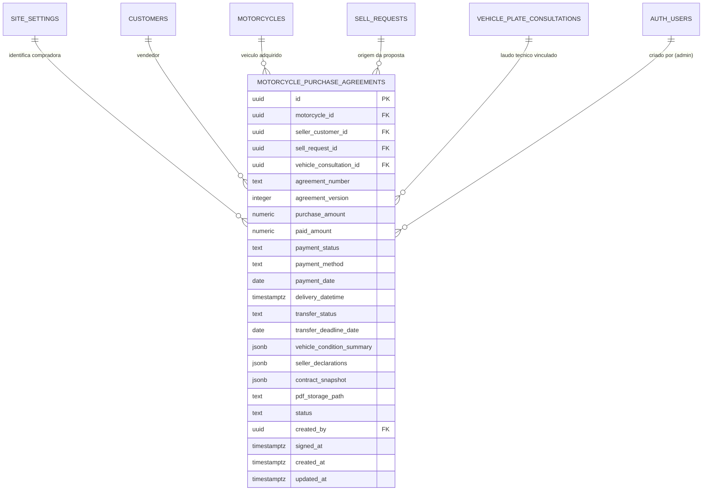

# Data Model & Storage Architecture: Contrato de Compra de Motocicleta

**Feature Directory**: `specs/019-contrato-compra-motocicleta`  
**Date**: 2026-08-31  
**Status**: Specification Phase (No Migrations Applied)  

---

## 1. Visão Geral das Entidades e Relacionamentos



---

## 2. Esquema da Tabela `motorcycle_purchase_agreements`

```sql
CREATE TABLE IF NOT EXISTS public.motorcycle_purchase_agreements (
  id uuid PRIMARY KEY DEFAULT gen_random_uuid(),
  
  -- Relacionamentos
  motorcycle_id uuid REFERENCES public.motorcycles(id) ON DELETE SET NULL,
  seller_customer_id uuid REFERENCES public.customers(id) ON DELETE RESTRICT,
  sell_request_id uuid REFERENCES public.sell_requests(id) ON DELETE SET NULL,
  vehicle_consultation_id uuid REFERENCES public.vehicle_plate_consultations(id) ON DELETE SET NULL,
  
  -- Identificação e Versão do Documento
  agreement_number text NOT NULL UNIQUE,
  agreement_version integer NOT NULL DEFAULT 1 CHECK (agreement_version >= 1),
  previous_agreement_id uuid REFERENCES public.motorcycle_purchase_agreements(id) ON DELETE SET NULL,
  replacement_reason text,

  -- Condições Comerciais e Financeiras
  purchase_amount numeric(12,2) NOT NULL CHECK (purchase_amount > 0),
  paid_amount numeric(12,2) NOT NULL DEFAULT 0.00 CHECK (paid_amount >= 0),
  payment_status text NOT NULL DEFAULT 'PAID_FULL' CHECK (payment_status IN ('PAID_FULL', 'PAID_PARTIAL', 'PENDING')),
  payment_method text NOT NULL DEFAULT 'PIX',
  payment_date date NOT NULL DEFAULT CURRENT_DATE,
  
  -- Entrega e Posse
  delivery_datetime timestamptz NOT NULL DEFAULT now(),
  delivery_km integer CHECK (delivery_km >= 0),
  keys_count integer NOT NULL DEFAULT 1 CHECK (keys_count >= 1),
  has_manual boolean NOT NULL DEFAULT false,
  has_spare_key boolean NOT NULL DEFAULT false,
  documents_delivered text[] DEFAULT '{}'::text[],
  accessories_delivered text[] DEFAULT '{}'::text[],
  apparent_condition_notes text,
  
  -- Transferência Documental
  transfer_status text NOT NULL DEFAULT 'PENDING' CHECK (transfer_status IN ('PENDING', 'IN_PROGRESS', 'COMPLETED', 'EXEMPT')),
  transfer_deadline_date date NOT NULL DEFAULT (CURRENT_DATE + INTERVAL '30 days'),
  transfer_notes text,

  -- Resumo de Declarações e Vistoria
  vehicle_condition_summary jsonb NOT NULL DEFAULT '{}'::jsonb,
  seller_declarations jsonb NOT NULL DEFAULT '{}'::jsonb,

  -- Snapshot Histórico Imutável (Fonte da Verdade para PDFs e Reimpressão)
  contract_snapshot jsonb NOT NULL,

  -- Armazenamento Seguro
  pdf_storage_path text NOT NULL,

  -- Metadados de Auditoria e Estado
  status text NOT NULL DEFAULT 'generated' CHECK (status IN ('draft', 'generated', 'signed', 'cancelled', 'superseded')),
  signed_at timestamptz,
  created_by uuid NOT NULL REFERENCES auth.users(id),
  created_at timestamptz NOT NULL DEFAULT now(),
  updated_at timestamptz NOT NULL DEFAULT now()
);

-- Índices para Performance e Auditoria
CREATE INDEX IF NOT EXISTS idx_purchase_agreements_motorcycle_id ON public.motorcycle_purchase_agreements(motorcycle_id);
CREATE INDEX IF NOT EXISTS idx_purchase_agreements_seller_id ON public.motorcycle_purchase_agreements(seller_customer_id);
CREATE INDEX IF NOT EXISTS idx_purchase_agreements_sell_request_id ON public.motorcycle_purchase_agreements(sell_request_id);
CREATE INDEX IF NOT EXISTS idx_purchase_agreements_status ON public.motorcycle_purchase_agreements(status);
CREATE INDEX IF NOT EXISTS idx_purchase_agreements_created_at ON public.motorcycle_purchase_agreements(created_at DESC);
```

---

## 3. Estrutura do Snapshot Histórico (`contract_snapshot jsonb`)

O snapshot imutável deve conter todos os dados necessários para gerar o PDF sem requisições adicionais:

```json
{
  "schema_version": "1.0",
  "generated_at": "2026-08-31T10:00:00.000Z",
  "generated_by": {
    "user_id": "9b1deb4d-3b7d-4bad-9bdd-2b0d7b3dcb6d",
    "name": "Administrador AF Motos",
    "email": "alex@afmotos.com"
  },
  "store": {
    "name": "AF Motos",
    "cnpj": "12.345.678/0001-90",
    "address": "Av. Principal, 1234, Centro - Carpina/PE",
    "city": "Carpina",
    "state": "PE",
    "phone": "(81) 98888-7777",
    "email": "contato@afmotos.com",
    "legal_representative": "Alexandre Ferreira"
  },
  "seller": {
    "customer_id": "e0b8e72f-5b18-4e89-9a29-28c0c1b48a12",
    "person_type": "PF",
    "full_name": "João da Silva",
    "document": "123.456.789-00",
    "rg": "1.234.567 SDS/PE",
    "phone": "(81) 99999-0000",
    "email": "joao.silva@email.com",
    "address": "Rua das Flores, 100, Bairro Novo, Carpina - PE, CEP 55815-000"
  },
  "motorcycle": {
    "id": "c1a2b3c4-d5e6-4f7a-8b9c-0d1e2f3a4b5c",
    "brand": "Honda",
    "model": "CB 300F Twister",
    "version": "ABS",
    "year_manufacture": 2024,
    "year_model": 2024,
    "color": "Vermelha",
    "fuel": "Flex",
    "engine_capacity": 300,
    "license_plate": "BRA2E19",
    "renavam": "01234567890",
    "chassi": "9C2NC4800KR000000",
    "engine_number": "NC48E0000000",
    "mileage_at_delivery": 4500,
    "fipe_code": "811192-1",
    "fipe_price": 23500.00,
    "fipe_reference": "agosto de 2026"
  },
  "commercial_terms": {
    "purchase_amount": 21000.00,
    "paid_amount": 21000.00,
    "payment_status": "PAID_FULL",
    "payment_status_label": "Pago Integralmente (Quitado)",
    "payment_method": "PIX",
    "payment_date": "2026-08-31",
    "is_full_discharge": true,
    "discharge_statement": "A AF Motos declara ter pago ao vendedor o valor total de R$ 21.000,00 pela aquisição da motocicleta, dando-se o vendedor por integralmente quitado quanto ao preço de compra, ressalvadas as responsabilidades do vendedor por débitos, restrições e infrações anteriores à entrega."
  },
  "delivery_and_possession": {
    "delivery_datetime": "2026-08-31T10:00:00-03:00",
    "delivery_location": "Sede da AF Motos - Carpina/PE",
    "delivery_km": 4500,
    "keys_count": 2,
    "has_manual": true,
    "has_spare_key": true,
    "documents_delivered": ["CRLV-e 2026", "ATPV-e Assinada"],
    "accessories_delivered": ["Capacete", "Suporte de Celular"],
    "apparent_condition_notes": "Veículo em excelente estado de conservação, sem avarias estruturais aparentes."
  },
  "transfer_and_compliance": {
    "transfer_status": "PENDING",
    "transfer_deadline_date": "2026-09-30",
    "transfer_deadline_days": 30,
    "legal_provisions": "Conforme Art. 123 e 134 do CTB e Resoluções CONTRAN aplicáveis."
  },
  "seller_declarations": {
    "legitimate_ownership_confirmed": true,
    "civil_capacity_confirmed": true,
    "no_undisclosed_debts_confirmed": true,
    "no_judicial_or_financial_restrictions_confirmed": true,
    "no_theft_sinister_auction_record_confirmed": true,
    "engine_and_chassis_integrity_confirmed": true,
    "cooperation_for_transfer_confirmed": true
  },
  "vehicle_lookup_reference": {
    "consultation_id": "7a8b9c0d-1e2f-3a4b-5c6d-7e8f9a0b1c2d",
    "consulted_at": "2026-08-30T14:22:00Z",
    "risk_level": "LOW",
    "summary_notes": "Histórico veicular consultado sem apontamento de roubo/furto ou restrição judicial."
  },
  "signatures": {
    "seller_name": "JOÃO DA SILVA",
    "seller_document": "123.456.789-00",
    "seller_role": "Vendedor / Proprietário",
    "buyer_name": "AF MOTOS",
    "buyer_document": "12.345.678/0001-90",
    "buyer_role": "Compradora / Representante Legal",
    "witness_1_name": "Testemunha 1",
    "witness_1_document": "CPF: ___________________",
    "witness_2_name": "Testemunha 2",
    "witness_2_document": "CPF: ___________________"
  }
}
```

---

## 4. Atualização da Tabela `motorcycles` (Campos Complementares Opcionais)

Para registrar a proveniência e custo da moto no estoque próprio:

```sql
ALTER TABLE public.motorcycles
  ADD COLUMN IF NOT EXISTS purchase_amount numeric(12,2) CHECK (purchase_amount >= 0),
  ADD COLUMN IF NOT EXISTS purchase_date date,
  ADD COLUMN IF NOT EXISTS seller_customer_id uuid REFERENCES public.customers(id) ON DELETE SET NULL,
  ADD COLUMN IF NOT EXISTS acquisition_agreement_id uuid REFERENCES public.motorcycle_purchase_agreements(id) ON DELETE SET NULL;

CREATE INDEX IF NOT EXISTS idx_motorcycles_seller_customer_id ON public.motorcycles(seller_customer_id);
```

---

## 5. Arquitetura de Armazenamento e Segurança (Supabase Storage & RLS)

### 5.1 Bucket e Caminho de Arquivos
- **Bucket**: `agreements` (privado, `public = false`).
- **Padrão de Path**:
  ```text
  agreements/purchases/{motorcycle_id}/{agreement_number}_{timestamp}.pdf
  ```
  Exemplo: `agreements/purchases/c1a2b3c4-d5e6-4f7a-8b9c-0d1e2f3a4b5c/AFM-COMPRA-20260831-A1B2_20260831100000.pdf`

### 5.2 Políticas RLS Propostas

```sql
ALTER TABLE public.motorcycle_purchase_agreements ENABLE ROW LEVEL SECURITY;

-- Somente administradores ativos têm permissão integral
CREATE POLICY "Admins have full access to purchase agreements"
ON public.motorcycle_purchase_agreements
FOR ALL
USING (public.is_admin())
WITH CHECK (public.is_admin());
```

---

## 6. Tipos TypeScript & Schemas Zod

```typescript
// types/purchase-agreement.ts
import { z } from 'zod';

export const purchaseAgreementPrepareSchema = z.object({
  motorcycle_id: z.string().uuid().optional().nullable(),
  sell_request_id: z.string().uuid().optional().nullable(),
  seller_customer_id: z.string().uuid().optional().nullable(),
  vehicle_consultation_id: z.string().uuid().optional().nullable(),
  
  // Vendedor
  seller_name: z.string().min(3, 'Nome do vendedor é obrigatório'),
  seller_document: z.string().min(11, 'CPF ou CNPJ inválido'),
  seller_rg: z.string().optional().nullable(),
  seller_phone: z.string().min(10, 'Telefone inválido'),
  seller_email: z.string().email('E-mail inválido').optional().nullable().or(z.literal('')),
  seller_address: z.string().min(5, 'Endereço é obrigatório'),
  
  // Moto
  brand: z.string().min(1, 'Marca é obrigatória'),
  model: z.string().min(1, 'Modelo é obrigatório'),
  version: z.string().optional().nullable(),
  year_manufacture: z.number().int().min(1900),
  year_model: z.number().int().min(1900),
  color: z.string().optional().nullable(),
  fuel: z.string().optional().nullable(),
  engine_capacity: z.number().optional().nullable(),
  license_plate: z.string().min(7, 'Placa é obrigatória').max(8),
  renavam: z.string().optional().nullable(),
  chassi: z.string().optional().nullable(),
  engine_number: z.string().optional().nullable(),
  mileage: z.number().int().min(0, 'Quilometragem inválida'),
  fipe_code: z.string().optional().nullable(),
  fipe_price: z.number().optional().nullable(),

  // Comercial & Pagamento
  purchase_amount: z.number().positive('Valor de aquisição deve ser maior que zero'),
  paid_amount: z.number().min(0),
  payment_status: z.enum(['PAID_FULL', 'PAID_PARTIAL', 'PENDING']),
  payment_method: z.string().min(1, 'Forma de pagamento é obrigatória'),
  payment_date: z.string().min(10, 'Data de pagamento é obrigatória'),
  is_full_discharge_confirmed: z.boolean(),

  // Entrega e Vistoria
  delivery_datetime: z.string().min(10, 'Data de entrega é obrigatória'),
  delivery_km: z.number().int().min(0),
  keys_count: z.number().int().min(1),
  has_manual: z.boolean().default(false),
  has_spare_key: z.boolean().default(false),
  documents_delivered: z.array(z.string()).default([]),
  accessories_delivered: z.array(z.string()).default([]),
  apparent_condition_notes: z.string().optional().nullable(),

  // Transferência
  transfer_deadline_date: z.string().min(10),
  transfer_notes: z.string().optional().nullable(),

  // Confirmações Obrigatórias
  confirmed_data_accurate: z.literal(true, {
    errorMap: () => ({ message: 'É obrigatório confirmar que os dados foram conferidos' }),
  }),
  confirmed_payment_realized: z.literal(true, {
    errorMap: () => ({ message: 'É obrigatório confirmar o pagamento do valor acordado' }),
  }),
  confirmed_vehicle_received: z.literal(true, {
    errorMap: () => ({ message: 'É obrigatório confirmar a entrega/recebimento da motocicleta' }),
  }),
});

export type PurchaseAgreementPrepareInput = z.infer<typeof purchaseAgreementPrepareSchema>;
```
