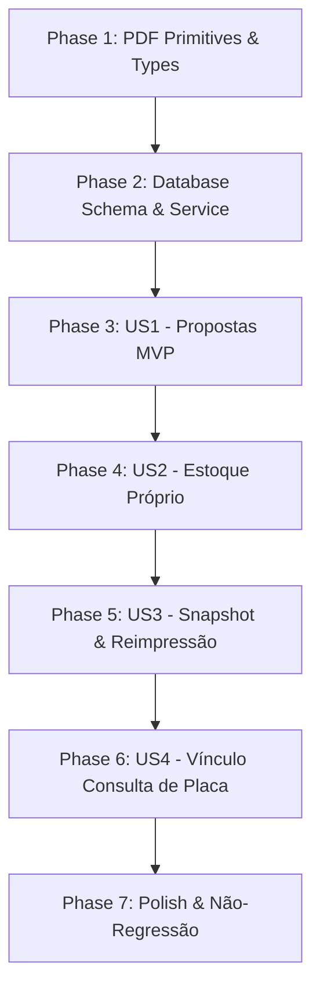

# Tasks: Contrato de Compra de Motocicleta pela AF Motos

**Input**: Design documents from `specs/019-contrato-compra-motocicleta/`  
**Prerequisites**: [plan.md](./plan.md), [spec.md](./spec.md), [research.md](./research.md), [data-model.md](./data-model.md), [contracts/](./contracts/)  

## Format: `- [ ] [ID] [P?] [Story?] Description with file path`

- **[P]**: Tarefa paralelística (arquivos independentes, sem bloqueios de tarefas anteriores)
- **[Story]**: Mapeamento para a User Story de `spec.md` (`[US1]`, `[US2]`, `[US3]`, `[US4]`)
- Todos os caminhos de arquivos são explícitos e referenciados a partir da raiz do repositório.

---

## Phase 1: Setup & Primitivas Compartilhadas de PDF (Foundational)

**Goal**: Criar a fundação modular de componentes `@react-pdf/renderer` e tipos TypeScript, garantindo **100% de paridade visual** com o contrato de intermediação existente.

- [ ] T001 [P] Criar as definições de tipo TypeScript de domínio e snapshot em `types/purchase-agreement.ts`
- [ ] T002 [P] Atualizar a tipagem global do Supabase em `types/database.ts` para incluir a tabela `motorcycle_purchase_agreements`
- [ ] T003 [P] Criar o componente modular de cabeçalho com logotipo e dados da loja em `lib/pdf/contract-company-header.tsx`
- [ ] T004 [P] Criar o componente de faixa de seção dourada `#d97706` em `lib/pdf/contract-section-header.tsx`
- [ ] T005 [P] Criar o componente de grid de cards informativos `#f8fafc` em `lib/pdf/contract-info-grid.tsx`
- [ ] T006 [P] Criar o componente de assinaturas com testemunhas instrumentárias em `lib/pdf/contract-signatures.tsx`
- [ ] T007 [P] Criar o componente de rodapé institucional com data e código de autenticidade em `lib/pdf/contract-footer.tsx`
- [ ] T008 [P] Criar os formatadores de dados de contrato e cláusulas em `lib/purchase-agreements/formatters.ts`

---

## Phase 2: Banco de Dados & Infraestrutura Supabase (Blocking Prerequisites)

**Goal**: Criar o esquema de dados relacional, constraints de integridade, snapshot JSONB e políticas de segurança RLS no Supabase.

- [ ] T009 Criar o script de migração incremental `supabase/migrations/20260831000000_create_motorcycle_purchase_agreements.sql` com índices e RLS
- [ ] T010 [P] Criar os schemas Zod de validação de payload em `lib/purchase-agreements/schema.ts`
- [ ] T011 [P] Criar as queries de consulta de contratos de compra em `lib/queries/purchase-agreements.ts`
- [ ] T012 Implementar o template principal do PDF de Compra em `lib/pdf/purchase-agreement.tsx` (`MotorcyclePurchaseAgreementPDF`) reutilizando `MercosulPlateBadge`
- [ ] T013 Implementar o service orquestrador de snapshot, PDF e Storage em `lib/purchase-agreements/service.ts`

**Checkpoint**: Fundação pronta — serviços e templates PDF operacionais no backend.

---

## Phase 3: User Story 1 — Geração de Contrato a partir da Proposta (Priority: P1) 🎯 MVP

**Goal**: Permitir que o administrador gere o Contrato de Compra de Motocicleta a partir do drawer de uma proposta de venda direta (`/admin/propostas`), gravando o snapshot e gerando o PDF.

**Independent Test**: Acessar uma proposta do tipo venda direta no painel administrativo, clicar em "Gerar Contrato de Compra", preencher/confirmar os dados comerciais e verificar a criação do registro com PDF assinado gerado.

- [ ] T014 [US1] Criar o Route Handler `POST /api/admin/purchase-agreements/generate` em `app/api/admin/purchase-agreements/generate/route.ts` com proteção de admin e rate-limiting
- [ ] T015 [US1] Criar a Server Action de pré-preenchimento e agregação de dados da proposta em `lib/actions/purchase-agreements.ts`
- [ ] T016 [US1] Criar o componente de modal/drawer de preparação de compra em `components/admin/purchase-agreement-modal.tsx` com 6 etapas de conferência
- [ ] T017 [US1] Integrar o botão e ação "Gerar Contrato de Compra" no drawer de propostas em `components/admin/proposal-detail-drawer.tsx`
- [ ] T018 [US1] Adicionar testes unitários para validação de schema Zod e cálculo de quitação em `tests/unit/purchase-agreements-validation.test.ts`

**Checkpoint**: MVP concluído — administradores conseguem emitir contratos de compra a partir de propostas de clientes.

---

## Phase 4: User Story 2 — Geração de Contrato para Moto de Estoque Próprio (Priority: P1)

**Goal**: Permitir gerar o contrato de aquisição diretamente na página de uma moto de estoque próprio (`ownership_type = 'OWNED'`), vinculando o vendedor cadastrado no CRM de Clientes.

**Independent Test**: Acessar `/admin/motos/[id]` de uma moto própria, acionar "Contrato de Aquisição", selecionar um cliente vendedor e emitir o contrato com sucesso.

- [ ] T019 [US2] Criar a Server Action para vincular contrato emitido à motocicleta em `lib/actions/motorcycles.ts`
- [ ] T020 [US2] Integrar o botão "Contrato de Aquisição" e o modal de preparação na tela de visualização/edição de motos em `app/admin/(protected)/motos/[id]/page.tsx`
- [ ] T021 [US2] Exibir o status do contrato de compra e link de download no card de procedência da moto em `app/admin/(protected)/motos/[id]/page.tsx`
- [ ] T022 [US2] Adicionar testes de integração para o fluxo de compra de moto de estoque em `tests/integration/purchase-agreements-inventory.test.ts`

**Checkpoint**: User Stories 1 e 2 operacionais com fluxos integrados de propostas e estoque.

---

## Phase 5: User Story 3 — Download e Reimpressão Histórica sem Alterações (Priority: P1)

**Goal**: Garantir que contratos emitidos possam ser baixados, visualizados e reimpressos a qualquer momento a partir do snapshot imutável, sem alteração de conteúdo ou duplicação.

**Independent Test**: Acessar o endpoint de PDF de um contrato gerado, verificar a entrega da signed URL correta e validar que edições posteriores no cadastro do cliente/moto não afetam o PDF retornado.

- [ ] T023 [US3] Criar o Route Handler `GET /api/admin/purchase-agreements/[id]/pdf` em `app/api/admin/purchase-agreements/[id]/pdf/route.ts` para servir signed URLs autenticadas
- [ ] T024 [US3] Implementar o helper de regeneração sob demanda a partir do `contract_snapshot` em `lib/purchase-agreements/service.ts`
- [ ] T025 [US3] Integrar a listagem de contratos de compra emitidos no perfil do cliente em `app/admin/(protected)/clientes/[id]/page.tsx`
- [ ] T026 [US3] Adicionar testes de imutabilidade garantindo que alterações cadastrais não alteram o snapshot em `tests/integration/purchase-agreements-snapshot.test.ts`

**Checkpoint**: Fidelidade histórica e auditoria fiscal garantidas.

---

## Phase 6: User Story 4 — Vínculo com Histórico de Consulta de Placa (Priority: P2)

**Goal**: Referenciar no snapshot e no contrato o código interno e nível de risco do laudo veicular oficial realizado na Spec 018.

**Independent Test**: Emitir um contrato de compra para uma moto que possua consulta em `vehicle_plate_consultations` e verificar a inclusão do resumo de vistoria veicular no PDF gerado.

- [ ] T027 [US4] Implementar o adaptador de extração de dados da consulta de placa em `lib/purchase-agreements/adapters/vehicle-lookup-adapter.ts`
- [ ] T028 [US4] Integrar a seleção de consulta veicular existente no modal de preparação em `components/admin/purchase-agreement-modal.tsx`
- [ ] T029 [US4] Adicionar nota de referência discreta da consulta veicular no template PDF em `lib/pdf/purchase-agreement.tsx`

---

## Phase 7: Polish, Não-Regressão & Validação Final

**Goal**: Executar validação visual de ponta a ponta, testes de segurança RLS, auditoria de não-regressão e conformidade técnica.

- [ ] T030 Executar teste de não-regressão visual no template de intermediação existente `lib/agreements/pdf.tsx`
- [ ] T031 [P] Validar segurança RLS e bloqueio de usuários anônimos/não-admin no endpoint de geração e Storage
- [ ] T032 [P] Executar testes com múltiplos cenários de dados: placa antiga vs Mercosul, loja sem CNPJ, vendedor PJ vs PF, pagamento integral vs parcial
- [ ] T033 Executar `npm run build`, `npm run lint` e validação estrita de tipos TypeScript

---

## Dependency Graph & Implementation Order

---

## Parallel Execution Opportunities

- **Fase 1 (Primitivas PDF)**: As tarefas `T001` a `T008` criam arquivos independentes e podem ser executadas em paralelo.
- **Fase 2 (Infraestrutura)**: As tarefas `T010` (Zod schemas), `T011` (queries) e `T012` (template PDF) podem ser desenvolvidas em paralelo após a migração `T009`.
- **Fase 7 (Testes & Polish)**: `T031` (segurança RLS) e `T032` (cenários de dados) podem rodar em paralelo.

---

## Suggested MVP Scope

- **Escopo do MVP**: **Fase 1 + Fase 2 + Fase 3 (User Story 1)**.
- Com esse escopo inicial, a AF Motos já consegue emitir contratos de compra com quitação integral a partir da central de propostas com 100% de paridade visual e snapshot imutável.
