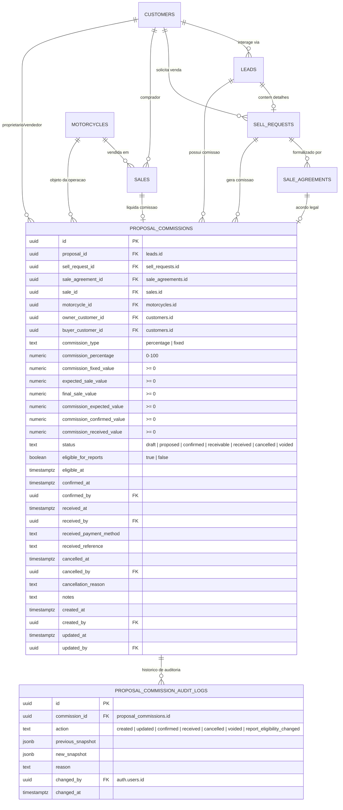

# Data Model: Registro e Controle de Comissões por Proposta

**Feature**: `022-registro-comissoes-propostas`  
**Date**: 2026-08-31

---

## 1. Diagrama de Entidades e Relacionamentos (ERD)



---

## 2. Estrutura das Tabelas SQL

### 2.1 Tabela `public.proposal_commissions`

```sql
CREATE TABLE IF NOT EXISTS public.proposal_commissions (
  id uuid PRIMARY KEY DEFAULT gen_random_uuid(),

  -- Chaves estrangeiras com entidades centrais
  proposal_id uuid NOT NULL REFERENCES public.leads(id) ON DELETE CASCADE,
  sell_request_id uuid REFERENCES public.sell_requests(id) ON DELETE SET NULL,
  sale_agreement_id uuid REFERENCES public.sale_agreements(id) ON DELETE SET NULL,
  sale_id uuid REFERENCES public.sales(id) ON DELETE SET NULL,
  motorcycle_id uuid REFERENCES public.motorcycles(id) ON DELETE SET NULL,

  -- Clientes CRM envolvidos
  owner_customer_id uuid REFERENCES public.customers(id) ON DELETE SET NULL,
  buyer_customer_id uuid REFERENCES public.customers(id) ON DELETE SET NULL,

  -- Modalidade e Parâmetros de Comissão
  commission_type text NOT NULL DEFAULT 'percentage' CHECK (commission_type IN ('percentage', 'fixed')),
  commission_percentage numeric(5,2) NULL CHECK (commission_percentage IS NULL OR (commission_percentage >= 0 AND commission_percentage <= 100)),
  commission_fixed_value numeric(12,2) NULL CHECK (commission_fixed_value IS NULL OR commission_fixed_value >= 0),

  -- Valores de Referência da Moto
  expected_sale_value numeric(12,2) NULL CHECK (expected_sale_value IS NULL OR expected_sale_value >= 0),
  final_sale_value numeric(12,2) NULL CHECK (final_sale_value IS NULL OR final_sale_value >= 0),

  -- Valores Financeiros da Comissão
  commission_expected_value numeric(12,2) NOT NULL DEFAULT 0 CHECK (commission_expected_value >= 0),
  commission_confirmed_value numeric(12,2) NULL CHECK (commission_confirmed_value IS NULL OR commission_confirmed_value >= 0),
  commission_received_value numeric(12,2) NULL CHECK (commission_received_value IS NULL OR commission_received_value >= 0),

  -- Máquina de Estados
  status text NOT NULL DEFAULT 'draft' CHECK (
    status IN ('draft', 'proposed', 'confirmed', 'receivable', 'received', 'cancelled', 'voided')
  ),

  -- Elegibilidade para Relatórios
  eligible_for_reports boolean NOT NULL DEFAULT false,
  eligible_at timestamptz NULL,

  -- Confirmação (Competência)
  confirmed_at timestamptz NULL,
  confirmed_by uuid NULL REFERENCES auth.users(id) ON DELETE SET NULL,

  -- Recebimento / Baixa de Caixa
  received_at timestamptz NULL,
  received_by uuid NULL REFERENCES auth.users(id) ON DELETE SET NULL,
  received_payment_method text NULL,
  received_reference text NULL,

  -- Cancelamento e Anulação
  cancelled_at timestamptz NULL,
  cancelled_by uuid NULL REFERENCES auth.users(id) ON DELETE SET NULL,
  cancellation_reason text NULL,

  -- Observações e Metadados
  notes text NULL,
  created_at timestamptz NOT NULL DEFAULT now(),
  created_by uuid NULL REFERENCES auth.users(id) ON DELETE SET NULL,
  updated_at timestamptz NOT NULL DEFAULT now(),
  updated_by uuid NULL REFERENCES auth.users(id) ON DELETE SET NULL
);
```

### 2.2 Tabela `public.proposal_commission_audit_logs`

```sql
CREATE TABLE IF NOT EXISTS public.proposal_commission_audit_logs (
  id uuid PRIMARY KEY DEFAULT gen_random_uuid(),
  commission_id uuid NOT NULL REFERENCES public.proposal_commissions(id) ON DELETE CASCADE,
  action text NOT NULL CHECK (
    action IN (
      'created',
      'updated',
      'confirmed',
      'received',
      'cancelled',
      'voided',
      'reopened',
      'report_eligibility_changed'
    )
  ),
  previous_snapshot jsonb NULL,
  new_snapshot jsonb NOT NULL,
  reason text NULL,
  changed_by uuid NULL REFERENCES auth.users(id) ON DELETE SET NULL,
  changed_at timestamptz NOT NULL DEFAULT now()
);
```

---

## 3. Índices Estratégicos de Performance

```sql
CREATE INDEX IF NOT EXISTS idx_prop_comm_proposal_id ON public.proposal_commissions(proposal_id);
CREATE INDEX IF NOT EXISTS idx_prop_comm_sell_request_id ON public.proposal_commissions(sell_request_id) WHERE sell_request_id IS NOT NULL;
CREATE INDEX IF NOT EXISTS idx_prop_comm_sale_agreement_id ON public.proposal_commissions(sale_agreement_id) WHERE sale_agreement_id IS NOT NULL;
CREATE INDEX IF NOT EXISTS idx_prop_comm_sale_id ON public.proposal_commissions(sale_id) WHERE sale_id IS NOT NULL;
CREATE INDEX IF NOT EXISTS idx_prop_comm_motorcycle_id ON public.proposal_commissions(motorcycle_id) WHERE motorcycle_id IS NOT NULL;
CREATE INDEX IF NOT EXISTS idx_prop_comm_status ON public.proposal_commissions(status);
CREATE INDEX IF NOT EXISTS idx_prop_comm_reports_eligible ON public.proposal_commissions(eligible_for_reports, confirmed_at, received_at) WHERE eligible_for_reports = true;
CREATE INDEX IF NOT EXISTS idx_prop_comm_created_at ON public.proposal_commissions(created_at DESC);

CREATE INDEX IF NOT EXISTS idx_prop_comm_audit_commission_id ON public.proposal_commission_audit_logs(commission_id, changed_at DESC);
```

---

## 4. Políticas de Segurança (Row Level Security - RLS)

```sql
ALTER TABLE public.proposal_commissions ENABLE ROW LEVEL SECURITY;
ALTER TABLE public.proposal_commission_audit_logs ENABLE ROW LEVEL SECURITY;

-- Apenas administradores autenticados têm acesso total
CREATE POLICY "Admins full access on proposal_commissions"
  ON public.proposal_commissions
  FOR ALL
  TO authenticated
  USING (public.is_admin())
  WITH CHECK (public.is_admin());

CREATE POLICY "Admins full access on proposal_commission_audit_logs"
  ON public.proposal_commission_audit_logs
  FOR ALL
  TO authenticated
  USING (public.is_admin())
  WITH CHECK (public.is_admin());
```

---

## 5. Estratégia de Migração de Dados Legados

1. **Backfill Inicial**: Executar script para criar registros em `proposal_commissions` com base nos registros históricos de `sale_agreements` existentes.
2. **Associação de Vendas Passadas**: Onde `sale_agreements.sale_id` estiver preenchido e a venda correspondente for `PAID`, a comissão é populada como `confirmed` ou `received` com `eligible_for_reports = true`.
3. **Propostas sem Acordo**: Propostas antigas sem comissão registrada permanecerão sem registro até que o administrador cadastre uma comissão manualmente.
