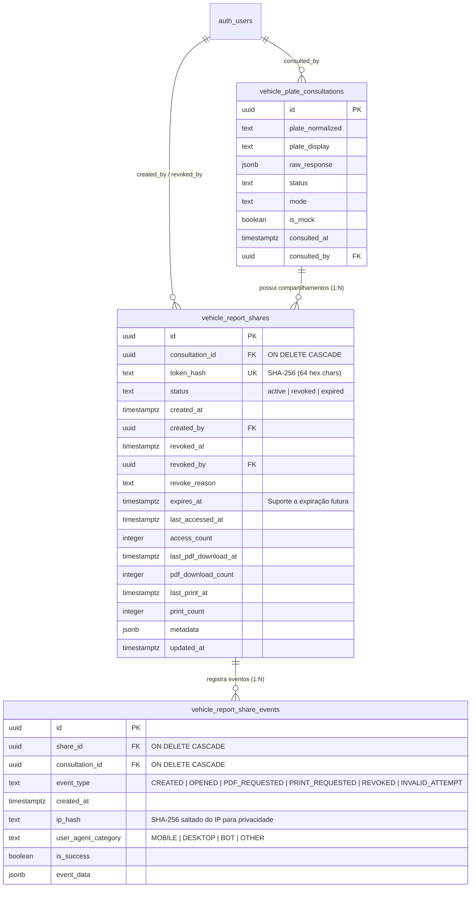

# Data Model & Security Schema: Compartilhamento Público de Laudos Veiculares

**Feature Directory**: `specs/023-compartilhamento-publico-laudo-veicular`  
**Created**: 2026-09-01  
**Status**: Approved Data Architecture  

---

## 1. Diagrama Entidade-Relacionamento (ERD)



---

## 2. Definição da Tabela `public.vehicle_report_shares`

```sql
-- Migration Proposta: create_vehicle_report_shares.sql

CREATE TABLE IF NOT EXISTS public.vehicle_report_shares (
  id uuid PRIMARY KEY DEFAULT gen_random_uuid(),

  -- Vínculo com a Consulta Veicular
  consultation_id uuid NOT NULL 
    REFERENCES public.vehicle_plate_consultations(id) 
    ON DELETE CASCADE,

  -- Token de Acesso Seguro (Hash Criptográfico SHA-256)
  token_hash text NOT NULL UNIQUE,

  -- Status e Ciclo de Vida do Compartilhamento
  status text NOT NULL DEFAULT 'active' 
    CHECK (status IN ('active', 'revoked', 'expired', 'disabled')),

  -- Auditoria de Criação
  created_at timestamptz NOT NULL DEFAULT now(),
  created_by uuid NOT NULL REFERENCES auth.users(id) ON DELETE RESTRICT,

  -- Auditoria de Revogação
  revoked_at timestamptz NULL,
  revoked_by uuid NULL REFERENCES auth.users(id) ON DELETE SET NULL,
  revoke_reason text NULL,

  -- Suporte à Expiração Futura (Opcional no MVP, padrão NULL = sem expiração)
  expires_at timestamptz NULL,

  -- Métricas Agregadas de Consumo Público
  last_accessed_at timestamptz NULL,
  access_count integer NOT NULL DEFAULT 0,

  last_pdf_download_at timestamptz NULL,
  pdf_download_count integer NOT NULL DEFAULT 0,

  last_print_at timestamptz NULL,
  print_count integer NOT NULL DEFAULT 0,

  -- Metadados Extensíveis (Sem dados pessoais ou tokens em texto puro)
  metadata jsonb NULL DEFAULT '{}'::jsonb,

  updated_at timestamptz NOT NULL DEFAULT now()
);

-- Comentários da Tabela e Colunas
COMMENT ON TABLE public.vehicle_report_shares IS 'Links públicos de compartilhamento de laudos veiculares protegidos por token hash de alta entropia.';
COMMENT ON COLUMN public.vehicle_report_shares.token_hash IS 'Hash SHA-256 (64 caracteres hexadecimais) do token de compartilhamento. O token puro nunca é persistido.';
COMMENT ON COLUMN public.vehicle_report_shares.status IS 'Estado atual do link: active (válido), revoked (cancelado pelo admin), expired (expirado).';
COMMENT ON COLUMN public.vehicle_report_shares.access_count IS 'Total de visualizações da página pública pelo cliente.';
COMMENT ON COLUMN public.vehicle_report_shares.pdf_download_count IS 'Total de downloads do laudo em formato PDF.';

-- Trigger para updated_at automático
DROP TRIGGER IF EXISTS update_vehicle_report_shares_updated_at ON public.vehicle_report_shares;
CREATE TRIGGER update_vehicle_report_shares_updated_at
  BEFORE UPDATE ON public.vehicle_report_shares
  FOR EACH ROW
  EXECUTE PROCEDURE update_updated_at_column();
```

---

## 3. Índices Estratégicos de Alta Performance

```sql
-- Índice Principal de Busca por Hash do Token (Tempo O(1))
CREATE UNIQUE INDEX IF NOT EXISTS idx_vrs_token_hash 
  ON public.vehicle_report_shares (token_hash);

-- Índice para Listagem de Compartilhamentos por Consulta no Admin
CREATE INDEX IF NOT EXISTS idx_vrs_consultation_id 
  ON public.vehicle_report_shares (consultation_id);

-- Índice para Filtro por Status e Data de Criação
CREATE INDEX IF NOT EXISTS idx_vrs_status_created_at 
  ON public.vehicle_report_shares (status, created_at DESC);

-- Índice Único Parcial: Garante no máximo 1 link com status 'active' por consulta veicular no MVP
CREATE UNIQUE INDEX IF NOT EXISTS idx_vrs_one_active_per_consultation 
  ON public.vehicle_report_shares (consultation_id) 
  WHERE (status = 'active');
```

---

## 4. Tabela de Eventos de Auditoria `public.vehicle_report_share_events`

```sql
CREATE TABLE IF NOT EXISTS public.vehicle_report_share_events (
  id uuid PRIMARY KEY DEFAULT gen_random_uuid(),
  share_id uuid NULL 
    REFERENCES public.vehicle_report_shares(id) 
    ON DELETE CASCADE,
  consultation_id uuid NOT NULL 
    REFERENCES public.vehicle_plate_consultations(id) 
    ON DELETE CASCADE,

  event_type text NOT NULL CHECK (
    event_type IN (
      'SHARE_CREATED',
      'SHARE_OPENED',
      'SHARE_PDF_REQUESTED',
      'SHARE_PRINT_REQUESTED',
      'SHARE_REVOKED',
      'SHARE_INVALID_ATTEMPT'
    )
  ),

  created_at timestamptz NOT NULL DEFAULT now(),
  ip_hash text NULL,                               -- SHA-256(ip + server_salt) para conformidade LGPD
  user_agent_category text NULL DEFAULT 'OTHER',  -- 'MOBILE' | 'DESKTOP' | 'BOT' | 'OTHER'
  is_success boolean NOT NULL DEFAULT true,
  event_data jsonb NULL DEFAULT '{}'::jsonb
);

CREATE INDEX IF NOT EXISTS idx_vrse_share_id 
  ON public.vehicle_report_share_events (share_id, created_at DESC);

CREATE INDEX IF NOT EXISTS idx_vrse_consultation_id 
  ON public.vehicle_report_share_events (consultation_id, created_at DESC);
```

---

## 5. Políticas de Row Level Security (RLS)

O acesso público às tabelas `vehicle_report_shares` e `vehicle_plate_consultations` **NÃO É EXPOSTO DIRETAMENTE** via Supabase Client no navegador. O acesso público é mediado exclusivamente por **Server Components e Route Handlers** no Next.js (utilizando o client autenticado do servidor com validação do hash).

```sql
-- Habilitar RLS em ambas as tabelas
ALTER TABLE public.vehicle_report_shares ENABLE ROW LEVEL SECURITY;
ALTER TABLE public.vehicle_report_share_events ENABLE ROW LEVEL SECURITY;

-- Políticas de RLS para Administradores Autenticados
DROP POLICY IF EXISTS "Admins can view report shares" ON public.vehicle_report_shares;
CREATE POLICY "Admins can view report shares"
  ON public.vehicle_report_shares
  FOR SELECT
  TO authenticated
  USING (public.is_admin());

DROP POLICY IF EXISTS "Admins can insert report shares" ON public.vehicle_report_shares;
CREATE POLICY "Admins can insert report shares"
  ON public.vehicle_report_shares
  FOR INSERT
  TO authenticated
  WITH CHECK (
    public.is_admin() 
    AND created_by = auth.uid()
  );

DROP POLICY IF EXISTS "Admins can update report shares" ON public.vehicle_report_shares;
CREATE POLICY "Admins can update report shares"
  ON public.vehicle_report_shares
  FOR UPDATE
  TO authenticated
  USING (public.is_admin())
  WITH CHECK (public.is_admin());

DROP POLICY IF EXISTS "Admins can delete report shares" ON public.vehicle_report_shares;
CREATE POLICY "Admins can delete report shares"
  ON public.vehicle_report_shares
  FOR DELETE
  TO authenticated
  USING (public.is_admin());

-- Políticas para vehicle_report_share_events
DROP POLICY IF EXISTS "Admins can view share events" ON public.vehicle_report_share_events;
CREATE POLICY "Admins can view share events"
  ON public.vehicle_report_share_events
  FOR SELECT
  TO authenticated
  USING (public.is_admin());

DROP POLICY IF EXISTS "System can insert share events" ON public.vehicle_report_share_events;
CREATE POLICY "System can insert share events"
  ON public.vehicle_report_share_events
  FOR INSERT
  TO authenticated
  WITH CHECK (true);
```

---

## 6. Modelos de Tipagem TypeScript

```typescript
// types/vehicle-share.ts

export type VehicleReportShareStatus = 'active' | 'revoked' | 'expired' | 'disabled';

export interface VehicleReportShareRecord {
  id: string;
  consultation_id: string;
  token_hash: string;
  status: VehicleReportShareStatus;
  created_at: string;
  created_by: string;
  revoked_at: string | null;
  revoked_by: string | null;
  revoke_reason: string | null;
  expires_at: string | null;
  last_accessed_at: string | null;
  access_count: number;
  last_pdf_download_at: string | null;
  pdf_download_count: number;
  last_print_at: string | null;
  print_count: number;
  metadata: Record<string, unknown> | null;
  updated_at: string;
}

export interface ShareCreationResult {
  share_id: string;
  consultation_id: string;
  share_token: string;      // Retornado UMA ÚNICA VEZ ao admin
  share_url: string;        // Ex: https://afmotos.com.br/laudos/veicular/vt_7d9Kx...
  created_at: string;
}

export interface ShareRevocationParams {
  share_id: string;
  reason?: string;
}
```
