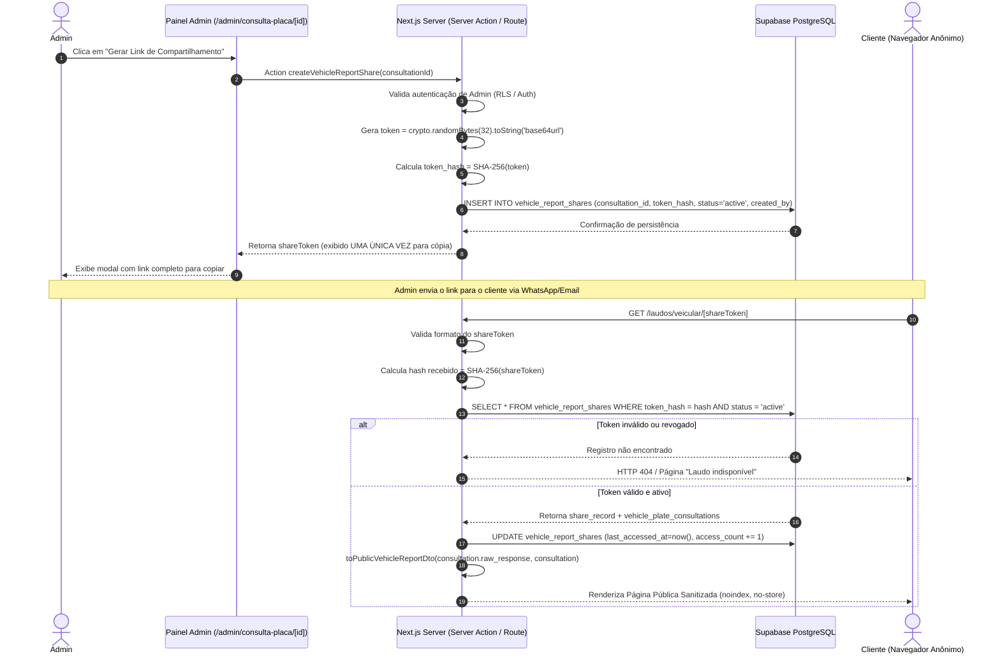

# Feature Specification: Compartilhamento Público Seguro de Laudos Veiculares por Link

**Feature Directory**: `specs/023-compartilhamento-publico-laudo-veicular`  
**Created**: 2026-09-01  
**Status**: Draft  
**Input**: Compartilhamento público seguro e auditável de laudos de histórico veicular via link com token de alta entropia, sem login para o cliente, com página responsiva institucional, PDF sob demanda a custo zero, mascaramento de dados (LGPD), proteção contra enumeração, revogação instantânea e não indexação em motores de busca.

---

## 1. Contexto e Problema de Negócio

A **AF Motos** disponibiliza a consulta e emissão de laudos de histórico veicular por placa (módulo administrativo `/admin/consulta-placa`), integrando dados oficiais da API Brasil com persistência de snapshot integral em JSONB na tabela `vehicle_plate_consultations`.

Quando um cliente compra uma motocicleta ou contrata o serviço de perícia/histórico veicular, a loja necessita **compartilhar o laudo com o cliente de forma ágil, profissional e segura**.

### Desafios e Riscos Atuais:
1. **Fricção de Acesso**: Clientes finais não possuem nem devem possuir credenciais de acesso ao painel administrativo Supabase da loja.
2. **Risco de Enumeração e Vazamento de Dados**: Se links utilizarem IDs sequenciais (`/laudo/123`), UUIDs diretos, placas na URL ou hashes previsíveis, terceiros mal-intencionados poderiam varrer outros laudos e dados de veículos de outros clientes.
3. **Privacidade e LGPD**: O snapshot bruto da API externa contém dados sensíveis de proprietários anteriores (CPF/CNPJ, endereços), além de chassi/RENAVAM completos e custos/saldos internos pagos pela AF Motos. Esses dados não podem ser expostos ao cliente final.
4. **Custo Duplicado**: Qualquer visualização, download de PDF ou reabertura do link pelo cliente **NÃO pode gerar nova consulta tarifada** na API Brasil. Deve ser reutilizado 100% o snapshot JSONB já gravado.
5. **Necessidade de Controle e Revogação**: Se um link for compartilhado erroneamente ou a negociação for encerrada, o gestor da AF Motos deve conseguir revogar o link instantaneamente com motivo registrado, interrompendo qualquer acesso futuro.
6. **Vazamento por Crawlers e Logs**: O link não pode ser indexado pelo Google, não pode constar em sitemaps e não deve registrar tokens em logs de auditoria ou provedores analíticos.

---

## 2. Objetivos e Não Objetivos

### Objetivos Principais
- Permitir que o administrador gere links públicos seguros diretamente da tela de detalhe do laudo (`/admin/consulta-placa/[id]`).
- Prover uma URL pública de alta entropia (`/laudos/veicular/[shareToken]`) com token de no mínimo 256 bits gerado criptograficamente no servidor (`base64url`).
- Armazenar **somente o hash criptográfico (SHA-256)** do token no banco de dados (`token_hash`), nunca persistindo o token puro.
- Entregar uma página pública moderna, mobile-first e institucional da AF Motos, com design system consistente, badges de procedência, visualização de placa Mercosul e seções estruturadas.
- Permitir que o cliente baixe o PDF e imprima o documento diretamente pelo link público, sem necessidade de login.
- Gerar o PDF público sob demanda no servidor (`renderToBuffer` com `@react-pdf/renderer`) a partir do DTO sanitizado, com custo zero e sem expor storage buckets privados publicamente.
- Sanitizar e mascarar todos os dados sensíveis (LGPD: CPF/CNPJ de proprietários, chassi parcial, RENAVAM parcial, motor parcial, remoção de saldo/custo de API e JSON bruto).
- Implementar revogação instantânea com trilha de auditoria (data, hora, admin e motivo).
- Configurar cabeçalhos rígidos anti-indexação e de privacidade (`noindex, nofollow, noarchive`, `Cache-Control: private, no-store`, `Referrer-Policy: no-referrer`).
- Bloquear tentativas de enumeração com rate limiting por IP e token.

### Não Objetivos (Fora de Escopo)
- Permitir que usuários anônimos solicitem novas consultas veiculares pagas a partir da página pública (a compra/consulta permanece no fluxo comercial/admin).
- Envio automatizado de SMS/WhatsApp por gateways pagos nesta etapa (o admin copia o link seguro e envia pelo WhatsApp/e-mail manualmente).
- Assinatura digital ICP-Brasil com carimbo de tempo governamental.
- Exposição de buckets privados do Supabase Storage como públicos.
- Expiração automática cronológica mandatória no MVP (os links permanecem ativos até revogação explícita pelo admin; campos de suporte a expiração futura serão previstos no schema).

---

## 3. Histórias de Usuário & Cenários de Teste

### User Story 1 — Geração de Link Seguro pelo Administrador (Prioridade: P1)
> **Como** administrador da AF Motos,  
> **Quero** gerar um link público seguro na tela de detalhe de uma consulta veicular concluída com sucesso,  
> **Para** enviar o laudo para o cliente visualizar sem que ele precise de cadastro ou login.

**Cenários de Aceite**:
1. **Given** uma consulta veicular com status `COMPLETED`,  
   **When** o admin clica no botão "Gerar Link de Compartilhamento",  
   **Then** o servidor gera um token aleatório de 256 bits, grava o `token_hash` na tabela `vehicle_report_shares` e exibe a URL completa com botão de copiar em um modal de confirmação.
2. **Given** uma consulta com status `FAILED` ou `PENDING_CONFIRMATION`,  
   **When** o admin visualiza a página,  
   **Then** a opção de gerar link público fica desabilitada com aviso explicativo.
3. **Given** uma consulta que já possui um link ativo,  
   **When** o admin solicita um novo link,  
   **Then** o sistema alerta que o link anterior será revogado e requer confirmação antes de gerar o novo.

---

### User Story 2 — Acesso Público sem Login pelo Cliente (Prioridade: P1)
> **Como** cliente comprador ou interessado,  
> **Quero** abrir o link recebido no meu celular ou computador sem login ou senha,  
> **Para** conferir a procedência, débitos, restrições e histórico da moto que pretendo comprar.

**Cenários de Aceite**:
1. **Given** um link válido e ativo no formato `/laudos/veicular/[shareToken]`,  
   **When** o cliente abre a URL em uma janela anônima ou celular,  
   **Then** o laudo é renderizado instantaneamente com identidade visual da AF Motos, sem solicitar autenticação.
2. **Given** um cliente que abre a página repetidas vezes ao longo dos dias,  
   **When** o link permanecer com status `active`,  
   **Then** ele acessa normalmente e o contador de acessos do registro é incrementado sem custo adicional.

---

### User Story 3 — Download e Impressão de PDF Público a Custo Zero (Prioridade: P1)
> **Como** cliente visualizando o laudo veicular,  
> **Quero** baixar o documento em formato PDF ou imprimir a página,  
> **Para** guardar o comprovante ou levar até o despachante/mecânico.

**Cenários de Aceite**:
1. **Given** a página pública do laudo aberta pelo cliente,  
   **When** o cliente clica em "Baixar PDF",  
   **Then** o endpoint `/api/public/laudos/veicular/[shareToken]/pdf` valida o token_hash, renderiza o PDF institucional sob demanda a partir do snapshot salvo e inicia o download do arquivo sem chamar a API Brasil.
2. **Given** o clique no botão "Imprimir",  
   **When** acionado,  
   **Then** a folha de estilo de impressão (`@media print`) formata o laudo de maneira limpa ou aciona a impressão nativa.

---

### User Story 4 — Revogação Instantânea do Compartilhamento (Prioridade: P1)
> **Como** gestor da AF Motos,  
> **Quero** revogar um link compartilhado a qualquer momento informando um motivo opcional,  
> **Para** cancelar o acesso caso o link tenha sido enviado incorretamente ou a negociação tenha expirado.

**Cenários de Aceite**:
1. **Given** um link público atualmente ativo,  
   **When** o admin clica em "Revogar Link" e confirma a ação com motivo "Negociação encerrada",  
   **Then** o status do registro muda para `revoked`, registrando `revoked_at`, `revoked_by` e `revoke_reason`.
2. **Given** um link revogado,  
   **When** qualquer usuário tenta acessar a URL pública ou o download de PDF,  
   **Then** a aplicação retorna status HTTP 404 (ou página neutra "Este laudo não está mais disponível") sem revelar dados internos ou IDs.

---

### User Story 5 — Proteção Contra Enumeração e Varredura de IDs (Prioridade: P1)
> **Como** diretor de segurança e conformidade da AF Motos,  
> **Quero** garantir que a URL não exponha IDs sequenciais, placas ou hashes previsíveis,  
> **Para** impedir que robôs ou usuários descubram consultas veiculares de outros clientes.

**Cenários de Aceite**:
1. **Given** uma requisição para `/laudos/veicular/[shareToken]`,  
   **When** um invasor tenta alterar caracteres do token, usar IDs UUID diretos ou injetar parâmetros como `?id=...` ou `?placa=...`,  
   **Then** o servidor rejeita a busca e retorna página genérica de recurso não encontrado.
2. **Given** múltiplos acessos com tokens inexistentes a partir do mesmo IP,  
   **When** atinge o limiar de taxa configurado,  
   **Then** o rate limiter bloqueia temporariamente as requisições anômalas com resposta HTTP 429.

---

### User Story 6 — Sanitização de Dados Pessoais (LGPD) e Omissão de Dados Internos (Prioridade: P1)
> **Como** cliente e gestor da AF Motos,  
> **Quero** que o laudo público contenha apenas informações técnicas e de procedência do veículo,  
> **Para** cumprir rigorosamente a LGPD e proteger o segredo comercial da loja.

**Cenários de Aceite**:
1. **Given** um laudo com histórico de proprietários anteriores,  
   **When** renderizado na página pública ou no PDF do cliente,  
   **Then** CPF/CNPJ de terceiros são exibidos no padrão `***.***.***-12`, nomes completos e contatos são omitidos.
2. **Given** o payload da consulta veicular,  
   **When** montado o DTO público,  
   **Then** chassi e RENAVAM são mascarados (`8AJZZZ******3456` / `******1222`), e custos da consulta, saldo da conta da API e JSON bruto são 100% eliminados.

---

### User Story 7 — Reutilização Estrita do Snapshot Salvo (Custo Zero) (Prioridade: P1)
> **Como** proprietário da AF Motos,  
> **Quero** que o link público opere exclusivamente sobre o JSON previamente gravado no banco,  
> **Para** garantir que a visualização pelo cliente nunca consuma saldo financeiro da loja.

**Cenários de Aceite**:
1. **Given** um laudo compartilhado acessado 100 vezes por um cliente ou rede familiar,  
   **When** as páginas e PDFs são gerados,  
   **Then** nenhuma requisição HTTP externa é disparada para a API Brasil e o saldo da conta permanece inalterado.

---

### User Story 8 — Trilha de Auditoria e Métricas de Visualização (Prioridade: P2)
> **Como** administrador da loja,  
> **Quero** visualizar quando o link foi criado, quantas vezes foi aberto e quantos PDFs foram baixados,  
> **Para** saber se o cliente já analisou o documento antes de prosseguir com a venda.

**Cenários de Aceite**:
1. **Given** o painel de detalhe do laudo no admin,  
   **When** o admin consulta o bloco "Compartilhamento com Cliente",  
   **Then** visualiza a data de criação, último acesso, total de aberturas e total de downloads de PDF, sem expor IPs completos ou PII de terceiros.

---

## 4. Fluxo de Compartilhamento e Arquitetura de Segurança

### 4.1. Ciclo de Vida do Token



### 4.2. Especificação do Token Criptográfico
- **Entropia**: 256 bits gerados via gerador pseudoaleatório criptograficamente seguro (`crypto.randomBytes(32)` do Node.js).
- **Codificação**: `base64url` (43 caracteres alfanuméricos URL-safe sem padding `=`).
- **Prefixo de Domínio**: `vt_` (Vehicle Token) para rastreabilidade de formato (exemplo: `vt_7d9KxL2mQp9vR...`).
- **Armazenamento no Banco**: `token_hash = sha256(shareToken)` em formato hexadecimal (64 caracteres).
- **Regra de Ouro**: O token puro **JAMAIS** é gravado no banco de dados, em logs, em query params ou em cookies.

---

## 5. DTO Público Sanitizado e Proteção de Dados (LGPD)

O adapter `toPublicVehicleReportDto` transforma o payload bruto do banco no DTO seguro `PublicVehicleReportDto`.

### 5.1. Regras de Exposição vs. Supressão

| Categoria | Dado | Tratamento no DTO Público |
| :--- | :--- | :--- |
| **Identificação do Veículo** | Placa | Formatada em padrão visual Mercosul (`ABC-1234` ou `BRA2E19`) |
| | Marca, Modelo, Versão, Ano Fab/Mod | Exibição Completa |
| | Cor, Combustível, Potência, Cilindradas | Exibição Completa |
| | Município / UF de emplacamento | Exibição Completa (ex: `Recife / PE`) |
| | Chassi | **Mascarado**: `8AJZZZ******3456` (primeiros 6 e últimos 4 dígitos) |
| | RENAVAM | **Mascarado**: `******1222` (apenas 4 dígitos finais) |
| | Número do Motor | **Mascarado**: `******3456` |
| **Procedência & Riscos** | Roubo / Furto | Indicador booleano e texto explicativo |
| | Restrição Judicial (Renajud) | Indicador booleano e tribunal sem expor partes processuais |
| | Gravame / Alienação Fiduciária | Nome da Instituição Financeira resumido, número de contrato ocultado |
| | Histórico de Leilão | Data e leiloeiro (sem dados pessoais de arrematantes) |
| | Registro de Sinistro / Seguradora | Nível de avaria (Pequena/Média/Grande) e seguradora |
| | Recalls de Fábrica | Componente e status (Pendente/Atendido) |
| **Débitos e Taxas** | IPVA, Licenciamento, Multas | Valores consolidados e contagem de autos |
| **Proprietários Anteriores** | Quantidade de Proprietários | Exibição Numérica |
| | Tipo de Documento | Apenas `Pessoa Física` ou `Pessoa Jurídica` |
| | Documento do Proprietário | **Mascarado**: `***.***.***-12` ou `**.***.***/****-01` |
| | Nome / Telefone / Endereço | **COMPLETAMENTE REMOVIDOS** |
| **FIPE & Mercado** | Código FIPE, Preço de Referência, Mês | Exibição Completa |
| | Histórico de Variação de Preço | Gráfico / Tabela de referência FIPE |
| | Quilometragem Registrada | Data e km apurado em anúncios/vistoria |
| **Dados Internos AF Motos** | Saldo da conta na API | **REMOVIDO 100%** |
| | Custo tarifado da consulta | **REMOVIDO 100%** |
| | ID interno do admin que consultou | **REMOVIDO 100%** |
| | Payload JSON Bruto | **REMOVIDO 100%** |

---

## 6. Página Pública do Laudo (`/laudos/veicular/[shareToken]`)

A página pública deve seguir os padrões de design institucional da AF Motos, com tema claro/escuro premium, excelente legibilidade e usabilidade mobile:

### 6.1. Componentes Estruturais
1. **Header Institucional do Laudo**:
   - Logo oficial da AF Motos.
   - Título "Histórico e Procedência Veicular".
   - Botões de Ação no topo: `[ Baixar PDF ]` e `[ Imprimir ]`.
2. **Hero Card do Veículo**:
   - Placa em destaque renderizada com design autêntico de **Placa Mercosul** (faixa azul com bandeira do Brasil e faixa holográfica).
   - Marca, Modelo, Versão e Ano (Fab/Mod).
   - Badge do **Veredito Geral de Procedência** (ex: *Procedência Aprovada*, *Procedência com Apontamentos* ou *Procedência Restrita*).
3. **Banner de Modo Mock (Simulação)**:
   - Se `is_mock = true`, exibe banner de aviso em tom âmbar:  
     *“Este relatório é uma simulação de ambiente de testes e demonstração institucional.”*
4. **Matriz de Riscos e Indicadores de Segurança**:
   - Cards com ícones e status claros: Roubo/Furto, Bloqueio Judicial, Gravame Financeiro, Passagem por Leilão, Registro de Sinistro, Recalls Pendentes e Débitos Estaduais.
5. **Navegação por Seções (Tabs no Desktop / Accordions no Mobile)**:
   - **Resumo Geral**: Veredito, pontuação e apontamentos críticos.
   - **Dados Cadastrais**: Ficha técnica, motor, chassi mascarado, procedência e combustível.
   - **Débitos & Multas**: Extrato de débitos estaduais pendentes e situação de circulação.
   - **Restrições & Gravames**: Detalhes de alienação, Renajud e restrições administrativas.
   - **Histórico & Proprietários**: Linha do tempo de proprietários anteriores anonimizados, leilões e sinistros.
   - **FIPE & Mercado**: Valor FIPE de referência, histórico de depreciação e histórico de odômetro.
   - **Termo de Limitações & Aviso Legal**:
     > *"Este relatório foi elaborado com base nas informações disponibilizadas pelas bases governamentais e conveniadas na data da consulta. A ausência de apontamentos não substitui a vistoria mecânica presencial ou a conferência física do veículo."*

---

## 7. Geração e Entrega de PDF sob Demanda

### 7.1. Fluxo de Download Público
- Rota: `GET /api/public/laudos/veicular/[shareToken]/pdf`
- Validação:
  1. Extração do `shareToken`.
  2. Cálculo do SHA-256 e busca na tabela `vehicle_report_shares` com `status = 'active'`.
  3. Recuperação do snapshot da consulta vinculada.
  4. Mapeamento para `PublicVehicleReportDto`.
  5. Renderização via `renderToBuffer` utilizando o componente `VehicleReportPDF`.
  6. Incremento assíncrono do contador `pdf_download_count` e `last_pdf_download_at`.
  7. Retorno do stream de PDF com headers:
     ```http
     Content-Type: application/pdf
     Content-Disposition: inline; filename="laudo-veicular_[placa].pdf"
     Cache-Control: private, no-store, max-age=0
     ```

---

## 8. Gestão Administrativa e Revogação

Na tela `/admin/consulta-placa/[id]`, será integrado o card **"Compartilhamento com Cliente"**:

### 8.1. Estados da Interface Administrativa
- **Sem Link Ativo**: Botão destacado "Gerar Link de Compartilhamento".
- **Com Link Ativo**:
  - Exibe data de criação e usuário admin responsável.
  - Métricas: Total de acessos (`access_count`), último acesso e total de downloads de PDF.
  - Ações: `[ Copiar Link ]`, `[ Abrir Visualização ]`, `[ Revogar Link ]`, `[ Gerar Novo Link ]`.
- **Link Revogado**:
  - Exibe tag "Revogado em DD/MM/AAAA às HH:mm por [Admin]".
  - Motivo da revogação registrado.
  - Botão "Gerar Novo Link".

### 8.2. Política de Concorrência e Idempotência
- Política padrão: **1 compartilhamento ativo por consulta veicular**.
- Ao gerar um novo link para uma consulta que já possui link ativo, o sistema pergunta ao admin se deseja revogar o link ativo anterior antes de prosseguir.
- A revogação é imediata e definitiva; tokens revogados não podem ser reativados.

---

## 9. Políticas de Privacidade, Anti-Indexação e Headers HTTP

A rota pública `/laudos/veicular/[shareToken]` e seus endpoints de apoio devem implementar proteção total contra vazamento e indexação:

```typescript
export const metadata: Metadata = {
  title: 'Histórico Veicular | AF Motos',
  description: 'Relatório institucional de procedência e histórico veicular.',
  robots: {
    index: false,
    follow: false,
    nocache: true,
    googleBot: {
      index: false,
      follow: false,
      noimageindex: true,
      'max-video-preview': -1,
      'max-image-preview': 'none',
      'max-snippet': -1,
    },
  },
};
```

### Headers de Resposta HTTP Obrigatórios:
- `X-Robots-Tag: noindex, nofollow, noarchive, nosnippet`
- `Cache-Control: private, no-store, max-age=0, must-revalidate`
- `Referrer-Policy: no-referrer`
- `X-Content-Type-Options: nosniff`
- `X-Frame-Options: SAMEORIGIN`

### Regras de Sitemap e Robots:
- A rota `/laudos/` deve ser expressamente incluída no `disallow` do `app/robots.ts`.
- A rota pública **NUNCA** deve constar no `app/sitemap.ts`.
- Nenhum link interno indexável no site deve apontar para rotas com tokens.

---

## 10. Rate Limiting e Prevenção contra Abuso

Para mitigar ataques de força bruta ou varredura automatizada:
1. **Limitação por IP para Tokens Inválidos**:
   - Máximo de 15 tentativas inválidas por IP em uma janela de 10 minutos. Atingido o limite, retorna `429 Too Many Requests`.
2. **Limitação por Token Válido**:
   - Máximo de 60 requisições por minuto por token, garantindo navegação suave para clientes legítimos e bloqueando scripts de scraping.
3. **Tempo de Resposta Neutro**:
   - A resposta para token inexistente ou revogado não deve possuir discrepância perceptível de tempo em relação a tokens válidos.

---

## 11. Auditoria e Métricas de Acesso

O sistema manterá métricas agregadas na própria tabela `vehicle_report_shares` e eventos detalhados na tabela `vehicle_report_share_events`:

### Eventos Rastreados:
- `SHARE_CREATED`: Geração de novo link pelo admin.
- `SHARE_ACCESSED`: Visualização da página pública pelo cliente.
- `SHARE_PDF_DOWNLOADED`: Download do laudo em PDF.
- `SHARE_PRINTED`: Clique no acionamento de impressão.
- `SHARE_REVOKED`: Revogação formal pelo admin.
- `SHARE_INVALID_ATTEMPT`: Tentativa de acesso com token inexistente/malformado.

---

## 12. Regras de Transição e Casos de Borda

| Caso de Borda | Comportamento Esperado |
| :--- | :--- |
| **Token Inexistente / Malformado** | Renderiza página 404 neutra: *"Este laudo não está disponível ou o link é inválido."* Sem revelar detalhes internos. |
| **Token Revogado** | Retorna 404 neutro sem informar ao visitante se o link já existiu no passado. |
| **Consulta em Modo Mock** | Exibe claramente o banner de simulação de testes, preservando a integridade comercial da loja. |
| **Consulta com Dados Parciais (API offline)** | Exibe os dados disponíveis com badges informativos "Não informado na base consultada", sem quebrar o layout. |
| **Consulta com Falha (`FAILED`)** | Bloqueia a criação do link no admin; exibe alerta orientando nova consulta. |
| **Duplo-clique no Admin ("Gerar Link")** | Bloqueio no client via mutation state + constraint de unicidade no banco prevenindo criação duplicada concorrente. |
| **Exclusão da Consulta Original** | A tabela `vehicle_report_shares` possui `ON DELETE CASCADE`, invalidando os links automaticamente. |

---

## 13. Critérios de Aceite Globais

- [ ] Administrador consegue gerar link seguro na tela de detalhe do laudo com 1 clique.
- [ ] O token é gerado com 256 bits (`crypto.randomBytes(32).toString('base64url')`) e salvo apenas como `token_hash` (SHA-256).
- [ ] O token puro **não** é salvo em banco, nem exposto em logs ou analytics.
- [ ] O cliente abre o link público sem necessidade de login ou senha.
- [ ] A página pública é responsiva, rápida e segue a identidade visual da AF Motos.
- [ ] A placa Mercosul é renderizada com estilo oficial e dados sanitizados.
- [ ] Dados sensíveis (CPF/CNPJ, endereços, nomes, chassi/renavam completos, custos da API) são mascarados ou removidos.
- [ ] O cliente consegue baixar e imprimir o PDF sem login.
- [ ] Visualização e download de PDF utilizam 100% o snapshot JSONB salvo, com **zero chamadas à API Brasil**.
- [ ] O link pode ser revogado pelo admin e deixa de funcionar imediatamente.
- [ ] A rota possui `noindex, nofollow, noarchive`, `Cache-Control: private, no-store` e não consta no sitemap.
- [ ] Tentativas com tokens inexistentes recebem resposta 404 neutra com proteção de rate limit.
