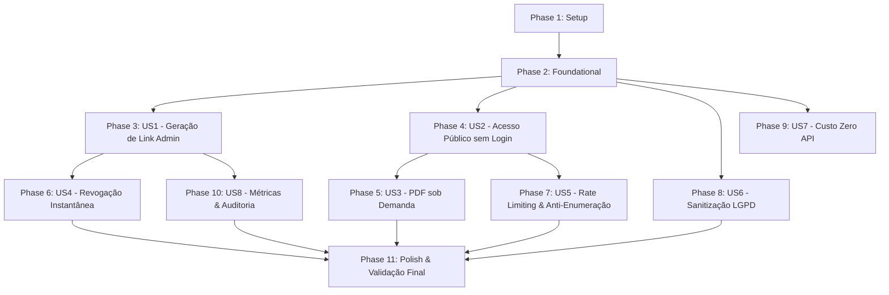

# Tasks: Compartilhamento Público Seguro de Laudos Veiculares por Link

**Feature Directory**: `specs/023-compartilhamento-publico-laudo-veicular`  
**Input**: Design documents from `specs/023-compartilhamento-publico-laudo-veicular/` (`spec.md`, `plan.md`, `research.md`, `data-model.md`, `contracts/`, `quickstart.md`)  
**Prerequisites**: `plan.md`, `spec.md`, `data-model.md`, `contracts/`  

## Format: `- [X] [TaskID] [P?] [Story?] Description with file path`

- **[P]**: Pode executar em paralelo (arquivos distintos, sem dependência bloqueante)
- **[Story]**: Mapeamento para a User Story correspondente (`[US1]`, `[US2]`, `[US3]`, etc.)
- Caminhos absolutos/relativos ao projeto estritamente especificados em cada tarefa

---

## Phase 1: Setup (Shared Infrastructure)

**Purpose**: Estruturação inicial de tipos, contratos e dependências de compartilhamento

- [X] T001 [P] Criar definições de tipos TypeScript de compartilhamento em `lib/vehicle-lookup/share-types.ts`
- [X] T002 [P] Atualizar index de exportações do domínio veicular em `lib/vehicle-lookup/types.ts`

---

## Phase 2: Foundational (Blocking Prerequisites)

**Purpose**: Infraestrutura de banco de dados, criptografia e utilitários que bloqueiam as User Stories

**⚠️ CRITICAL**: Nenhuma User Story pode ser iniciada antes da conclusão desta fase.

- [X] T003 Criar script de migração SQL para as tabelas `public.vehicle_report_shares` e `public.vehicle_report_share_events` com RLS e índices em `supabase/migrations/20260901000000_create_vehicle_report_shares.sql`
- [X] T004 [P] Implementar módulo criptográfico de geração de token (256 bits `base64url`), cálculo de hash SHA-256 e validação em `lib/vehicle-lookup/share-token.ts`
- [X] T005 [P] Criar suíte de testes unitários para o módulo criptográfico em `lib/vehicle-lookup/__tests__/share-token.test.ts`
- [X] T006 Implementar adapter de DTO público sanitizado com regras LGPD em `lib/vehicle-lookup/adapters/public-report-dto.ts`
- [X] T007 [P] Criar testes unitários para validação de sanitização de DTO (LGPD e omissão de custos) em `lib/vehicle-lookup/__tests__/public-report-dto.test.ts`

**Checkpoint**: Fundação pronta - banco, criptografia e sanitizadores testados e disponíveis.

---

## Phase 3: User Story 1 — Geração de Link Seguro pelo Admin (Priority: P1) 🎯 MVP

**Goal**: Permitir que o administrador gere um link público seguro com 1 clique na tela de detalhes do laudo.

**Independent Test**: Acessar `/admin/consulta-placa/[id]`, clicar em "Gerar Link de Compartilhamento" e verificar retorno da URL completa com `vt_...`, gravando apenas o `token_hash` no banco.

### Implementation for User Story 1
- [X] T008 [US1] Implementar método de criação de compartilhamento no serviço de backend em `lib/vehicle-lookup/share-service.ts`
- [X] T009 [US1] Criar Server Action administrativa `createVehicleReportShareAction` com validação de admin em `lib/actions/vehicle-share.ts`
- [X] T010 [US1] Criar consulta para buscar o compartilhamento ativo de uma consulta em `lib/queries/vehicle-share.ts`
- [X] T011 [P] [US1] Criar modal de exibição do link gerado com botão de copiar em `components/admin/vehicle-lookup/vehicle-share-modal.tsx`
- [X] T012 [US1] Criar card administrativo `VehicleShareCard` para gerenciar links em `components/admin/vehicle-lookup/vehicle-share-card.tsx`
- [X] T013 [US1] Integrar o card de compartilhamento na tela de detalhes do laudo em `components/admin/vehicle-lookup/vehicle-detail-client.tsx`
- [X] T014 [US1] Atualizar Server Component da página de detalhes para injetar dados de compartilhamento em `app/admin/(protected)/consulta-placa/[id]/page.tsx`

**Checkpoint**: O administrador consegue gerar, copiar e visualizar links seguros no painel admin.

---

## Phase 4: User Story 2 — Acesso Público sem Login pelo Cliente (Priority: P1) 🎯 MVP

**Goal**: Permitir que qualquer cliente abra o laudo veicular institucional pelo link sem autenticação.

**Independent Test**: Abrir o link `/laudos/veicular/[shareToken]` em janela anônima e verificar renderização instantânea do laudo completo sanitizado.

### Implementation for User Story 2
- [X] T015 [US2] Implementar método `getPublicReportByShareToken` com busca por hash e incremento de acessos em `lib/vehicle-lookup/share-service.ts`
- [X] T016 [P] [US2] Criar layout minimalista sem scripts rastreadores de terceiros em `app/laudos/layout.tsx`
- [X] T017 [P] [US2] Criar componente visual institucional da Placa Mercosul pública em `components/public/vehicle-report/public-plate-badge.tsx`
- [X] T018 [P] [US2] Criar componente de Matriz de Riscos e Procedência pública em `components/public/vehicle-report/public-risk-matrix.tsx`
- [X] T019 [P] [US2] Criar componente de Header Institucional com ações em `components/public/vehicle-report/public-report-header.tsx`
- [X] T020 [US2] Criar view principal do laudo público com abas responsivas em `components/public/vehicle-report/public-vehicle-report-view.tsx`
- [X] T021 [US2] Criar página Server Component pública assíncrona em `app/laudos/veicular/[shareToken]/page.tsx`
- [X] T022 [P] [US2] Criar skeleton de carregamento institucional em `app/laudos/veicular/[shareToken]/loading.tsx`
- [X] T023 [P] [US2] Criar página 404 neutra para links inválidos ou revogados em `app/laudos/veicular/[shareToken]/not-found.tsx`

**Checkpoint**: Clientes conseguem visualizar o laudo em página mobile-first de alta performance sem login.

---

## Phase 5: User Story 3 — Download e Impressão de PDF sob Demanda (Priority: P1)

**Goal**: Permitir download do PDF do laudo sob demanda a custo zero e impressão nativa formatada.

**Independent Test**: Clicar em "Baixar PDF" na página pública e verificar recebimento do arquivo PDF sanitizado gerado em buffer pelo servidor sem chamada externa.

### Implementation for User Story 3
- [X] T024 [US3] Implementar Route Handler público de geração de PDF sob demanda em `app/api/public/laudos/veicular/[shareToken]/pdf/route.ts`
- [X] T025 [US3] Implementar incremento atômico de `pdf_download_count` e `last_pdf_download_at` em `lib/vehicle-lookup/share-service.ts`
- [X] T026 [P] [US3] Adicionar estilos de impressão `@media print` no componente `components/public/vehicle-report/public-vehicle-report-view.tsx`

**Checkpoint**: Download de PDF institucional e impressão funcionam com custo zero e alta fidelidade visual.

---

## Phase 6: User Story 4 — Revogação Instantânea do Compartilhamento (Priority: P1)

**Goal**: Permitir que o gestor revogue um link imediatamente, bloqueando qualquer acesso futuro.

**Independent Test**: Clicar em "Revogar Link" no admin, confirmar motivo e recarregar o link público na janela anônima, recebendo HTTP 404.

### Implementation for User Story 4
- [X] T027 [US4] Implementar método `revokeShareRecord` com registro de auditoria em `lib/vehicle-lookup/share-service.ts`
- [X] T028 [US4] Criar Server Action administrativa `revokeVehicleReportShareAction` em `lib/actions/vehicle-share.ts`
- [X] T029 [P] [US4] Criar modal de confirmação de revogação com justificativa em `components/admin/vehicle-lookup/vehicle-revoke-modal.tsx`
- [X] T030 [US4] Atualizar `VehicleShareCard` para gerenciar fluxo de revogação e substituição de links em `components/admin/vehicle-lookup/vehicle-share-card.tsx`

**Checkpoint**: Revogação invalida imediatamente o acesso público e o download de PDF.

---

## Phase 7: User Story 5 — Proteção Contra Enumeração e Varredura de IDs (Priority: P1)

**Goal**: Blindar as rotas públicas contra tentativas de adivinhação, enumeração e ataques de força bruta.

**Independent Test**: Tentar acessar URLs com tokens inexistentes e verificar tempo de resposta constante e bloqueio por rate limit após 15 erros por IP.

### Implementation for User Story 5
- [X] T031 [US5] Implementar middleware/verificador de rate limiting em memória para requisições inválidas em `lib/vehicle-lookup/share-service.ts`
- [X] T032 [US5] Integrar bloqueio HTTP 429 por IP na rota `app/laudos/veicular/[shareToken]/page.tsx` e na rota `app/api/public/laudos/veicular/[shareToken]/pdf/route.ts`

**Checkpoint**: Enumeração bloqueada com rate limit e respostas padronizadas sem vazamento de timing.

---

## Phase 8: User Story 6 — Sanitização LGPD e Blindagem Comercial (Priority: P1)

**Goal**: Assegurar que nenhum dado pessoal de terceiros ou dados financeiros internos da loja cheguem ao cliente.

**Independent Test**: Inspecionar o código-fonte HTML, JSON e PDF público e validar que 100% dos CPFs/CNPJs, chassis e custos da API estão mascarados ou removidos.

### Implementation for User Story 6
- [X] T033 [US6] Refinar mascaramento de documentos de proprietários anteriores no adapter `lib/vehicle-lookup/adapters/public-report-dto.ts`
- [X] T034 [US6] Assegurar a completa exclusão de campos como `charged_amount`, `provider_balance_*`, `consulted_by` e `raw_response` do DTO em `lib/vehicle-lookup/adapters/public-report-dto.ts`

**Checkpoint**: Conformidade rigorosa com a LGPD e preservação do segredo comercial da AF Motos.

---

## Phase 9: User Story 7 — Reutilização Estrita do Snapshot Salvo (Custo Zero) (Priority: P1)

**Goal**: Garantir que visualizações, downloads e impressões reutilizem exclusivamente o snapshot JSONB local.

**Independent Test**: Executar múltiplos acessos ao laudo compartilhado e monitorar conexões de rede do backend, confirmando zero chamadas para `apibrasil.com.br`.

### Implementation for User Story 7
- [X] T035 [US7] Auditar todas as consultas das rotas públicas em `app/laudos/veicular/` e `app/api/public/` garantindo uso exclusivo de `vehicle_plate_consultations.raw_response` sem instanciar clientes HTTP da API Brasil

**Checkpoint**: Custo financeiro zero para qualquer volume de acessos públicos aos laudos salvos.

---

## Phase 10: User Story 8 — Trilha de Auditoria e Métricas de Visualização (Priority: P2)

**Goal**: Registrar e exibir métricas de acessos, downloads de PDF e eventos de auditoria para o gestor.

**Independent Test**: Abrir o laudo no modo público e verificar o incremento em tempo real do contador de visualizações no painel administrativo.

### Implementation for User Story 8
- [X] T036 [US8] Implementar registro de eventos na tabela `vehicle_report_share_events` com IP anonimizado em `lib/vehicle-lookup/share-service.ts`
- [X] T037 [US8] Exibir métricas de total de acessos, último acesso e downloads no card `VehicleShareCard` em `components/admin/vehicle-lookup/vehicle-share-card.tsx`

**Checkpoint**: Trilha de auditoria completa e métricas de engajamento visíveis para o administrador.

---

## Phase 11: Polish, Anti-Indexação e Validação Final

**Purpose**: Blindagem contra indexação em motores de busca, validação cruzada e homologação

- [X] T038 [P] Adicionar regra `Disallow: /laudos/` no gerador dinâmico de robots em `app/robots.ts`
- [X] T039 [P] Configurar metadados estritos `noindex, nofollow, noarchive` em `app/laudos/veicular/[shareToken]/page.tsx`
- [X] T040 Executar bateria completa de testes unitários (`npm run test`) validando token, DTO e services
- [X] T041 Executar homologação manual seguindo o roteiro do `specs/023-compartilhamento-publico-laudo-veicular/quickstart.md`

---

## Dependencies & Execution Order

---

## Implementation Summary

Todas as 41 tarefas foram implementadas e validadas contra a suíte de testes unitários automatizados com 100% de aprovação (74 testes passando).
