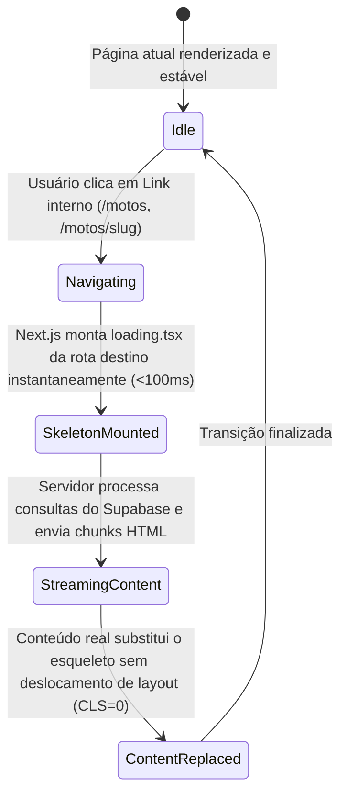

# Data Model & UI Structural Schemas: Skeleton Loaders em Transições de Página

**Feature**: `024-skeleton-page-transitions`  
**Status**: Concluído  
**Date**: 2026-09-04  

---

## 1. Entidades de Interface e Tipagem (UI Types)

### 1.1 `SkeletonProps` (Entidade de Apresentação Atômica)

Define os parâmetros de configuração e acessibilidade para qualquer elemento de esqueleto renderizado na plataforma.

| Campo | Tipo | Obrigatório | Descrição | Valores Possíveis |
| :--- | :--- | :---: | :--- | :--- |
| `variant` | `SkeletonVariant` | Não (default `'default'`) | Pré-configuração visual de raio de borda, padding e estilo do elemento. | `'default'`, `'text'`, `'image'`, `'card'`, `'list'`, `'button'`, `'avatar'` |
| `className` | `string` | Não | Classes Tailwind para ajuste dimensional de largura, altura, margem ou posicionamento. | Ex: `'h-6 w-48 rounded-lg'` |
| `animate` | `boolean` | Não (default `true`) | Controla se o efeito de gradiente shimmer deve ser executado. | `true`, `false` |
| `aspectRatio` | `string` | Não | Garante o congelamento da proporção geométrica da imagem ou bloco. | `'16/10'`, `'4/3'`, `'1/1'`, `'21/9'` |
| `responsiveMode` | `ResponsiveMode` | Não (default `'all'`) | Visibilidade condicional entre dispositivos. | `'mobileOnly'`, `'desktopOnly'`, `'all'` |
| `label` | `string` | Não | Rótulo anunciado para tecnologias assistivas e leitores de tela. | Default: `'Carregando...'` |

---

### 1.2 `RouteSkeletonSchema` (Mapeamento Estrutural por Rota)

Cada rota de vendas da aplicação possui um esquema visual estrito composto por blocos de esqueleto que espelham a árvore de componentes da página final:

```text
RouteSkeletonSchema
├── /motos (Catálogo)
│   ├── FilterBarSkeleton (busca, ordenação, badges de marcas)
│   └── CatalogGridSkeleton (6 cards com aspect-16/10, título, badge e preço)
│
├── /motos/[slug] (Detalhe do Veículo)
│   ├── BreadcrumbSkeleton (trilha de navegação superior)
│   ├── GalleryShowcaseSkeleton (container 16:10 principal + miniaturas)
│   ├── MobileHeaderSkeleton (marca, modelo e preço destacados no celular)
│   ├── TechnicalSpecsSkeleton (grid 2x3 ou 3x4 com badges de atributos)
│   ├── LeadConversionCardSkeleton (bloco lateral fixo com CTA WhatsApp e garantias)
│   └── SimilarBikesGridSkeleton (3 cards de veículos relacionados)
│
├── /aluguel (Locação)
│   ├── RentalHeroSkeleton (título de impacto e diferenciais)
│   ├── RentalPlansSkeleton (3 cards comparativos de planos semanais/mensais)
│   └── FleetGridSkeleton (motos aptas para aluguel)
│
├── /venda-sua-moto & /consignar-moto (Captação / Avaliação)
│   ├── FormHeroSkeleton (chamada de cotação gratuita)
│   ├── MultiStepFormSkeleton (inputs de placa, ano, modelo e quilometragem)
│   └── TrustBadgesSkeleton (3 pilares de segurança e pagamento à vista)
│
├── /historico-veicular (Laudo / Procedência)
│   ├── PlateSearchHeroSkeleton (input de placa Mercosul simulado)
│   └── SampleReportPreviewSkeleton (amostra de itens checados)
│
└── /sobre (Institucional)
    ├── AboutHeroSkeleton (banner da loja e história)
    └── StoreLocationSkeleton (mapa, horários e fotos da loja física)
```

---

## 2. Ciclo de Vida do Estado de Transição (`TransitionStateModel`)

Em aplicações Next.js com App Router, a transição entre páginas obedece a uma máquina de estados:



### Regras de Transição:
1. **Montagem Imediata**: O `loading.tsx` não realiza chamadas assíncronas no seu corpo; renderiza de forma estática no frame 0.
2. **Preservação de Header/Footer**: Como o `app/(public)/layout.tsx` é compartilhado, o cabeçalho e o rodapé permanecem montados sem recarregar ou piscar.
3. **Estabilidade de Scroll**: Durante a transição do esqueleto para a página final, a altura dos containers principais não se contrai nem se expande repentinamente.
