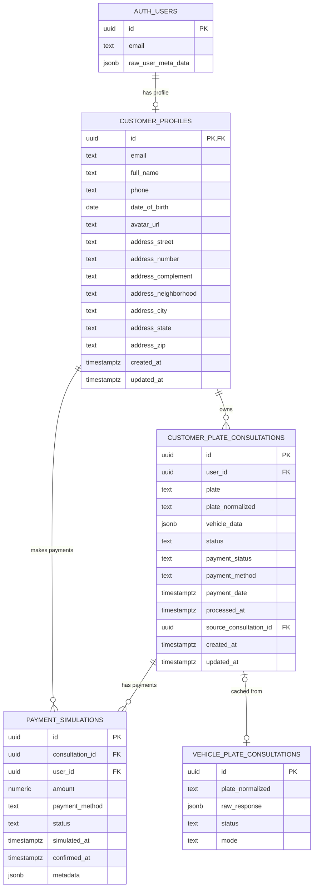

# Data Model: Customer Area — Plate Consultation & User Dashboard

**Feature**: 025-customer-area-plate-dashboard
**Date**: 2026-09-11

## Entity Relationship Diagram



## Entities

### 1. `customer_profiles`

Self-registered customer profile linked 1:1 to Supabase `auth.users`.

| Column | Type | Nullable | Default | Constraints | Description |
|--------|------|----------|---------|-------------|-------------|
| `id` | `UUID` | NO | — | PK, FK → `auth.users(id)` ON DELETE CASCADE | Same as auth user ID |
| `email` | `TEXT` | NO | — | UNIQUE | Customer email (synced from auth) |
| `full_name` | `TEXT` | NO | — | `length(trim(full_name)) >= 2` | Customer full name |
| `phone` | `TEXT` | YES | — | — | WhatsApp phone number |
| `phone_normalized` | `TEXT` | YES | — | — | Normalized phone (digits only) |
| `date_of_birth` | `DATE` | YES | — | `date_of_birth <= CURRENT_DATE` | Birth date |
| `avatar_url` | `TEXT` | YES | — | — | Profile photo URL (ImgBB) |
| `address_street` | `TEXT` | YES | — | — | Street name |
| `address_number` | `TEXT` | YES | — | — | Street number |
| `address_complement` | `TEXT` | YES | — | — | Apartment, suite, etc. |
| `address_neighborhood` | `TEXT` | YES | — | — | Neighborhood |
| `address_city` | `TEXT` | YES | — | — | City |
| `address_state` | `TEXT` | YES | — | `length(address_state) = 2` when not null | State (UF) |
| `address_zip` | `TEXT` | YES | — | — | CEP/ZIP code |
| `created_at` | `TIMESTAMPTZ` | NO | `now()` | — | Record creation time |
| `updated_at` | `TIMESTAMPTZ` | NO | `now()` | Auto-updated via trigger | Last modification time |

**RLS Policies**:
- SELECT: `auth.uid() = id` (user sees only their own profile)
- INSERT: `auth.uid() = id` (user creates only their own profile)
- UPDATE: `auth.uid() = id` (user updates only their own profile)

**Indexes**:
- PK on `id`
- UNIQUE on `email`
- Index on `phone_normalized` (partial, WHERE NOT NULL)

---

### 2. `customer_plate_consultations`

Customer-facing consultation records with payment lifecycle and vehicle data snapshot.

| Column | Type | Nullable | Default | Constraints | Description |
|--------|------|----------|---------|-------------|-------------|
| `id` | `UUID` | NO | `gen_random_uuid()` | PK | Unique consultation ID |
| `user_id` | `UUID` | NO | — | FK → `customer_profiles(id)` ON DELETE CASCADE | Owner customer |
| `plate` | `TEXT` | NO | — | — | Plate as entered by user |
| `plate_normalized` | `TEXT` | NO | — | — | Normalized plate (uppercase, no hyphens) |
| `vehicle_data` | `JSONB` | YES | — | — | Full vehicle data snapshot (null until processed) |
| `status` | `TEXT` | NO | `'pending'` | CHECK IN ('pending', 'paid', 'processing', 'completed', 'failed') | Consultation lifecycle status |
| `payment_status` | `TEXT` | NO | `'unpaid'` | CHECK IN ('unpaid', 'paid', 'refunded') | Payment lifecycle status |
| `payment_method` | `TEXT` | YES | — | CHECK IN ('pix', 'credit_card', 'boleto') when not null | Selected payment method |
| `payment_date` | `TIMESTAMPTZ` | YES | — | — | When payment was confirmed |
| `processed_at` | `TIMESTAMPTZ` | YES | — | — | When plate lookup completed |
| `source_consultation_id` | `UUID` | YES | — | FK → `vehicle_plate_consultations(id)` ON DELETE SET NULL | Link to cached global consultation |
| `created_at` | `TIMESTAMPTZ` | NO | `now()` | — | Record creation time |
| `updated_at` | `TIMESTAMPTZ` | NO | `now()` | Auto-updated via trigger | Last modification time |

**State Machine**:
```
pending → paid → processing → completed
                             → failed
```

**RLS Policies**:
- SELECT: `auth.uid() = user_id` (user sees only their consultations)
- INSERT: `auth.uid() = user_id` (user creates only their consultations)
- UPDATE: `auth.uid() = user_id` (user updates only their consultations)

**Indexes**:
- PK on `id`
- Index on `user_id`
- Index on `plate_normalized`
- Index on `(user_id, created_at DESC)` for history pagination
- UNIQUE on `(user_id, plate_normalized)` — one consultation per customer per plate

---

### 3. `payment_simulations`

Audit trail for simulated payment transactions.

| Column | Type | Nullable | Default | Constraints | Description |
|--------|------|----------|---------|-------------|-------------|
| `id` | `UUID` | NO | `gen_random_uuid()` | PK | Unique payment ID |
| `consultation_id` | `UUID` | NO | — | FK → `customer_plate_consultations(id)` ON DELETE CASCADE | Linked consultation |
| `user_id` | `UUID` | NO | — | FK → `customer_profiles(id)` ON DELETE CASCADE | Customer who paid |
| `amount` | `NUMERIC(10,2)` | NO | — | `amount > 0` | Payment amount in BRL |
| `payment_method` | `TEXT` | NO | — | CHECK IN ('pix', 'credit_card', 'boleto') | Method used |
| `status` | `TEXT` | NO | `'pending'` | CHECK IN ('pending', 'confirmed', 'cancelled') | Payment status |
| `simulated_at` | `TIMESTAMPTZ` | NO | `now()` | — | When simulation was initiated |
| `confirmed_at` | `TIMESTAMPTZ` | YES | — | — | When payment was confirmed |
| `metadata` | `JSONB` | YES | — | — | Extra data (future use, audit details) |

**RLS Policies**:
- SELECT: `auth.uid() = user_id` (user sees only their payments)
- INSERT: `auth.uid() = user_id` (user creates only their payments)

**Indexes**:
- PK on `id`
- Index on `consultation_id`
- Index on `user_id`

---

### 4. `vehicle_plate_consultations` (existing — no schema changes)

This table is **not modified**. It serves as the global cache layer. When a customer consultation is processed:

1. System calls `findExistingConsultation(plate)` to check for cached COMPLETED result
2. If cache hit → copy `raw_response` to `customer_plate_consultations.vehicle_data`
3. If cache miss → run `executeVehiclePlateLookup()` which inserts into `vehicle_plate_consultations` → then copy result to `customer_plate_consultations.vehicle_data`

The original user description proposed adding a `customer_id` FK to this table, but per research R3, we keep the tables decoupled to avoid RLS complexity.

---

## Validation Rules (Zod Schemas)

### Registration Form

```
full_name: string, min 2 chars, trimmed
email: valid email format
phone: Brazilian mobile format (11 digits, starts with DDD)
date_of_birth: date, must be in the past, must be at least 14 years old
password: min 8 chars
```

### Profile Update Form

```
full_name: string, min 2 chars, trimmed
email: valid email format (read-only if Google OAuth)
phone: Brazilian mobile format
date_of_birth: date, in the past
address_street: optional string
address_number: optional string
address_complement: optional string
address_neighborhood: optional string
address_city: optional string
address_state: optional string, exactly 2 chars uppercase when provided
address_zip: optional string, 8 digits (CEP format)
```

### Plate Consultation Form

```
plate: valid Brazilian plate format (old: ABC-1234, Mercosul: ABC1D23), normalized before lookup
```

### Payment Confirmation

```
consultation_id: valid UUID
payment_method: one of 'pix' | 'credit_card' | 'boleto'
```

## Migration Script

File: `supabase/migrations/20260911000000_create_customer_area.sql`

See [contracts/customer-api.md](file:///c:/Users/Alexr/OneDrive/Ambiente%20de%20Trabalho/www/af-motos/specs/025-customer-area-plate-dashboard/contracts/customer-api.md) for the full SQL migration.
