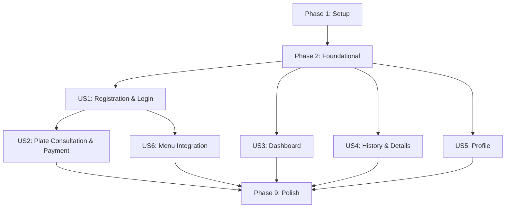

# Tasks: Customer Area — Plate Consultation & User Dashboard

**Feature**: 025-customer-area-plate-dashboard
**Branch**: `025-customer-area-plate-dashboard`
**Plan**: [plan.md](file:///c:/Users/Alexr/OneDrive/Ambiente%20de%20Trabalho/www/af-motos/specs/025-customer-area-plate-dashboard/plan.md)
**Spec**: [spec.md](file:///c:/Users/Alexr/OneDrive/Ambiente%20de%20Trabalho/www/af-motos/specs/025-customer-area-plate-dashboard/spec.md)

---

## Phase 1: Setup (Shared Infrastructure)

**Purpose**: Database schema, types, and shared configuration required by all user stories.

- [X] T001 Create database migration for customer area tables (`customer_profiles`, `customer_plate_consultations`, `payment_simulations`) with RLS policies and indexes in `supabase/migrations/20260911000000_create_customer_area.sql`
- [X] T002 Apply migration to Supabase (run via Supabase Dashboard SQL Editor or `supabase db push`)
- [X] T003 [P] Create TypeScript types for customer domain entities in `lib/customer/types.ts` (CustomerProfile, CustomerPlateConsultation, PaymentSimulation, form input types, status enums)
- [X] T004 [P] Create Zod validation schemas for all customer forms in `lib/customer/schemas.ts` (registration, login, profile update, plate consultation, payment confirmation)
- [X] T005 [P] Create OAuth callback Route Handler for Google sign-in at `app/api/auth/callback/route.ts` (exchange code for session, handle `next` query param for redirect)
- [X] T006 Update Supabase middleware to protect `/cliente/*` routes (redirect unauthenticated users to `/cliente/login?returnUrl=...`, exclude `/cliente/login` and `/cliente/cadastro`) in `lib/supabase/middleware.ts`

**Checkpoint**: Database schema deployed, types/schemas available, middleware protecting customer routes.

---

## Phase 2: Foundational (Blocking Prerequisites)

**Purpose**: Server Actions and query functions that all customer UI components depend on.

**⚠️ CRITICAL**: No user story UI work can begin until this phase is complete.

- [X] T007 Create customer auth Server Actions in `lib/customer/actions.ts`: `registerCustomer(formData)` — validate with Zod, call `supabase.auth.signUp()`, insert into `customer_profiles`, return result
- [X] T008 Create customer auth Server Actions in `lib/customer/actions.ts`: `loginCustomer(formData)` — validate with Zod, call `supabase.auth.signInWithPassword()`, return result
- [X] T009 Create customer auth Server Actions in `lib/customer/actions.ts`: `loginWithGoogle()` — call `supabase.auth.signInWithOAuth({ provider: 'google' })`, return OAuth URL
- [X] T010 Create customer auth Server Actions in `lib/customer/actions.ts`: `logoutCustomer()` — call `supabase.auth.signOut()`, redirect to `/`
- [X] T011 [P] Create customer profile Server Actions in `lib/customer/actions.ts`: `updateCustomerProfile(formData)` — validate with Zod, update `customer_profiles` WHERE `id = auth.uid()`
- [X] T012 [P] Create customer data queries in `lib/customer/queries.ts`: `getCustomerProfile()` — fetch `customer_profiles` for authenticated user
- [X] T013 [P] Create customer data queries in `lib/customer/queries.ts`: `getCustomerDashboardData()` — fetch profile name/avatar, consultation count, and last 3 consultations
- [X] T014 [P] Create customer data queries in `lib/customer/queries.ts`: `getConsultationHistory(page, plateFilter?)` — paginated query (20/page) with optional plate ILIKE filter
- [X] T015 [P] Create customer data queries in `lib/customer/queries.ts`: `getConsultationDetail(consultationId)` — fetch single consultation with ownership check (`user_id = auth.uid()`)
- [X] T016 Create consultation orchestration in `lib/customer/consultation-service.ts`: `initiateConsultation(plate)` — normalize plate, check for existing customer consultation, insert pending row or return existing
- [X] T017 Create payment simulation in `lib/customer/payment-service.ts`: `confirmPayment(consultationId, paymentMethod)` — create `payment_simulations` record, update consultation status, check `vehicle_plate_consultations` cache, run `executeVehiclePlateLookup()` on miss, copy result to `customer_plate_consultations.vehicle_data`

**Checkpoint**: All Server Actions and queries functional. Ready for UI implementation.

---

## Phase 3: User Story 1 — Customer Registration & Login (Priority: P1) 🎯 MVP

**Goal**: Visitors can register (email/password or Google) and log in to access the protected customer area.

**Independent Test**: Visit `/cliente/cadastro`, fill form, submit → redirected to `/cliente` as logged-in user. Visit `/cliente/login`, enter credentials → redirected to `/cliente`.

### Implementation for User Story 1

- [X] T018 [P] [US1] Create reusable auth form component (login + registration modes) in `components/customer/auth-form.tsx` — email/password fields, password strength indicator, Google OAuth button, validation error display, loading state, shadcn/ui dark theme with gold accents
- [X] T019 [P] [US1] Create customer login page at `app/cliente/login/page.tsx` — render AuthForm in login mode, handle `returnUrl` query param for post-login redirect, redirect to `/cliente` if already authenticated
- [X] T020 [P] [US1] Create customer registration page at `app/cliente/cadastro/page.tsx` — render AuthForm in register mode with full_name, email, phone (masked), date_of_birth, password fields, redirect to `/cliente` if already authenticated
- [X] T021 [US1] Create login page layout at `app/cliente/login/layout.tsx` — centered card layout similar to admin login (dark glassmorphism, logo, gold accent), no sidebar
- [X] T022 [US1] Create registration page layout at `app/cliente/cadastro/layout.tsx` — same centered card layout as login, no sidebar
- [X] T023 [US1] Wire auth form submit handlers to Server Actions (`registerCustomer`, `loginCustomer`, `loginWithGoogle`) with toast notifications (sonner) for success/error in `components/customer/auth-form.tsx`
- [X] T024 [US1] Handle Google OAuth profile creation in `app/api/auth/callback/route.ts` — after code exchange, check if `customer_profiles` row exists, if not create one from `user.user_metadata` (full_name, email, avatar_url)

**Checkpoint**: Registration and login fully functional. Users can create accounts and access the empty dashboard shell.

---

## Phase 4: User Story 2 — Self-Service Plate Consultation with Simulated Payment (Priority: P1)

**Goal**: Authenticated customers can consult a plate from the public page, go through simulated payment, and see the result.

**Independent Test**: Navigate to `/historico-veicular`, enter plate, log in if needed, complete payment, verify result saved and displayed at `/cliente/consultas/{id}`.

### Implementation for User Story 2

- [X] T025 [P] [US2] Create auth modal component for public page login prompt in `components/customer/auth-modal.tsx` — Dialog/Sheet with AuthForm embedded, triggered when unauthenticated user submits plate, preserves entered plate in URL/state
- [X] T026 [US2] Modify `/historico-veicular` hero component to detect auth state and show auth modal or proceed to consultation summary — update `components/vehicle-history/vehicle-history-hero.tsx` to add client-side auth check on plate submit
- [X] T027 [P] [US2] Create plate consultation summary card component in `components/customer/plate-consultation-summary.tsx` — displays plate, vehicle type (if cached), consultation price, "Pagar e Consultar" button, styled as dark glassmorphism card
- [X] T028 [P] [US2] Create payment simulation page at `app/cliente/pagamento/[consultationId]/page.tsx` — Server Component fetching consultation details, rendering PaymentSimulation component
- [X] T029 [P] [US2] Create payment simulation component in `components/customer/payment-simulation.tsx` — order summary (plate, price), 3 payment method cards (PIX, Cartão, Boleto) with icons, "Confirmar Pagamento" button, loading/processing state, success redirect
- [X] T030 [US2] Wire consultation initiation flow: plate submit → auth check → `initiateConsultation()` Server Action → redirect to `/cliente/pagamento/{consultationId}` — orchestrate in a new Server Action or client-side handler in the hero component
- [X] T031 [US2] Wire payment confirmation: "Confirmar Pagamento" click → `confirmPayment()` Server Action → redirect to `/cliente/consultas/{id}` on success — handle errors with toast messages in `components/customer/payment-simulation.tsx`

**Checkpoint**: Full plate consultation flow works end-to-end. Customer can pay and see vehicle data.

---

## Phase 5: User Story 3 — Customer Dashboard (Priority: P2)

**Goal**: Authenticated customers see a personalized dashboard with consultation summary, recent activity, and navigation shortcuts.

**Independent Test**: Log in, navigate to `/cliente`, verify welcome message with name, consultation count, last 3 consultations displayed, "Nova Consulta" button links to `/historico-veicular`.

### Implementation for User Story 3

- [X] T032 [P] [US3] Create customer area layout at `app/cliente/layout.tsx` — sidebar navigation (Dashboard, Consultas, Perfil, Sair) for desktop, bottom/top nav for mobile, user avatar and name display, dark theme matching site aesthetic
- [X] T033 [P] [US3] Create customer sidebar/nav component in `components/customer/customer-nav.tsx` — navigation links with active state highlighting, logout button, responsive (sidebar on desktop, sheet/drawer on mobile), lucide-react icons
- [X] T034 [US3] Create customer dashboard page at `app/cliente/page.tsx` — Server Component calling `getCustomerDashboardData()`, rendering ClientDashboard component
- [X] T035 [US3] Create dashboard content component in `components/customer/client-dashboard.tsx` — "Olá, [name]" welcome, stats cards (total consultations), last 3 consultations list with plate/date/status badges, "Nova Consulta" CTA button, "Ver Histórico" shortcut, empty state for new users, skeleton loader
- [X] T036 [US3] Create dashboard loading state at `app/cliente/loading.tsx` — skeleton loader matching dashboard layout (per spec 024 patterns)

**Checkpoint**: Dashboard shows personalized data. Customer has a home base after login.

---

## Phase 6: User Story 4 — Consultation History & Details (Priority: P2)

**Goal**: Customers can browse their paginated consultation history, filter by plate, and view full vehicle details.

**Independent Test**: Complete multiple consultations, navigate to `/cliente/consultas`, verify pagination, filter by plate, click into detail page to see full vehicle data.

### Implementation for User Story 4

- [X] T037 [P] [US4] Create consultation history page at `app/cliente/consultas/page.tsx` — Server Component with `searchParams` for page and plate filter, calling `getConsultationHistory()`, rendering ConsultationHistory component
- [X] T038 [P] [US4] Create consultation history component in `components/customer/consultation-history.tsx` — responsive table/card list (table on desktop, cards on mobile) with columns: Placa, Data, Status badge (color-coded), Ação button; pagination controls (prev/next/page numbers); plate text filter input with debounce; empty state; skeleton loader
- [X] T039 [P] [US4] Create consultation detail page at `app/cliente/consultas/[id]/page.tsx` — Server Component calling `getConsultationDetail()`, rendering ConsultationDetails component, return `notFound()` if not owned by user
- [X] T040 [US4] Create consultation details component in `components/customer/consultation-details.tsx` — vehicle data display in organized sections (similar to admin detail view but simplified for customer): vehicle info card (brand, model, year, color), risk summary badges, status/date information, skeleton loader
- [X] T041 [US4] Create consultation history loading state at `app/cliente/consultas/loading.tsx` — skeleton loader matching list layout
- [X] T042 [US4] Create consultation detail loading state at `app/cliente/consultas/[id]/loading.tsx` — skeleton loader matching detail layout

**Checkpoint**: Full consultation history browsable and searchable. Detail view shows complete vehicle data.

---

## Phase 7: User Story 5 — Profile Management (Priority: P3)

**Goal**: Customers can view and edit their personal information, address, and profile photo.

**Independent Test**: Navigate to `/cliente/perfil`, edit phone number, add address, upload photo, save, refresh page to verify persistence.

### Implementation for User Story 5

- [X] T043 [US5] Create profile editing page at `app/cliente/perfil/page.tsx` — Server Component calling `getCustomerProfile()`, rendering ProfileForm component
- [X] T044 [US5] Create profile form component in `components/customer/profile-form.tsx` — react-hook-form with Zod resolver, fields: full_name, email (read-only if Google OAuth), phone (masked input), date_of_birth (date picker), address fields (street, number, complement, neighborhood, city, state dropdown, CEP with mask), profile photo upload (ImgBB via existing `uploadImage`), "Salvar Alterações" button, validation errors, success/error toasts
- [X] T045 [US5] Wire profile form submit to `updateCustomerProfile()` Server Action with optimistic UI update and toast feedback in `components/customer/profile-form.tsx`
- [X] T046 [US5] Create profile page loading state at `app/cliente/perfil/loading.tsx` — skeleton loader matching form layout

**Checkpoint**: Profile fully editable with photo upload. Data persists across sessions.

---

## Phase 8: User Story 6 — Main Menu Integration & Logout (Priority: P3)

**Goal**: The site's main navigation shows "Área do Cliente" link. Auth-aware behavior for logged-in vs visitor state.

**Independent Test**: Check menu as visitor (see login link), log in (see dashboard link + avatar), click "Sair" (session destroyed, redirected to home).

### Implementation for User Story 6

- [X] T047 [US6] Add "Área do Cliente" nav item to the main site header in `components/layout/header.tsx` — add new nav group or item with `UserCircle` icon, link to `/cliente`, position after "Serviços & Negociação" group in both desktop and mobile menus
- [X] T048 [US6] Make header auth-aware in `components/layout/header.tsx` — use Supabase client-side auth state to conditionally show: visitor → "Área do Cliente" link to `/cliente/login`; logged-in customer → user name/avatar with link to `/cliente` and "Sair" button
- [X] T049 [US6] Verify logout flow end-to-end: clicking "Sair" in both the customer dashboard nav and the main site header correctly destroys session and redirects to `/`

**Checkpoint**: Navigation fully integrated. Auth state reflected in menu across the entire site.

---

## Phase 9: Polish & Cross-Cutting Concerns

**Purpose**: Final validation, accessibility, responsiveness, and edge case handling.

- [X] T050 Validate all RLS policies by testing cross-user data access (register 2 users, verify isolation per quickstart.md Scenario 8)
- [X] T051 [P] Verify mobile responsiveness on all customer pages (320px–768px viewport) — auth forms, dashboard, history table/cards, detail view, profile form, payment page
- [X] T052 [P] Verify accessibility: form labels, ARIA attributes on interactive elements, keyboard navigation through all customer flows, color contrast on status badges
- [X] T053 [P] Add skeleton loaders to any pages missing them (verify all `loading.tsx` files exist and match component layouts)
- [X] T054 Test edge cases: duplicate registration email (shows friendly error), invalid plate format (shows validation hint), session expiry during payment flow (preserves intent), Google OAuth failure (shows fallback option)
- [X] T055 Run complete end-to-end flow per quickstart.md Scenario 3: public page → plate entry → auth prompt → login → payment → confirmation → processing → detail view → dashboard history
- [X] T056 Verify existing admin plate consultation workflow is unaffected — admin panel continues to work independently without regressions

---

## Dependencies & Execution Order

### Phase Dependencies

- **Setup (Phase 1)**: No dependencies — start immediately
- **Foundational (Phase 2)**: Depends on Phase 1 (database and types must exist)
- **US1 (Phase 3)**: Depends on Phase 2 (auth actions must exist)
- **US2 (Phase 4)**: Depends on Phase 2 + Phase 3 (needs auth flow working)
- **US3 (Phase 5)**: Depends on Phase 2 (needs queries). Can run parallel with US2.
- **US4 (Phase 6)**: Depends on Phase 2 (needs queries). Can run parallel with US2/US3.
- **US5 (Phase 7)**: Depends on Phase 2 (needs profile actions). Can run parallel with US2/US3/US4.
- **US6 (Phase 8)**: Depends on Phase 3 (needs auth state). Can start after US1.
- **Polish (Phase 9)**: Depends on all user stories being complete

### User Story Dependencies



### Within Each User Story

- Models/types before services
- Services/actions before UI components
- UI components before page composition
- Page composition before loading states

### Parallel Opportunities

- **Phase 1**: T003, T004, T005 can run in parallel (types, schemas, OAuth callback)
- **Phase 2**: T011–T015 can run in parallel (independent queries/actions for different features)
- **After Phase 2**: US3, US4, US5 can run in parallel (different page groups, no shared components)
- **Phase 3**: T018, T019, T020 can run in parallel (different files)
- **Phase 4**: T025, T027, T028, T029 can run in parallel (different components)
- **Phase 6**: T037, T038, T039 can run in parallel (different pages/components)
- **Phase 9**: T051, T052, T053 can run in parallel (different validation domains)

---

## Parallel Example: Phase 2 (Foundational)

```bash
# These can all run simultaneously (different functions, same file or independent files):
Task T011: "updateCustomerProfile() in lib/customer/actions.ts"
Task T012: "getCustomerProfile() in lib/customer/queries.ts"
Task T013: "getCustomerDashboardData() in lib/customer/queries.ts"
Task T014: "getConsultationHistory() in lib/customer/queries.ts"
Task T015: "getConsultationDetail() in lib/customer/queries.ts"
```

## Parallel Example: User Stories 3+4+5 (after Phase 3)

```bash
# These three story phases can run completely in parallel:
# Developer A: US3 (Dashboard) — T032-T036
# Developer B: US4 (History & Details) — T037-T042
# Developer C: US5 (Profile) — T043-T046
```

---

## Implementation Strategy

### MVP First (User Stories 1 + 2 Only)

1. Complete Phase 1: Setup (database + types)
2. Complete Phase 2: Foundational (all Server Actions and queries)
3. Complete Phase 3: US1 — Registration & Login
4. Complete Phase 4: US2 — Plate Consultation & Payment
5. **STOP and VALIDATE**: Test full consultation flow end-to-end
6. Deploy MVP — customers can register, pay, and consult plates

### Incremental Delivery

1. Setup + Foundational → Infrastructure ready
2. US1 (Auth) → Users can register and log in ✅
3. US2 (Consultation) → Core value delivered: self-service plate lookup ✅
4. US3 (Dashboard) → Personalized home for returning users ✅
5. US4 (History) → Browse and revisit past consultations ✅
6. US5 (Profile) → Full profile management ✅
7. US6 (Menu) → Seamless site-wide integration ✅
8. Polish → Production-ready quality ✅

### Single Developer Strategy (Recommended)

Execute phases sequentially in order (1 → 2 → 3 → 4 → 5 → 6 → 7 → 8 → 9). Within each phase, parallelize where marked with `[P]`.

---

## Notes

- `[P]` tasks = different files, no dependencies — safe to parallelize
- `[USn]` label maps task to specific user story for traceability
- Each user story phase is independently completable and testable
- Commit after each task or logical group of tasks
- Stop at any checkpoint to validate the story independently
- The spec explicitly excludes: password recovery, account deletion, real payment, email notifications, result sharing
- Existing admin workflows must remain unaffected (verify in T056)
