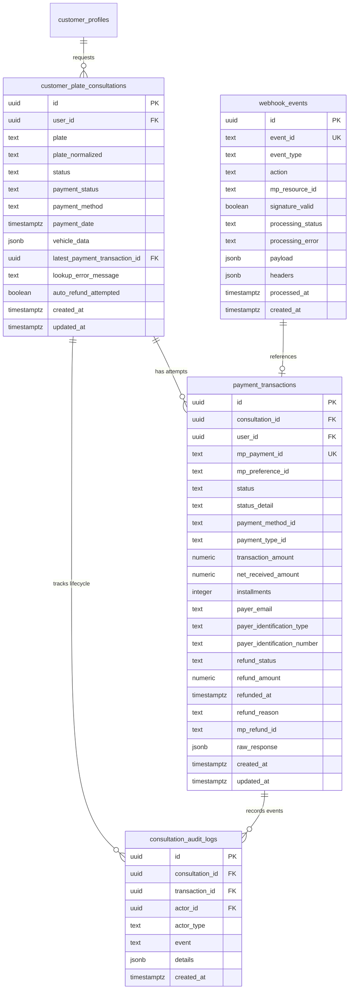

# Data Model: Mercado Pago Vehicle Plate Payment

**Feature**: `026-mercadopago-vehicle-payment`  
**Date**: 2026-09-12  
**Status**: Completed  

---

## 1. Entity Relationship Diagram



---

## 2. Table Schemas & Constraints

### 2.1 `payment_transactions`
Stores every Mercado Pago payment attempt and refund status linked to a consultation.

```sql
CREATE TABLE IF NOT EXISTS payment_transactions (
    id UUID PRIMARY KEY DEFAULT gen_random_uuid(),
    consultation_id UUID NOT NULL REFERENCES customer_plate_consultations(id) ON DELETE CASCADE,
    user_id UUID NOT NULL REFERENCES auth.users(id) ON DELETE CASCADE,
    mp_payment_id TEXT UNIQUE,
    mp_preference_id TEXT,
    status TEXT NOT NULL CHECK (status IN ('pending', 'approved', 'authorized', 'in_process', 'in_mediation', 'rejected', 'cancelled', 'refunded', 'charged_back')),
    status_detail TEXT,
    payment_method_id TEXT,
    payment_type_id TEXT,
    transaction_amount NUMERIC(10,2) NOT NULL CHECK (transaction_amount >= 0),
    net_received_amount NUMERIC(10,2),
    installments INTEGER NOT NULL DEFAULT 1,
    payer_email TEXT,
    payer_identification_type TEXT,
    payer_identification_number TEXT,
    refund_status TEXT NOT NULL DEFAULT 'none' CHECK (refund_status IN ('none', 'pending', 'refunded', 'failed')),
    refund_amount NUMERIC(10,2),
    refunded_at TIMESTAMPTZ,
    refund_reason TEXT,
    mp_refund_id TEXT,
    raw_response JSONB,
    created_at TIMESTAMPTZ NOT NULL DEFAULT NOW(),
    updated_at TIMESTAMPTZ NOT NULL DEFAULT NOW()
);

-- Indexes for performance
CREATE INDEX IF NOT EXISTS idx_payment_transactions_consultation ON payment_transactions(consultation_id);
CREATE INDEX IF NOT EXISTS idx_payment_transactions_user ON payment_transactions(user_id);
CREATE INDEX IF NOT EXISTS idx_payment_transactions_status ON payment_transactions(status);
CREATE INDEX IF NOT EXISTS idx_payment_transactions_mp_payment ON payment_transactions(mp_payment_id);
CREATE INDEX IF NOT EXISTS idx_payment_transactions_created_at ON payment_transactions(created_at DESC);
```

### 2.2 `webhook_events`
Stores raw webhook notifications from Mercado Pago for idempotency, debugging, and audit.

```sql
CREATE TABLE IF NOT EXISTS webhook_events (
    id UUID PRIMARY KEY DEFAULT gen_random_uuid(),
    event_id TEXT UNIQUE,
    event_type TEXT NOT NULL,
    action TEXT,
    mp_resource_id TEXT,
    signature_valid BOOLEAN NOT NULL DEFAULT FALSE,
    processing_status TEXT NOT NULL DEFAULT 'pending' CHECK (processing_status IN ('pending', 'processed', 'ignored', 'failed')),
    processing_error TEXT,
    payload JSONB NOT NULL,
    headers JSONB,
    processed_at TIMESTAMPTZ,
    created_at TIMESTAMPTZ NOT NULL DEFAULT NOW()
);

CREATE INDEX IF NOT EXISTS idx_webhook_events_resource ON webhook_events(mp_resource_id);
CREATE INDEX IF NOT EXISTS idx_webhook_events_status ON webhook_events(processing_status);
CREATE INDEX IF NOT EXISTS idx_webhook_events_created_at ON webhook_events(created_at DESC);
```

### 2.3 `consultation_audit_logs`
Chronological lifecycle audit trail.

```sql
CREATE TABLE IF NOT EXISTS consultation_audit_logs (
    id UUID PRIMARY KEY DEFAULT gen_random_uuid(),
    consultation_id UUID NOT NULL REFERENCES customer_plate_consultations(id) ON DELETE CASCADE,
    transaction_id UUID REFERENCES payment_transactions(id) ON DELETE SET NULL,
    actor_id UUID REFERENCES auth.users(id) ON DELETE SET NULL,
    actor_type TEXT NOT NULL CHECK (actor_type IN ('customer', 'system', 'admin', 'webhook')),
    event TEXT NOT NULL,
    details JSONB,
    created_at TIMESTAMPTZ NOT NULL DEFAULT NOW()
);

CREATE INDEX IF NOT EXISTS idx_consultation_audit_logs_consultation ON consultation_audit_logs(consultation_id);
CREATE INDEX IF NOT EXISTS idx_consultation_audit_logs_created_at ON consultation_audit_logs(created_at DESC);
```

---

## 3. Row Level Security (RLS) Policies

### `payment_transactions`
- **Customers**: Can read (`SELECT`) only their own transactions where `user_id = auth.uid()`. No direct `INSERT`/`UPDATE` from client.
- **Admins**: Can read (`SELECT`) all transactions.
- **Service Role**: Full access for server-side handlers and webhooks.

```sql
ALTER TABLE payment_transactions ENABLE ROW LEVEL SECURITY;

CREATE POLICY "Customers can view their own transactions"
    ON payment_transactions FOR SELECT
    USING (auth.uid() = user_id);

CREATE POLICY "Admins can view all transactions"
    ON payment_transactions FOR SELECT
    USING (
        EXISTS (
            SELECT 1 FROM admin_profiles
            WHERE admin_profiles.id = auth.uid()
            AND admin_profiles.is_active = true
        )
    );
```

### `webhook_events`
- **Customers**: No access.
- **Admins**: Read access (`SELECT`) for troubleshooting.
- **Service Role**: Full access.

```sql
ALTER TABLE webhook_events ENABLE ROW LEVEL SECURITY;

CREATE POLICY "Admins can view webhook events"
    ON webhook_events FOR SELECT
    USING (
        EXISTS (
            SELECT 1 FROM admin_profiles
            WHERE admin_profiles.id = auth.uid()
            AND admin_profiles.is_active = true
        )
    );
```

### `consultation_audit_logs`
- **Customers**: Can view logs for their own consultations.
- **Admins**: Can view all logs.

```sql
ALTER TABLE consultation_audit_logs ENABLE ROW LEVEL SECURITY;

CREATE POLICY "Customers can view logs for their own consultations"
    ON consultation_audit_logs FOR SELECT
    USING (
        EXISTS (
            SELECT 1 FROM customer_plate_consultations
            WHERE customer_plate_consultations.id = consultation_audit_logs.consultation_id
            AND customer_plate_consultations.user_id = auth.uid()
        )
    );

CREATE POLICY "Admins can view all audit logs"
    ON consultation_audit_logs FOR SELECT
    USING (
        EXISTS (
            SELECT 1 FROM admin_profiles
            WHERE admin_profiles.id = auth.uid()
            AND admin_profiles.is_active = true
        )
    );
```
