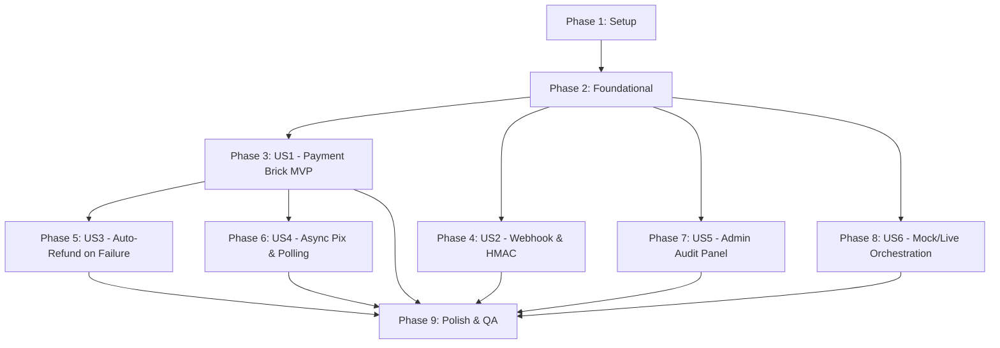

# Tasks: Mercado Pago Vehicle Consultation Payment & Mock/Live Orchestration

**Feature**: `026-mercadopago-vehicle-payment`  
**Spec**: [spec.md](file:///c:/Users/Alexr/OneDrive/Ambiente%20de%20Trabalho/www/af-motos/specs/026-mercadopago-vehicle-payment/spec.md) | **Plan**: [plan.md](file:///c:/Users/Alexr/OneDrive/Ambiente%20de%20Trabalho/www/af-motos/specs/026-mercadopago-vehicle-payment/plan.md)  
**Status**: Ready for Implementation  

---

## Phase 1: Setup (Dependencies & Configuration)

**Purpose**: Project initialization and dependencies setup for Mercado Pago integration

- [X] T001 Install Mercado Pago server SDK dependency (`mercadopago`) via `npm install mercadopago` in `package.json`
- [X] T002 [P] Configure Mercado Pago environment variables and test credentials in `.env.local` and update `.env.example`
- [X] T003 [P] Create Mercado Pago TypeScript type definitions in `lib/mercadopago/types.ts`
- [X] T004 [P] Create Zod schemas for payment actions and webhook payloads in `lib/mercadopago/schemas.ts`

---

## Phase 2: Foundational (Database & Core Services)

**Purpose**: Core infrastructure, database tables, and adapter layer that MUST be complete before ANY user story can be implemented

**⚠️ CRITICAL**: Foundational tasks block all user story tasks

- [X] T005 Create Supabase migration file `supabase/migrations/20260912110000_mercadopago_transactions_and_audit.sql` defining `payment_transactions`, `webhook_events`, `consultation_audit_logs` and RLS policies
- [X] T006 [P] Implement server-side Mercado Pago SDK client initialization in `lib/mercadopago/client.ts`
- [X] T007 [P] Implement HMAC-SHA256 webhook signature validator in `lib/mercadopago/signature.ts`
- [X] T008 [P] Unit test for HMAC-SHA256 signature verification in `lib/mercadopago/__tests__/signature.test.ts`
- [X] T009 Implement base payment transaction persistence and audit logging functions in `lib/mercadopago/payment-service.ts`

**Checkpoint**: Foundation ready - database models, client setup, and security validation active.

---

## Phase 3: User Story 1 - Cliente paga e recebe consulta veicular (Priority: P1) 🎯 MVP

**Goal**: Authenticated customer can submit plate, view server-enforced price, pay via Mercado Pago Payment Brick, and view consultation results upon approval.

**Independent Test**: Complete full checkout flow in sandbox using test card; verify database transaction created, payment approved, vehicle lookup executed, and results rendered on dashboard.

### Implementation for User Story 1
- [X] T010 [P] [US1] Create server action `createPaymentPreference` to fetch canonical price and initialize payment session in `lib/mercadopago/payment-service.ts`
- [X] T011 [US1] Create server action `processBrickPayment` to handle card token submission, call MP API `Payment.create`, record transaction, and execute vehicle lookup in `lib/mercadopago/payment-service.ts`
- [X] T012 [P] [US1] Create client-side Payment Brick component `components/customer/payment-brick.tsx`
- [X] T013 [US1] Update customer payment page `app/cliente/pagamento/[consultationId]/page.tsx` to render Payment Brick with server price
- [X] T014 [US1] Update customer consultation processing service in `lib/customer/payment-service.ts` to link with `payment_transactions` and update `customer_plate_consultations`
- [X] T015 [US1] Unit test for payment processing and vehicle lookup trigger in `lib/mercadopago/__tests__/payment-service.test.ts`

**Checkpoint**: User Story 1 complete — credit/debit card flow operational in sandbox.

---

## Phase 4: User Story 2 - Webhook confirma pagamento e libera consulta com segurança (Priority: P1)

**Goal**: Asynchronous notifications from Mercado Pago are securely received, verified via HMAC, deduplicated, and trigger consultation processing.

**Independent Test**: Send valid and invalid HMAC webhook payloads to `/api/webhooks/mercadopago`; verify invalid requests are rejected with 401 and valid approved payments transition consultation to completed without duplication.

### Implementation for User Story 2
- [X] T016 [US2] Implement API route handler `app/api/webhooks/mercadopago/route.ts` with raw body extraction and HMAC signature verification
- [X] T017 [US2] Implement webhook idempotency deduplication and event recording in `webhook_events` table in `lib/mercadopago/payment-service.ts`
- [X] T018 [US2] Implement webhook status reconciler: fetch payment from MP API (`Payment.get`), verify amount against DB, and trigger vehicle lookup if approved in `lib/mercadopago/payment-service.ts`
- [X] T019 [US2] Unit test for webhook handler routing and signature validation in `lib/mercadopago/__tests__/webhook.test.ts`

**Checkpoint**: User Story 2 complete — Webhooks securely processed and idempotent.

---

## Phase 5: User Story 3 - Estorno automático quando a consulta falha (Priority: P1)

**Goal**: If vehicle consultation fails after payment approval, automatically initiate refund via Mercado Pago API, record audit logs, and display customer notice with WhatsApp support.

**Independent Test**: Simulate an API provider failure on plate lookup; verify Mercado Pago `PaymentRefund.create` is invoked, payment status updates to `refunded`, and customer sees the refund banner with WhatsApp support button.

### Implementation for User Story 3
- [X] T020 [US3] Implement `processAutoRefund` method using Mercado Pago `PaymentRefund.create` in `lib/mercadopago/payment-service.ts`
- [X] T021 [US3] Wrap vehicle lookup post-payment in error handler that triggers `processAutoRefund` on failure in `lib/mercadopago/payment-service.ts`
- [X] T022 [P] [US3] Create customer auto-refund alert component with support button in `components/customer/auto-refund-notice.tsx`
- [X] T023 [US3] Integrate `auto-refund-notice` into `/cliente/consultas/[id]/page.tsx` and payment status view
- [X] T024 [US3] Unit test for automatic refund trigger and state transitions in `lib/mercadopago/__tests__/refund.test.ts`

**Checkpoint**: User Story 3 complete — Automatic refund ensures zero customer loss on external outage.

---

## Phase 6: User Story 4 - Pagamento com meio assíncrono (Pix/boleto) (Priority: P2)

**Goal**: Support Pix payments with QR Code and copy-paste key, pending status polling banner, manual refresh button, and retry flow on expiration.

**Independent Test**: Generate a test Pix payment; verify QR code and copy-paste payload display, status remains pending until webhook or refresh, and retry works if expired.

### Implementation for User Story 4
- [X] T025 [P] [US4] Implement Pix QR Code and copy-paste key rendering in `components/customer/pix-payment-display.tsx`
- [X] T026 [P] [US4] Implement payment status polling and refresh banner in `components/customer/payment-status-banner.tsx`
- [X] T027 [US4] Implement `getPaymentStatus` server action for client polling/refresh in `lib/customer/payment-service.ts`
- [X] T028 [US4] Update payment page `app/cliente/pagamento/[consultationId]/page.tsx` to handle async Pix state and retry button

**Checkpoint**: User Story 4 complete — Pix and async payment methods fully supported.

---

## Phase 7: User Story 5 - Administrador audita transações de consultas (Priority: P2)

**Goal**: Admins can view, search, filter, and audit all vehicle consultation transactions, view detailed lifecycle timelines, and manually retry refunds or reconcile payments.

**Independent Test**: Access `/admin/transacoes-consultas` as active admin; filter by plate/customer/status, open transaction detail modal to see timeline, and test manual refund retry.

### Implementation for User Story 5
- [X] T029 [P] [US5] Implement admin transaction query functions `getAdminPaymentTransactions` and `getTransactionDetail` in `lib/admin/transaction-queries.ts`
- [X] T030 [P] [US5] Implement admin server actions `retryPaymentRefund` and `reconcilePaymentWithMercadoPago` in `lib/admin/transaction-actions.ts`
- [X] T031 [P] [US5] Create admin transaction table and filter components in `components/admin/transactions/transaction-table.tsx`
- [X] T032 [P] [US5] Create transaction detail and timeline dialog in `components/admin/transactions/transaction-detail-dialog.tsx`
- [X] T033 [US5] Create admin page `app/admin/transacoes-consultas/page.tsx` with metrics cards (revenue, approved, refunded, pending)
- [X] T034 [US5] Add navigation link to `Transações de Consultas` in `components/admin/admin-sidebar.tsx`

**Checkpoint**: User Story 5 complete — Admin audit and reconciliation portal active.

---

## Phase 8: User Story 6 - Modo de desenvolvimento sem consumo de API externa (Priority: P2)

**Goal**: Seamlessly orchestrate mock and live vehicle lookup modes without charging external lookup APIs during development and staging tests.

**Independent Test**: Run payment flow with `VEHICLE_LOOKUP_MODE=mock`; verify mock vehicle data is populated and plate `ERR9999` triggers test refund.

### Implementation for User Story 6
- [X] T035 [US6] Ensure `lib/vehicle-lookup/service.ts` respects `VEHICLE_LOOKUP_MODE` and handles simulated test plates for refund testing
- [X] T036 [US6] Add optional dev simulation fallback toggle in `app/cliente/pagamento/[consultationId]/page.tsx` gated by `NODE_ENV === 'development'` and `ENABLE_DEV_PAYMENT_SIMULATION === 'true'`

---

## Phase 9: Polish & Cross-Cutting Concerns

**Purpose**: Quality assurance, type safety verification, responsive review, and end-to-end testing

- [X] T037 [P] Run TypeScript type checking (`npm run typecheck`) and fix any type discrepancies
- [X] T038 [P] Run full test suite (`npm test`) to ensure all unit and integration tests pass
- [X] T039 [P] Perform mobile responsiveness check on Payment Brick, Pix display, and Admin Table
- [X] T040 Validate quickstart end-to-end scenarios per `specs/026-mercadopago-vehicle-payment/quickstart.md`

---

## Dependencies & Execution Order

---

## Parallel Execution Opportunities

- **Phase 1**: T002, T003, T004 can be written in parallel.
- **Phase 2**: T006, T007, T008 can be written in parallel once migration is established.
- **Phase 3 & 4**: Client UI (T012) and Webhook Handler (T016, T017) can be developed concurrently.
- **Phase 7**: Admin UI components (T031, T032) and query functions (T029, T030) can be developed independently.

---

## Implementation Strategy: MVP First

1. **Sprint 1 (Foundations + MVP)**: Complete Phase 1, Phase 2, and Phase 3 (US1). This provides a working Payment Brick checkout in sandbox.
2. **Sprint 2 (Security & Resilience)**: Complete Phase 4 (Webhook HMAC) and Phase 5 (Auto-Refund).
3. **Sprint 3 (Pix & Admin Operations)**: Complete Phase 6 (Pix UI), Phase 7 (Admin Transactions Panel), and Phase 8 (Mock/Live).
4. **Sprint 4 (Verification & Polish)**: Complete Phase 9 (Typecheck, automated tests, mobile review).
