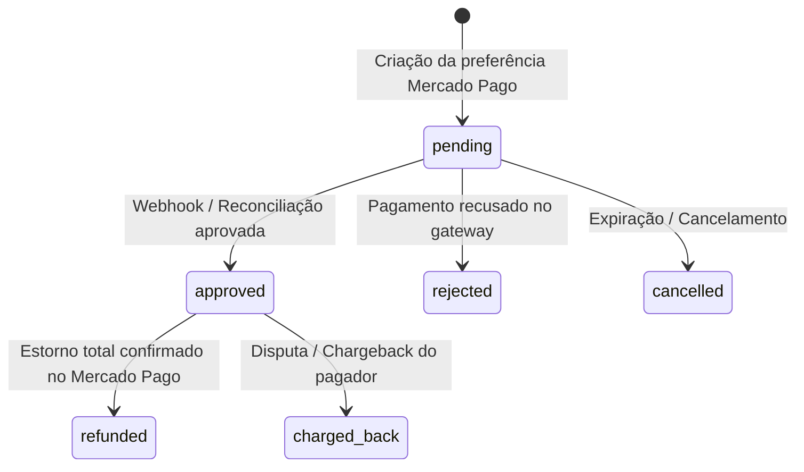
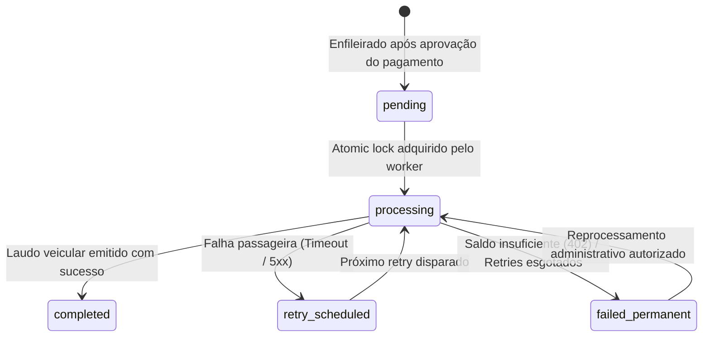
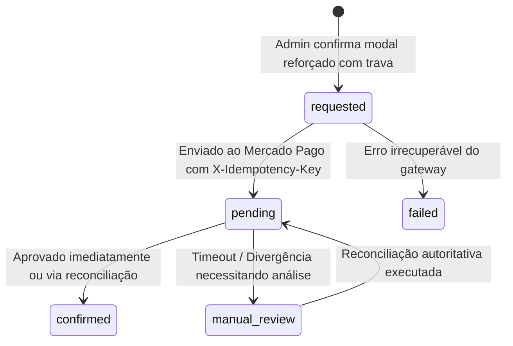

# Modelo de Dados e Arquitetura de Persistência: Central Administrativa

## 1. Visão Geral e Princípios

A Central Administrativa reutiliza integralmente o ecossistema de tabelas e tipos já consolidados nas migrations anteriores do projeto AF Motos:
- Nenhuma tabela transacional existente é deletada ou substituída.
- Nenhuma coluna duplicada é criada.
- Toda extensão é estritamente aditiva via índices complementares e uma View administrativa otimizada.
- Políticas de RLS são rigorosamente mantidas e reforçadas.

---

## 2. Entidades Reutilizadas e Mapeamento

### 2.1. `payment_transactions`
| Coluna | Tipo | Descrição |
|---|---|---|
| `id` | `UUID PK` | Identificador interno da transação |
| `consultation_id` | `UUID FK` | Referência para `customer_plate_consultations(id)` |
| `user_id` | `UUID FK` | Referência para o cliente pagador em `auth.users(id)` |
| `mp_payment_id` | `TEXT UNIQUE` | Identificador oficial do pagamento no Mercado Pago |
| `mp_preference_id` | `TEXT` | ID da preferência criada no Checkout Pro |
| `status` | `TEXT` | `pending`, `approved`, `authorized`, `in_process`, `in_mediation`, `rejected`, `cancelled`, `refunded`, `charged_back` |
| `status_detail` | `TEXT` | Detalhe textual do gateway (ex.: `accredited`, `by_collector`) |
| `payment_method_id` | `TEXT` | Método utilizado (`pix`, `bolbradesco`, `master`, `visa`, etc.) |
| `payment_type_id` | `TEXT` | Tipo (`bank_transfer`, `ticket`, `credit_card`) |
| `transaction_amount` | `NUMERIC(10,2)` | Valor nominal cobrado em BRL |
| `net_received_amount`| `NUMERIC(10,2)` | Valor líquido após taxas do gateway |
| `refund_status` | `TEXT` | `none`, `pending`, `refunded`, `failed` |
| `refund_amount` | `NUMERIC(10,2)` | Valor acumulado estornado |
| `refunded_at` | `TIMESTAMPTZ` | Momento em que o estorno foi confirmado |
| `mp_refund_id` | `TEXT` | Identificador do estorno retornado pelo Mercado Pago |
| `created_at` | `TIMESTAMPTZ` | Criação do registro |
| `updated_at` | `TIMESTAMPTZ` | Última modificação |

### 2.2. `customer_plate_consultations`
| Coluna | Tipo | Descrição |
|---|---|---|
| `id` | `UUID PK` | Identificador da consulta solicitada pelo cliente |
| `user_id` | `UUID FK` | Referência para `customer_profiles(id)` |
| `plate` | `TEXT` | Placa veicular formatada |
| `plate_normalized` | `TEXT` | Placa sem traço em caixa alta (indexada) |
| `vehicle_data` | `JSONB` | Snapshot completo do laudo veicular oficial emitido |
| `status` | `TEXT` | `pending`, `paid`, `processing`, `completed`, `failed` |
| `payment_status` | `TEXT` | `unpaid`, `paid`, `refunded` |
| `payment_method` | `TEXT` | `pix`, `credit_card`, `boleto` |
| `payment_date` | `TIMESTAMPTZ` | Data/hora de confirmação do pagamento |
| `processed_at` | `TIMESTAMPTZ` | Data/hora da conclusão do laudo |
| `source_consultation_id` | `UUID FK` | Referência para consulta global em cache (`vehicle_plate_consultations`) |
| `lookup_error_message` | `TEXT` | Mensagem de erro segura em caso de falha |
| `auto_refund_attempted` | `BOOLEAN` | Sinalizador de tentativa de estorno automático |

### 2.3. `payment_refunds`
| Coluna | Tipo | Descrição |
|---|---|---|
| `id` | `UUID PK` | Identificador imutável da ordem de estorno |
| `transaction_id` | `UUID FK` | Referência para `payment_transactions(id)` |
| `consultation_id` | `UUID FK` | Referência para `customer_plate_consultations(id)` |
| `provider` | `TEXT` | Provedor de pagamento (`mercadopago`) |
| `provider_payment_id`| `TEXT` | Identificador obrigatório do pagamento no provedor |
| `provider_refund_id` | `TEXT` | Identificador do estorno retornado pelo provedor |
| `amount_cents` | `INTEGER` | Valor estornado em centavos (ex.: 4999 para R$ 49,99) |
| `currency` | `TEXT` | Moeda (`BRL`) |
| `status` | `TEXT` | `requested`, `pending`, `confirmed`, `failed`, `manual_review` |
| `reason_code` | `TEXT` | Código semântico do motivo (ex.: `APIBRASIL_INSUFFICIENT_CREDITS`) |
| `reason_safe` | `TEXT` | Descrição higienizada para auditoria |
| `idempotency_key` | `UUID UNIQUE` | Chave única para prevenir duplicação de chamadas ao gateway |
| `request_attempts` | `INTEGER` | Quantidade de tentativas de envio |
| `requested_at` | `TIMESTAMPTZ` | Momento da primeira solicitação |
| `confirmed_at` | `TIMESTAMPTZ` | Momento de confirmação oficial pelo gateway |
| `failed_at` | `TIMESTAMPTZ` | Momento da falha técnica segura |
| `last_error_code` | `TEXT` | Código de erro do gateway |
| `last_error_safe` | `TEXT` | Mensagem de erro sanitizada |

> **Garantia de Integridade**: O índice único `idx_unique_active_refund_per_transaction` em `payment_refunds` impede a existência simultânea de mais de um estorno nos estados `requested`, `pending` ou `confirmed` para a mesma transação.

### 2.4. `consultation_delivery_jobs`
| Coluna | Tipo | Descrição |
|---|---|---|
| `id` | `UUID PK` | Identificador do job de entrega assíncrona |
| `consultation_id` | `UUID FK` | Referência para a consulta do cliente |
| `transaction_id` | `UUID FK` | Referência para a transação financeira aprovada |
| `status` | `TEXT` | `pending`, `processing`, `completed`, `retry_scheduled`, `failed_permanent` |
| `attempt_count` | `INTEGER` | Contador de tentativas realizadas |
| `max_attempts` | `INTEGER` | Limite máximo configurado de tentativas |
| `next_retry_at` | `TIMESTAMPTZ` | Próximo horário agendado para execução |
| `locked_at` | `TIMESTAMPTZ` | Timestamp do lock pessimista ativo |
| `locked_by` | `TEXT` | Identificador do worker/processo que adquiriu o lock |
| `last_error_code` | `TEXT` | Código seguro da última falha (ex.: `APIBRASIL_INSUFFICIENT_CREDITS`) |
| `last_http_status` | `INTEGER` | Código HTTP da resposta do provedor veicular (ex.: 402) |
| `last_failure_class`| `TEXT` | Classificação (`transient`, `permanent`, `unknown`) |

### 2.5. `consultation_audit_logs`
| Coluna | Tipo | Descrição |
|---|---|---|
| `id` | `UUID PK` | Identificador do log de auditoria |
| `consultation_id` | `UUID FK` | Consulta veicular auditada |
| `transaction_id` | `UUID FK` | Transação financeira associada |
| `actor_id` | `UUID FK` | ID do usuário autenticado (ou nulo para sistema) |
| `actor_type` | `TEXT` | `customer`, `system`, `admin`, `webhook` |
| `event` | `TEXT` | Código do evento (ex.: `admin_refund_requested`, `admin_delivery_reprocessed`) |
| `details` | `JSONB` | Dicionário com detalhes seguros e contexto da operação |
| `created_at` | `TIMESTAMPTZ` | Timestamp do evento |

---

## 3. Estratégia de Consulta: View Administrativa Otimizada

Para permitir listagens ultrarrápidas com busca e filtros combinados, criamos a View:
`public.admin_payment_consultations_view`

```sql
CREATE OR REPLACE VIEW public.admin_payment_consultations_view AS
SELECT
    pt.id AS transaction_id,
    pt.created_at AS payment_created_at,
    pt.updated_at AS payment_updated_at,
    pt.status AS payment_status,
    pt.status_detail AS payment_status_detail,
    pt.transaction_amount AS amount,
    pt.payment_method_id,
    pt.payment_type_id,
    pt.mp_payment_id,
    pt.mp_preference_id,
    
    -- Dados da Consulta
    cpc.id AS consultation_id,
    cpc.plate,
    cpc.plate_normalized,
    cpc.status AS consultation_status,
    cpc.payment_status AS consultation_payment_status,
    (cpc.vehicle_data IS NOT NULL) AS has_report_data,
    cpc.processed_at AS consultation_processed_at,
    
    -- Dados do Cliente
    cp.id AS customer_id,
    cp.full_name AS customer_name,
    cp.email AS customer_email,
    cp.phone AS customer_phone,
    
    -- Dados do Job de Entrega
    cdj.id AS delivery_job_id,
    cdj.status AS delivery_status,
    cdj.attempt_count AS delivery_attempt_count,
    cdj.max_attempts AS delivery_max_attempts,
    cdj.next_retry_at AS delivery_next_retry_at,
    cdj.last_error_code AS delivery_last_error_code,
    cdj.last_http_status AS delivery_last_http_status,
    cdj.last_failure_class AS delivery_last_failure_class,
    
    -- Dados do Refund
    pr.id AS refund_id,
    COALESCE(pr.status, pt.refund_status, 'none') AS refund_status,
    pr.provider_refund_id,
    pr.reason_code AS refund_reason_code,
    pr.reason_safe AS refund_reason_safe,
    pr.requested_at AS refund_requested_at,
    pr.confirmed_at AS refund_confirmed_at,
    pr.last_error_code AS refund_last_error_code,
    
    -- Indicadores Operacionais Computados
    CASE
      WHEN cdj.last_error_code = 'APIBRASIL_INSUFFICIENT_CREDITS' 
           OR cdj.last_http_status = 402 THEN TRUE
      ELSE FALSE
    END AS is_insufficient_credits,
    
    CASE
      WHEN pt.status = 'approved' 
           AND (cpc.status != 'completed' OR cpc.vehicle_data IS NULL)
           AND COALESCE(pr.status, 'none') NOT IN ('requested', 'pending', 'confirmed')
           AND pt.status != 'refunded'
           AND pt.mp_payment_id IS NOT NULL THEN TRUE
      ELSE FALSE
    END AS is_refund_eligible,

    CASE
      WHEN pt.status = 'approved' 
           AND (cpc.status != 'completed' OR cpc.vehicle_data IS NULL)
           AND COALESCE(pr.status, 'none') NOT IN ('requested', 'pending', 'confirmed')
           AND (cdj.status IS NULL OR cdj.status != 'processing') THEN TRUE
      ELSE FALSE
    END AS is_reprocess_eligible

FROM public.payment_transactions pt
JOIN public.customer_plate_consultations cpc ON cpc.id = pt.consultation_id
LEFT JOIN public.customer_profiles cp ON cp.id = cpc.user_id
LEFT JOIN LATERAL (
    SELECT * FROM public.consultation_delivery_jobs
    WHERE consultation_id = cpc.id
    ORDER BY created_at DESC
    LIMIT 1
) cdj ON TRUE
LEFT JOIN LATERAL (
    SELECT * FROM public.payment_refunds
    WHERE transaction_id = pt.id
    ORDER BY created_at DESC
    LIMIT 1
) pr ON TRUE;
```

---

## 4. Máquinas de Estado

### 4.1. Ciclo de Vida da Transação de Pagamento


### 4.2. Ciclo de Vida da Entrega do Laudo


### 4.3. Ciclo de Vida do Estorno Administrativo

