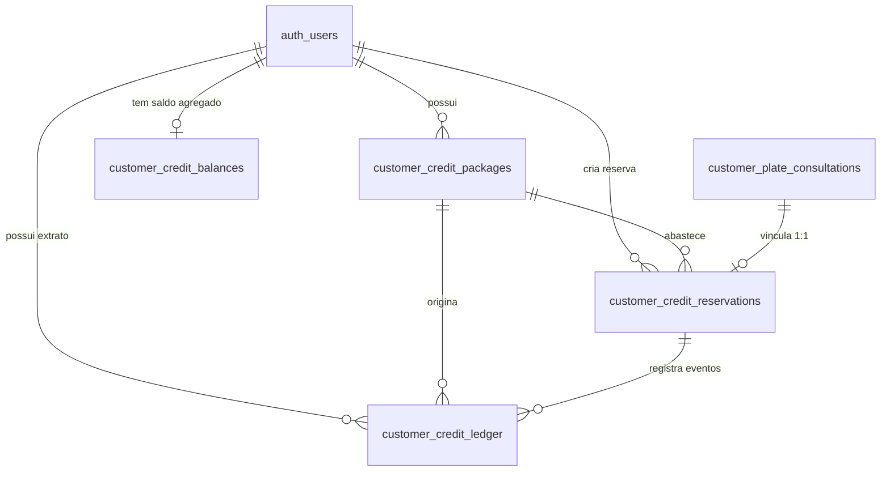

# Data Model: Pacotes B2B de Créditos, Ledger, Reservas e Balanços

## 1. Visão Geral da Arquitetura

O modelo de dados de créditos B2B adota uma arquitetura estrita de **Dupla Partida / Event Sourcing com Balanço Agregado**:
- **Ledger Imutável (`customer_credit_ledger`)**: Fonte primária e incontestável de auditoria. Lançamentos append-only que nunca sofrem UPDATE ou DELETE.
- **Pacotes Comerciais (`customer_credit_packages`)**: Representação das cotas negociadas manualmente fora da plataforma (WhatsApp, Pix, Transferência).
- **Reservas de Crédito (`customer_credit_reservations`)**: Entidade de ciclo de vida transitório associada 1-para-1 à consulta veicular, assegurando que reserva não seja confundida com consumo.
- **Balanço Agregado em Cache (`customer_credit_balances`)**: Visão materializada em tempo real (`available_credits`, `reserved_credits`, `consumed_credits`) para otimização de leitura e lock pessimista (`SELECT FOR UPDATE`).

---

## 2. Tabelas e Definições de Atributos

### 2.1 `public.customer_credit_balances`
Tabela de balanço agregado por cliente. Funciona como projeção em tempo real e âncora para concorrência.

| Coluna | Tipo | Modificadores | Descrição |
|---|---|---|---|
| `user_id` | `UUID` | `PRIMARY KEY REFERENCES auth.users(id) ON DELETE CASCADE` | ID do cliente no Supabase Auth |
| `available_credits` | `INTEGER` | `NOT NULL DEFAULT 0 CHECK (available_credits >= 0)` | Saldo pronto para ser reservado |
| `reserved_credits` | `INTEGER` | `NOT NULL DEFAULT 0 CHECK (reserved_credits >= 0)` | Créditos travados em consultas em andamento |
| `consumed_credits` | `INTEGER` | `NOT NULL DEFAULT 0 CHECK (consumed_credits >= 0)` | Total acumulado de créditos consumidos com laudo entregue |
| `updated_at` | `TIMESTAMPTZ` | `NOT NULL DEFAULT timezone('utc', now())` | Carimbo de atualização via trigger |

---

### 2.2 `public.customer_credit_packages`
Registro de lotes de créditos comercialmente concedidos.

| Coluna | Tipo | Modificadores | Descrição |
|---|---|---|---|
| `id` | `UUID` | `PRIMARY KEY DEFAULT gen_random_uuid()` | Identificador único do pacote |
| `user_id` | `UUID` | `NOT NULL REFERENCES auth.users(id) ON DELETE CASCADE` | Cliente beneficiário |
| `package_name` | `TEXT` | `NOT NULL` | Ex: "Pacote 5 Consultas WhatsApp" |
| `package_type` | `TEXT` | `NOT NULL CHECK (package_type IN ('manual_negotiated', 'agency', 'reseller', 'promotional', 'partner', 'test'))` | Segmento ou finalidade |
| `credits_granted` | `INTEGER` | `NOT NULL CHECK (credits_granted > 0)` | Quantidade total inicial de créditos |
| `credits_remaining` | `INTEGER` | `NOT NULL CHECK (credits_remaining >= 0)` | Saldo remanescente utilizável deste lote |
| `status` | `TEXT` | `NOT NULL DEFAULT 'active' CHECK (status IN ('active', 'exhausted', 'expired', 'suspended', 'cancelled'))` | Status operacional do pacote |
| `payment_channel` | `TEXT` | `NOT NULL CHECK (payment_channel IN ('whatsapp', 'pix_manual', 'bank_transfer', 'cash', 'invoice', 'other'))` | Canal de negociação |
| `external_payment_reference` | `TEXT` | `NULL` | ID do Pix / comprovante |
| `unit_price_cents` | `INTEGER` | `NULL CHECK (unit_price_cents IS NULL OR unit_price_cents >= 0)` | Valor unitário acordado em centavos |
| `total_paid_cents` | `INTEGER` | `NULL CHECK (total_paid_cents IS NULL OR total_paid_cents >= 0)` | Valor total recebido em centavos |
| `currency` | `TEXT` | `NOT NULL DEFAULT 'BRL'` | Moeda corrente |
| `sales_note` | `TEXT` | `NULL` | Notas da negociação comercial |
| `admin_note` | `TEXT` | `NULL` | Observações internas do administrador |
| `granted_by` | `UUID` | `NOT NULL REFERENCES auth.users(id)` | Administrador que concedeu o pacote |
| `granted_at` | `TIMESTAMPTZ` | `NOT NULL DEFAULT timezone('utc', now())` | Data e hora da concessão |
| `expires_at` | `TIMESTAMPTZ` | `NULL` | Data limite de expiração (NULL = sem expiração) |
| `created_at` | `TIMESTAMPTZ` | `NOT NULL DEFAULT timezone('utc', now())` | Criação do registro |
| `updated_at` | `TIMESTAMPTZ` | `NOT NULL DEFAULT timezone('utc', now())` | Atualização do registro |

**Constraint de Integridade:**
`CHECK (credits_remaining <= credits_granted)`

---

### 2.3 `public.customer_credit_reservations`
Entidade isolada para a reserva temporária vinculada à consulta veicular.

| Coluna | Tipo | Modificadores | Descrição |
|---|---|---|---|
| `id` | `UUID` | `PRIMARY KEY DEFAULT gen_random_uuid()` | Identificador da reserva |
| `user_id` | `UUID` | `NOT NULL REFERENCES auth.users(id) ON DELETE CASCADE` | Cliente titular |
| `package_id` | `UUID` | `NOT NULL REFERENCES public.customer_credit_packages(id) ON DELETE RESTRICT` | Pacote debitado na reserva |
| `consultation_id` | `UUID` | `NOT NULL REFERENCES public.customer_plate_consultations(id) ON DELETE RESTRICT` | Consulta veicular atendida |
| `status` | `TEXT` | `NOT NULL DEFAULT 'reserved' CHECK (status IN ('reserved', 'consumed', 'released', 'expired', 'revoked', 'manual_review'))` | Estado do ciclo de reserva |
| `quantity` | `INTEGER` | `NOT NULL DEFAULT 1 CHECK (quantity = 1)` | Quantidade travada (fixo em 1 por consulta) |
| `reservation_idempotency_key` | `TEXT` | `NOT NULL UNIQUE` | Chave de idempotência (ex: `res_consultation_{id}`) |
| `reserved_at` | `TIMESTAMPTZ` | `NOT NULL DEFAULT timezone('utc', now())` | Momento da trava |
| `consumed_at` | `TIMESTAMPTZ` | `NULL` | Momento da efetivação do consumo (após entrega de laudo) |
| `released_at` | `TIMESTAMPTZ` | `NULL` | Momento da liberação do crédito (em caso de falha definitiva) |
| `expired_at` | `TIMESTAMPTZ` | `NULL` | Momento de expiração da reserva |
| `release_reason_code` | `TEXT` | `NULL` | Código da liberação (ex: `DELIVERY_FAILED_PERMANENT`, `MANUAL_ADMIN`) |
| `release_reason_note` | `TEXT` | `NULL` | Justificativa legível |
| `created_at` | `TIMESTAMPTZ` | `NOT NULL DEFAULT timezone('utc', now())` | Criação do registro |
| `updated_at` | `TIMESTAMPTZ` | `NOT NULL DEFAULT timezone('utc', now())` | Atualização do registro |

**Constraint de Unicidade Rigorosa:**
`UNIQUE (consultation_id)` — Impede estruturalmente que uma mesma consulta receba mais de uma reserva concorrente ou cumulativa.

---

### 2.4 `public.customer_credit_ledger`
Extrato contábil analítico append-only de todas as mutações de crédito.

| Coluna | Tipo | Modificadores | Descrição |
|---|---|---|---|
| `id` | `UUID` | `PRIMARY KEY DEFAULT gen_random_uuid()` | ID do lançamento |
| `user_id` | `UUID` | `NOT NULL REFERENCES auth.users(id) ON DELETE CASCADE` | Cliente titular |
| `package_id` | `UUID` | `NULL REFERENCES public.customer_credit_packages(id) ON DELETE RESTRICT` | Pacote relacionado |
| `consultation_id` | `UUID` | `NULL REFERENCES public.customer_plate_consultations(id) ON DELETE RESTRICT` | Consulta veicular relacionada |
| `reservation_id` | `UUID` | `NULL REFERENCES public.customer_credit_reservations(id) ON DELETE RESTRICT` | Reserva relacionada |
| `entry_type` | `TEXT` | `NOT NULL CHECK (entry_type IN ('grant', 'reserve', 'consume', 'release', 'expire', 'adjustment_add', 'adjustment_remove', 'revoke'))` | Tipo do evento contábil |
| `quantity` | `INTEGER` | `NOT NULL CHECK (quantity > 0)` | Volume de créditos do evento |
| `available_effect` | `INTEGER` | `NOT NULL DEFAULT 0` | Impacto no saldo disponível (+/-) |
| `reserved_effect` | `INTEGER` | `NOT NULL DEFAULT 0` | Impacto no saldo reservado (+/-) |
| `consumed_effect` | `INTEGER` | `NOT NULL DEFAULT 0` | Impacto no saldo consumido (+/-) |
| `reason_code` | `TEXT` | `NOT NULL` | Código de motivo auditável |
| `reason_note` | `TEXT` | `NULL` | Descrição complementar |
| `created_by` | `UUID` | `NULL REFERENCES auth.users(id) ON DELETE SET NULL` | Autor da operação |
| `actor_type` | `TEXT` | `NOT NULL CHECK (actor_type IN ('admin', 'customer', 'system', 'delivery_worker'))` | Categoria do autor |
| `idempotency_key` | `TEXT` | `NOT NULL UNIQUE` | Chave única anti-duplicação |
| `metadata` | `JSONB` | `NOT NULL DEFAULT '{}'::jsonb` | Metadados contextuais (sanitizados) |
| `created_at` | `TIMESTAMPTZ` | `NOT NULL DEFAULT timezone('utc', now())` | Data e hora do lançamento |

**Proteção de Imutabilidade:**
Trigger `prevent_customer_credit_ledger_mutation` que rejeita qualquer `UPDATE` ou `DELETE`.

---

### 2.5 Modificações em `public.customer_plate_consultations`

Campos adicionais com transição suave e retrocompatível:
1. `payment_coverage_type`: `TEXT NULL CHECK (payment_coverage_type IN ('mercadopago', 'platform_credit', 'free', 'legacy_unknown'))`
2. `credit_package_id`: `UUID NULL REFERENCES public.customer_credit_packages(id) ON DELETE RESTRICT`
3. `credit_reservation_id`: `UUID NULL REFERENCES public.customer_credit_reservations(id) ON DELETE RESTRICT`
4. `credit_status`: `TEXT NULL CHECK (credit_status IN ('none', 'reserved', 'consumed', 'released'))`

**Backfill Seguro:**
- Registros que possuem registro aprovado em `payment_transactions` são classificados como `'mercadopago'`.
- Registros históricos sem pagamento são marcados como `'legacy_unknown'`.
- Nenhuma consulta histórica é falsamente rotulada sem evidência.

---

## 3. Matriz de Efeitos do Ledger

| `entry_type` | `available_effect` | `reserved_effect` | `consumed_effect` | Momento de Aplicação |
|---|---|---|---|---|
| `grant` | `+quantity` | `0` | `0` | Concessão inicial de pacote pelo admin |
| `reserve` | `-quantity` | `+quantity` | `0` | Seleção de pagamento por crédito na consulta |
| `consume` | `0` | `-quantity` | `+quantity` | Entrega bem-sucedida do laudo da API Brasil |
| `release` | `+quantity` | `-quantity` | `0` | Falha definitiva de entrega ou cancelamento |
| `expire` | `-quantity` | `0` | `0` | Expiração do lote de créditos por data limite |
| `adjustment_add` | `+quantity` | `0` | `0` | Correção manual positiva por administrador |
| `adjustment_remove`| `-quantity` | `0` | `0` | Correção manual negativa por administrador |
| `revoke` | `-quantity` | `0` | `0` | Cancelamento integral de pacote restante |
