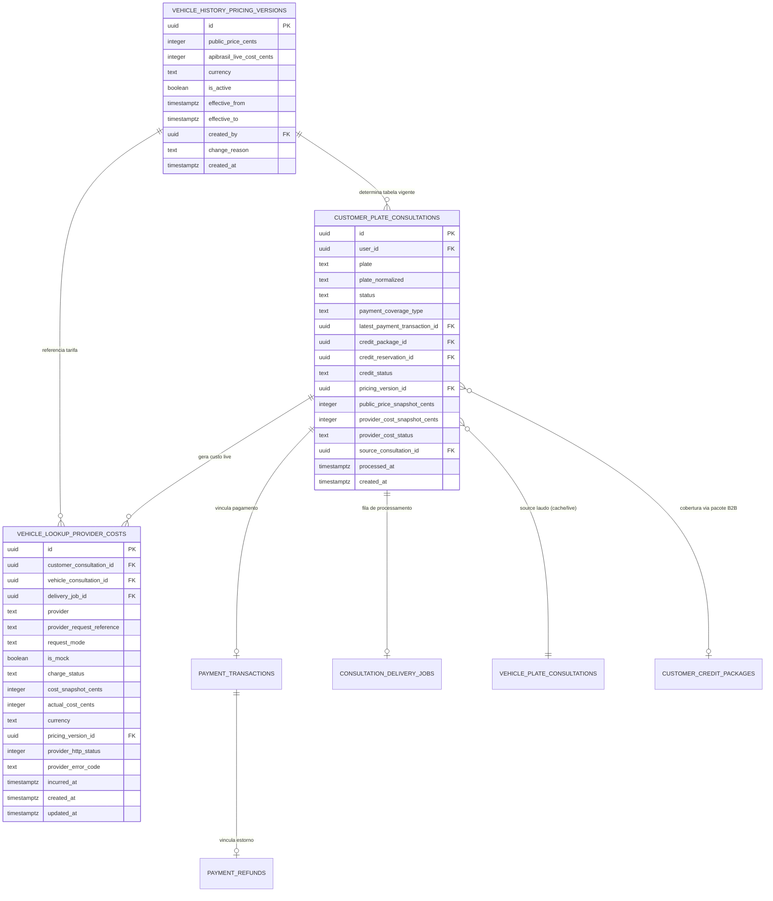

# Data Model: Relatório Financeiro e Operacional de Histórico Veicular

**Feature Directory**: `specs/037-vehicle-history-financial-accountant-reports`  
**Date**: 2026-09-14  
**Status**: Proposal  

---

## 1. Diagrama de Relacionamento de Entidades (ERD)



---

## 2. Tabelas Propostas

### 2.1 `public.vehicle_history_pricing_versions` (Versionamento de Tabela de Preços e Custos)

Representa os períodos de vigência das tarifas aplicadas pela AF Motos. Cada reajuste desativa a versão anterior e inicia uma nova versão com vigência no momento do cadastro.

```sql
CREATE TABLE IF NOT EXISTS public.vehicle_history_pricing_versions (
    id UUID PRIMARY KEY DEFAULT gen_random_uuid(),
    public_price_cents INTEGER NOT NULL CHECK (public_price_cents > 0),
    apibrasil_live_cost_cents INTEGER NOT NULL CHECK (apibrasil_live_cost_cents >= 0),
    currency TEXT NOT NULL DEFAULT 'BRL',
    is_active BOOLEAN NOT NULL DEFAULT true,
    effective_from TIMESTAMPTZ NOT NULL DEFAULT timezone('utc', now()),
    effective_to TIMESTAMPTZ NULL,
    created_by UUID NOT NULL REFERENCES auth.users(id) ON DELETE RESTRICT,
    change_reason TEXT NULL,
    metadata JSONB NOT NULL DEFAULT '{}'::jsonb,
    created_at TIMESTAMPTZ NOT NULL DEFAULT timezone('utc', now())
);

-- Garante no máximo UMA versão ativa simultaneamente
CREATE UNIQUE INDEX IF NOT EXISTS idx_unique_active_vehicle_pricing_version
    ON public.vehicle_history_pricing_versions (is_active)
    WHERE (is_active = true);

CREATE INDEX IF NOT EXISTS idx_vehicle_history_pricing_versions_dates
    ON public.vehicle_history_pricing_versions (effective_from DESC, effective_to);

-- RLS
ALTER TABLE public.vehicle_history_pricing_versions ENABLE ROW LEVEL SECURITY;

DROP POLICY IF EXISTS "Admins have full access to pricing versions" ON public.vehicle_history_pricing_versions;
CREATE POLICY "Admins have full access to pricing versions"
    ON public.vehicle_history_pricing_versions
    FOR ALL
    TO authenticated
    USING (
        EXISTS (
            SELECT 1 FROM public.admin_profiles
            WHERE admin_profiles.auth_user_id = auth.uid()
              AND admin_profiles.is_active = true
              AND admin_profiles.role IN ('admin', 'super_admin')
        )
    )
    WITH CHECK (
        EXISTS (
            SELECT 1 FROM public.admin_profiles
            WHERE admin_profiles.auth_user_id = auth.uid()
              AND admin_profiles.is_active = true
              AND admin_profiles.role IN ('admin', 'super_admin')
        )
    );
```

### 2.2 `public.vehicle_lookup_provider_costs` (Registro de Custos Efetivos de Provedores)

Armazena de forma auditável e com chave de idempotência cada custo ou tentativa de consumo associada a chamadas à API Brasil.

```sql
CREATE TABLE IF NOT EXISTS public.vehicle_lookup_provider_costs (
    id UUID PRIMARY KEY DEFAULT gen_random_uuid(),
    customer_consultation_id UUID NULL REFERENCES public.customer_plate_consultations(id) ON DELETE SET NULL,
    vehicle_consultation_id UUID NULL REFERENCES public.vehicle_plate_consultations(id) ON DELETE SET NULL,
    delivery_job_id UUID NULL REFERENCES public.consultation_delivery_jobs(id) ON DELETE SET NULL,
    provider TEXT NOT NULL DEFAULT 'apibrasil',
    provider_request_reference TEXT NULL,
    request_mode TEXT NOT NULL CHECK (request_mode IN ('mock', 'live')),
    is_mock BOOLEAN NOT NULL DEFAULT false,
    
    charge_status TEXT NOT NULL CHECK (
        charge_status IN (
            'not_applicable',  -- Cache hit, mock ou teste gratuito
            'pending',         -- Em processamento
            'incurred',        -- Custo real cobrado e confirmado pelo provedor
            'not_incurred',    -- Saldo insuficiente, token inválido ou erro pré-chamada
            'unknown',         -- Timeout de 120s sem confirmação de débito
            'reversed'         -- Cancelado ou estornado pelo provedor
        )
    ),
    
    cost_snapshot_cents INTEGER NOT NULL CHECK (cost_snapshot_cents >= 0),
    actual_cost_cents INTEGER NULL CHECK (actual_cost_cents IS NULL OR actual_cost_cents >= 0),
    currency TEXT NOT NULL DEFAULT 'BRL',
    
    pricing_version_id UUID NULL REFERENCES public.vehicle_history_pricing_versions(id) ON DELETE RESTRICT,
    provider_http_status INTEGER NULL,
    provider_error_code TEXT NULL,
    provider_balance_before NUMERIC(14,3) NULL,
    provider_balance_after NUMERIC(14,3) NULL,
    
    idempotency_key TEXT NOT NULL UNIQUE,
    incurred_at TIMESTAMPTZ NULL,
    created_at TIMESTAMPTZ NOT NULL DEFAULT timezone('utc', now()),
    updated_at TIMESTAMPTZ NOT NULL DEFAULT timezone('utc', now())
);

CREATE INDEX IF NOT EXISTS idx_vlpc_customer_consultation
    ON public.vehicle_lookup_provider_costs (customer_consultation_id);

CREATE INDEX IF NOT EXISTS idx_vlpc_delivery_job
    ON public.vehicle_lookup_provider_costs (delivery_job_id);

CREATE INDEX IF NOT EXISTS idx_vlpc_charge_status
    ON public.vehicle_lookup_provider_costs (charge_status);

CREATE INDEX IF NOT EXISTS idx_vlpc_created_at
    ON public.vehicle_lookup_provider_costs (created_at DESC);

-- Trigger de updated_at
DROP TRIGGER IF EXISTS trg_vlpc_set_updated_at ON public.vehicle_lookup_provider_costs;
CREATE TRIGGER trg_vlpc_set_updated_at
    BEFORE UPDATE ON public.vehicle_lookup_provider_costs
    FOR EACH ROW
    EXECUTE FUNCTION public.set_updated_at();

-- RLS
ALTER TABLE public.vehicle_lookup_provider_costs ENABLE ROW LEVEL SECURITY;

DROP POLICY IF EXISTS "Admins have full access to provider costs" ON public.vehicle_lookup_provider_costs;
CREATE POLICY "Admins have full access to provider costs"
    ON public.vehicle_lookup_provider_costs
    FOR ALL
    TO authenticated
    USING (
        EXISTS (
            SELECT 1 FROM public.admin_profiles
            WHERE admin_profiles.auth_user_id = auth.uid()
              AND admin_profiles.is_active = true
              AND admin_profiles.role IN ('admin', 'super_admin')
        )
    )
    WITH CHECK (
        EXISTS (
            SELECT 1 FROM public.admin_profiles
            WHERE admin_profiles.auth_user_id = auth.uid()
              AND admin_profiles.is_active = true
              AND admin_profiles.role IN ('admin', 'super_admin')
        )
    );
```

### 2.3 Extensões Aditivas em `customer_plate_consultations`

Adiciona os campos de snapshot financeiro e vínculo de versão sem quebrar nenhum dado existente:

```sql
ALTER TABLE public.customer_plate_consultations
    ADD COLUMN IF NOT EXISTS pricing_version_id UUID REFERENCES public.vehicle_history_pricing_versions(id) ON DELETE RESTRICT,
    ADD COLUMN IF NOT EXISTS public_price_snapshot_cents INTEGER NULL,
    ADD COLUMN IF NOT EXISTS provider_cost_snapshot_cents INTEGER NULL,
    ADD COLUMN IF NOT EXISTS provider_cost_status TEXT NULL CHECK (
        provider_cost_status IS NULL OR
        provider_cost_status IN ('not_applicable', 'pending', 'incurred', 'not_incurred', 'unknown', 'reversed')
    );

CREATE INDEX IF NOT EXISTS idx_cpc_pricing_version
    ON public.customer_plate_consultations (pricing_version_id);

CREATE INDEX IF NOT EXISTS idx_cpc_provider_cost_status
    ON public.customer_plate_consultations (provider_cost_status);
```

---

## 3. View Unificada Administrativa e Financeira

Criação da view consolidada `public.admin_vehicle_history_financial_view` para alimentar a Central de Relatórios de forma performática e com segurança:

```sql
CREATE OR REPLACE VIEW public.admin_vehicle_history_financial_view AS
SELECT
    -- Identificação da Consulta
    cpc.id AS consultation_id,
    cpc.created_at AS consultation_created_at,
    cpc.processed_at AS consultation_processed_at,
    cpc.plate,
    cpc.plate_normalized,
    cpc.status AS consultation_status,
    cpc.payment_coverage_type,
    cpc.credit_status,
    (cpc.vehicle_data IS NOT NULL) AS has_report_data,
    cpc.source_consultation_id,
    
    -- Snapshots Financeiros da Consulta
    cpc.pricing_version_id,
    COALESCE(cpc.public_price_snapshot_cents, ROUND(pt.transaction_amount * 100)::integer, 3990) AS public_price_snapshot_cents,
    COALESCE(cpc.provider_cost_snapshot_cents, vlpc.cost_snapshot_cents, 3000) AS provider_cost_snapshot_cents,
    COALESCE(cpc.provider_cost_status, vlpc.charge_status, 
        CASE 
            WHEN vpc.is_mock = true THEN 'not_applicable'
            WHEN cpc.source_consultation_id IS NOT NULL AND cpc.source_consultation_id != vpc.id THEN 'not_applicable'
            WHEN vpc.is_chargeable = true THEN 'incurred'
            ELSE 'unknown'
        END
    ) AS provider_cost_status,

    -- Dados do Provedor (API Brasil)
    vpc.mode AS provider_mode,
    vpc.is_mock AS provider_is_mock,
    vpc.provider_status_code,
    vpc.provider_error,
    CASE 
        WHEN cpc.source_consultation_id IS NOT NULL AND vpc.id IS NOT NULL AND cpc.id != vpc.id THEN 'cache'
        WHEN vpc.is_mock = true THEN 'mock'
        WHEN vpc.mode = 'live' THEN 'live'
        ELSE 'unknown'
    END AS report_origin,
    
    -- Custo Efetivo
    COALESCE(vlpc.actual_cost_cents, 
        CASE 
            WHEN vpc.is_mock = true THEN 0
            WHEN vpc.is_chargeable = true THEN 3000
            ELSE 0
        END
    ) AS actual_cost_cents,

    -- Dados de Pagamento (Mercado Pago)
    pt.id AS transaction_id,
    pt.mp_payment_id,
    pt.status AS payment_status,
    pt.transaction_amount AS payment_amount,
    COALESCE(ROUND(pt.transaction_amount * 100)::integer, 0) AS payment_amount_cents,
    
    -- Dados de Estorno
    pr.id AS refund_id,
    COALESCE(pr.status, pt.refund_status, 'none') AS refund_status,
    COALESCE(pr.amount_cents, ROUND(COALESCE(pt.refund_amount, 0) * 100)::integer, 0) AS refund_amount_cents,
    pr.confirmed_at AS refund_confirmed_at,
    pr.reason_code AS refund_reason_code,

    -- Receita Líquida Computada (em centavos)
    CASE 
        WHEN pt.status = 'approved' THEN 
            ROUND(pt.transaction_amount * 100)::integer - 
            CASE WHEN COALESCE(pr.status, pt.refund_status) = 'confirmed' OR pt.status = 'refunded' 
                 THEN COALESCE(pr.amount_cents, ROUND(COALESCE(pt.refund_amount, 0) * 100)::integer, 0)
                 ELSE 0 
            END
        ELSE 0
    END AS net_revenue_cents,

    -- Margem Bruta Estimada da Consulta (em centavos)
    CASE 
        WHEN cpc.payment_coverage_type = 'mercadopago' AND pt.status = 'approved' THEN
            (ROUND(pt.transaction_amount * 100)::integer - 
             CASE WHEN COALESCE(pr.status, pt.refund_status) = 'confirmed' OR pt.status = 'refunded' 
                  THEN COALESCE(pr.amount_cents, 0) ELSE 0 END) -
            CASE WHEN COALESCE(vlpc.charge_status, 'incurred') = 'incurred' 
                 THEN COALESCE(vlpc.actual_cost_cents, 3000) ELSE 0 END
        ELSE NULL
    END AS estimated_margin_cents,

    -- Dados do Cliente
    cp.id AS customer_id,
    cp.full_name AS customer_name,
    cp.email AS customer_email,
    cp.phone AS customer_phone,
    
    -- Dados do Pacote B2B (se aplicável)
    ccp.id AS credit_package_id,
    ccp.package_name,
    ccp.package_type,
    ccp.payment_channel AS package_payment_channel,
    ccp.total_paid_cents AS package_total_paid_cents,
    ccp.unit_price_cents AS package_unit_price_cents,

    -- Dados do Job de Entrega
    cdj.id AS delivery_job_id,
    cdj.status AS delivery_status,
    cdj.attempt_count AS delivery_attempt_count,
    cdj.last_error_code AS delivery_last_error_code

FROM public.customer_plate_consultations cpc
LEFT JOIN public.customer_profiles cp ON cp.id = cpc.user_id
LEFT JOIN public.payment_transactions pt ON pt.id = cpc.latest_payment_transaction_id
LEFT JOIN public.vehicle_plate_consultations vpc ON vpc.id = cpc.source_consultation_id
LEFT JOIN public.customer_credit_packages ccp ON ccp.id = cpc.credit_package_id
LEFT JOIN LATERAL (
    SELECT * FROM public.payment_refunds
    WHERE transaction_id = pt.id
    ORDER BY created_at DESC
    LIMIT 1
) pr ON TRUE
LEFT JOIN LATERAL (
    SELECT * FROM public.consultation_delivery_jobs
    WHERE consultation_id = cpc.id
    ORDER BY created_at DESC
    LIMIT 1
) cdj ON TRUE
LEFT JOIN LATERAL (
    SELECT * FROM public.vehicle_lookup_provider_costs
    WHERE customer_consultation_id = cpc.id
    ORDER BY created_at DESC
    LIMIT 1
) vlpc ON TRUE;

-- Permissões
GRANT SELECT ON public.admin_vehicle_history_financial_view TO authenticated;
GRANT SELECT ON public.admin_vehicle_history_financial_view TO service_role;
```

---

## 4. Estrutura dos Eventos de Auditoria

Para persistência de logs estruturados na tabela existente `public.consultation_audit_logs` ou tabela equivalente:

```typescript
export interface VehicleHistoryAuditPayload {
  event: 
    | 'vehicle_history_pricing.created'
    | 'vehicle_history_pricing.updated'
    | 'vehicle_history_pricing.version_activated'
    | 'vehicle_history_cost.snapshot_created'
    | 'vehicle_history_cost.incurred'
    | 'vehicle_history_cost.not_incurred'
    | 'vehicle_history_cost.unknown'
    | 'vehicle_history_report.generated'
    | 'vehicle_history_report.exported_csv'
    | 'vehicle_history_report.filters_applied'
    | 'vehicle_history_annual_report.generated';
  actorId: string;
  actorType: 'admin' | 'system' | 'delivery_worker';
  pricingVersionId?: string;
  consultationId?: string;
  vehicleConsultationId?: string;
  paymentTransactionId?: string;
  packageId?: string;
  reportPeriod?: string;
  costCents?: number;
  revenueCents?: number;
  refundCents?: number;
  currency: 'BRL';
  source?: string;
  mode?: 'mock' | 'live';
  isMock?: boolean;
  isChargeable?: boolean;
  status?: string;
  timestamp: string;
}
```
