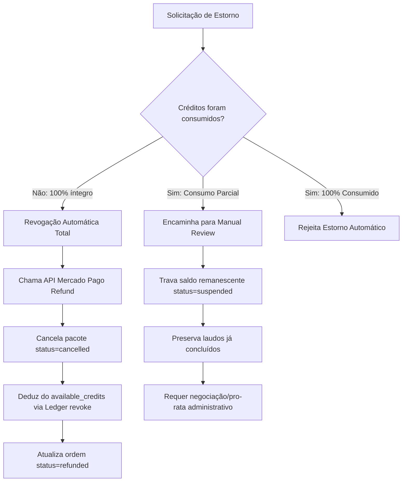

# Contract: Package Refund API & Policy

## Processamento de Estorno de Pacote de Créditos

`POST /api/admin/credit-package-orders/[orderId]/refund`

**Autenticação**: Administrador com perfil ativo (`is_active = true` e `role IN ('admin', 'super_admin')`).

### Request Body

```json
{
  "reason": "Solicitação do cliente dentro do prazo de arrependimento legal",
  "idempotencyKey": "refund-opt-88992211"
}
```

---

## Matriz de Decisão de Estorno



### Resposta de Sucesso - Estorno Total Concluído (200 OK)

```json
{
  "success": true,
  "refunded": true,
  "action": "full_package_revocation",
  "creditsRevoked": 5,
  "orderId": "770e8400-e29b-41d4-a716-446655440022",
  "mpRefundId": "ref_123456789",
  "message": "Estorno aprovado com sucesso. Pacote cancelado e créditos revogados no balanço do cliente."
}
```

### Resposta de Erro / Alerta - Consumo Parcial (422 Unprocessable Entity)

```json
{
  "success": false,
  "code": "REFUND_REQUIRES_MANUAL_REVIEW",
  "error": "O cliente já consumiu 2 de 5 créditos deste pacote. O estorno automático foi bloqueado; o pacote foi colocado em revisão manual para cálculo de ressarcimento pro-rata.",
  "consumedCredits": 2,
  "remainingCredits": 3
}
```
