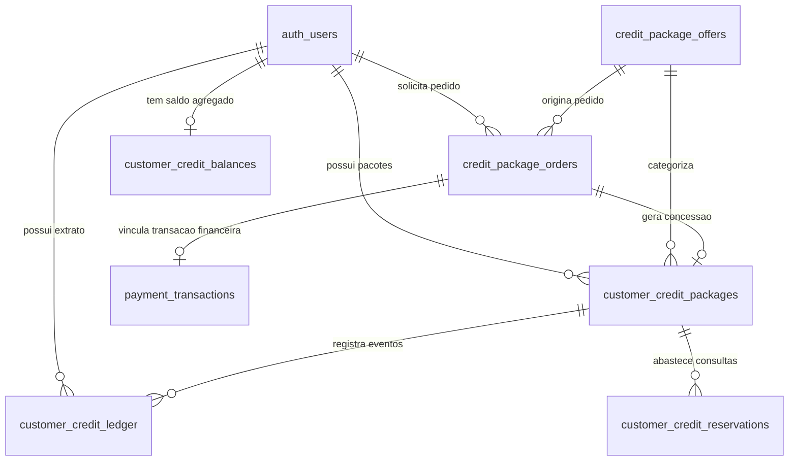

# Data Model: Checkout Pro para Pacotes de Créditos B2B

## 1. Diagrama Entidade-Relacionamento (ERD)



---

## 2. Tabelas do Domínio de Pacotes Comerciais

### 2.1 Tabela `public.credit_package_offers` (Catálogo Comercial)

Armazena as opções de pacotes disponíveis para visualização e compra.

```sql
CREATE TABLE IF NOT EXISTS public.credit_package_offers (
    id UUID PRIMARY KEY DEFAULT gen_random_uuid(),
    slug TEXT NOT NULL UNIQUE,
    name TEXT NOT NULL,
    short_label TEXT,
    description TEXT,
    package_type TEXT NOT NULL DEFAULT 'standard' 
        CHECK (package_type IN ('standard', 'agency', 'reseller', 'fleet', 'custom')),
    credits_quantity INTEGER NOT NULL CHECK (credits_quantity > 0),
    price_cents INTEGER NOT NULL CHECK (price_cents >= 0),
    currency TEXT NOT NULL DEFAULT 'BRL',
    reference_individual_price_cents INTEGER,
    discount_percent NUMERIC(5,2),
    is_active BOOLEAN NOT NULL DEFAULT TRUE,
    is_featured BOOLEAN NOT NULL DEFAULT FALSE,
    display_order INTEGER NOT NULL DEFAULT 0,
    contact_only BOOLEAN NOT NULL DEFAULT FALSE,
    requires_whatsapp BOOLEAN NOT NULL DEFAULT FALSE,
    validity_days INTEGER CHECK (validity_days IS NULL OR validity_days > 0),
    terms_summary TEXT,
    created_by UUID REFERENCES auth.users(id) ON DELETE SET NULL,
    updated_by UUID REFERENCES auth.users(id) ON DELETE SET NULL,
    created_at TIMESTAMPTZ NOT NULL DEFAULT timezone('utc', now()),
    updated_at TIMESTAMPTZ NOT NULL DEFAULT timezone('utc', now()),
    published_at TIMESTAMPTZ
);

-- Regra: contact_only obriga requires_whatsapp
ALTER TABLE public.credit_package_offers
    ADD CONSTRAINT check_contact_only_whatsapp 
    CHECK (NOT contact_only OR (contact_only AND requires_whatsapp));

CREATE INDEX IF NOT EXISTS idx_credit_package_offers_active_order 
    ON public.credit_package_offers (is_active, display_order ASC);
```

### 2.2 Tabela `public.credit_package_orders` (Pedidos Financeiros de Pacotes)

Registra o pedido emitido pelo cliente no checkout, atuando como snapshot imutável do valor e intermediário para o Mercado Pago.

```sql
CREATE TABLE IF NOT EXISTS public.credit_package_orders (
    id UUID PRIMARY KEY DEFAULT gen_random_uuid(),
    user_id UUID NOT NULL REFERENCES auth.users(id) ON DELETE CASCADE,
    offer_id UUID NOT NULL REFERENCES public.credit_package_offers(id) ON DELETE RESTRICT,
    quantity INTEGER NOT NULL DEFAULT 1 CHECK (quantity = 1),
    credits_quantity INTEGER NOT NULL CHECK (credits_quantity > 0),
    price_cents INTEGER NOT NULL CHECK (price_cents > 0),
    currency TEXT NOT NULL DEFAULT 'BRL',
    unit_price_cents INTEGER NOT NULL CHECK (unit_price_cents > 0),
    discount_cents INTEGER NOT NULL DEFAULT 0 CHECK (discount_cents >= 0),
    discount_percent NUMERIC(5,2),
    status TEXT NOT NULL DEFAULT 'pending' 
        CHECK (status IN ('pending', 'payment_in_process', 'paid', 'rejected', 'cancelled', 'refunded', 'manual_review')),
    mp_preference_id TEXT UNIQUE,
    mp_payment_id TEXT UNIQUE,
    payment_transaction_id UUID,
    external_reference TEXT NOT NULL UNIQUE,
    idempotency_key TEXT NOT NULL UNIQUE,
    granted_at TIMESTAMPTZ,
    created_at TIMESTAMPTZ NOT NULL DEFAULT timezone('utc', now()),
    updated_at TIMESTAMPTZ NOT NULL DEFAULT timezone('utc', now()),
    paid_at TIMESTAMPTZ,
    cancelled_at TIMESTAMPTZ
);

CREATE INDEX IF NOT EXISTS idx_credit_package_orders_user_status 
    ON public.credit_package_orders (user_id, status, created_at DESC);
CREATE INDEX IF NOT EXISTS idx_credit_package_orders_preference 
    ON public.credit_package_orders (mp_preference_id);
CREATE INDEX IF NOT EXISTS idx_credit_package_orders_payment 
    ON public.credit_package_orders (mp_payment_id);
```

---

## 3. Extensões e Atualizações em Tabelas Existentes

### 3.1 Atualizações em `public.payment_transactions`

Para que compras de pacotes sejam registradas como transações reais sem criar duplicidades:

```sql
-- Torna consultation_id opcional
ALTER TABLE public.payment_transactions 
    ALTER COLUMN consultation_id DROP NOT NULL;

-- Adiciona finalidade da transação
ALTER TABLE public.payment_transactions 
    ADD COLUMN IF NOT EXISTS purpose TEXT NOT NULL DEFAULT 'vehicle_consultation'
    CHECK (purpose IN ('vehicle_consultation', 'credit_package'));

-- Adiciona chave estrangeira para o pedido de pacote
ALTER TABLE public.payment_transactions 
    ADD COLUMN IF NOT EXISTS credit_package_order_id UUID 
    REFERENCES public.credit_package_orders(id) ON DELETE SET NULL;

-- Garante coerência de integridade relacional
ALTER TABLE public.payment_transactions
    ADD CONSTRAINT check_transaction_purpose_target
    CHECK (
        (purpose = 'vehicle_consultation' AND consultation_id IS NOT NULL) OR
        (purpose = 'credit_package' AND credit_package_order_id IS NOT NULL)
    );

CREATE INDEX IF NOT EXISTS idx_payment_transactions_purpose_order 
    ON public.payment_transactions (purpose, credit_package_order_id);
```

### 3.2 Atualizações em `public.customer_credit_packages`

Adiciona rastreabilidade de origem da compra automatizada:

```sql
ALTER TABLE public.customer_credit_packages 
    ADD COLUMN IF NOT EXISTS offer_id UUID 
    REFERENCES public.credit_package_offers(id) ON DELETE SET NULL;

ALTER TABLE public.customer_credit_packages 
    ADD COLUMN IF NOT EXISTS source TEXT NOT NULL DEFAULT 'manual_admin'
    CHECK (source IN ('manual_admin', 'mercadopago_package', 'promotional', 'partner', 'test'));

ALTER TABLE public.customer_credit_packages 
    ADD COLUMN IF NOT EXISTS purchase_order_id UUID UNIQUE 
    REFERENCES public.credit_package_orders(id) ON DELETE SET NULL;

ALTER TABLE public.customer_credit_packages 
    ADD COLUMN IF NOT EXISTS purchase_price_cents INTEGER 
    CHECK (purchase_price_cents IS NULL OR purchase_price_cents >= 0);

ALTER TABLE public.customer_credit_packages 
    ADD COLUMN IF NOT EXISTS purchase_currency TEXT NOT NULL DEFAULT 'BRL';

ALTER TABLE public.customer_credit_packages 
    ADD COLUMN IF NOT EXISTS purchased_at TIMESTAMPTZ;

CREATE INDEX IF NOT EXISTS idx_customer_credit_packages_purchase_order 
    ON public.customer_credit_packages (purchase_order_id);
```

---

## 4. Função Atômica RPC: `grant_credit_package_from_paid_order`

Garante que o crédito seja liberado uma única vez por pedido aprovado:

```sql
CREATE OR REPLACE FUNCTION public.grant_credit_package_from_paid_order(
    p_order_id UUID
)
RETURNS JSONB
LANGUAGE plpgsql
SECURITY DEFINER
SET search_path = public, auth
AS $$
DECLARE
    v_order RECORD;
    v_existing_package_id UUID;
    v_package_id UUID;
    v_offer_name TEXT;
    v_idempotency_key TEXT;
BEGIN
    -- 1. Lock pessimista da ordem
    SELECT * INTO v_order
    FROM public.credit_package_orders
    WHERE id = p_order_id
    FOR UPDATE;

    IF NOT FOUND THEN
        RETURN jsonb_build_object('success', false, 'code', 'ORDER_NOT_FOUND', 'message', 'Pedido não encontrado.');
    END IF;

    IF v_order.status <> 'paid' THEN
        RETURN jsonb_build_object('success', false, 'code', 'ORDER_NOT_PAID', 'message', 'O pedido ainda não está com status pago.');
    END IF;

    -- 2. Verificação de idempotência (já concedido?)
    SELECT id INTO v_existing_package_id
    FROM public.customer_credit_packages
    WHERE purchase_order_id = p_order_id;

    IF v_existing_package_id IS NOT NULL THEN
        RETURN jsonb_build_object(
            'success', true, 
            'code', 'ALREADY_GRANTED', 
            'message', 'Os créditos deste pedido já foram liberados anteriormente.',
            'package_id', v_existing_package_id
        );
    END IF;

    -- 3. Identifica nome da oferta
    SELECT name INTO v_offer_name
    FROM public.credit_package_offers
    WHERE id = v_order.offer_id;

    v_package_id := gen_random_uuid();
    v_idempotency_key := 'package-grant:' || p_order_id::text;

    -- 4. Criação do pacote concedido
    INSERT INTO public.customer_credit_packages (
        id,
        user_id,
        offer_id,
        package_name,
        package_type,
        credits_granted,
        credits_remaining,
        status,
        payment_channel,
        external_payment_reference,
        unit_price_cents,
        total_paid_cents,
        currency,
        source,
        purchase_order_id,
        purchase_price_cents,
        purchase_currency,
        purchased_at,
        granted_by,
        granted_at,
        created_at,
        updated_at
    ) VALUES (
        v_package_id,
        v_order.user_id,
        v_order.offer_id,
        COALESCE(v_offer_name, 'Pacote de Consultas Mercado Pago'),
        'standard',
        v_order.credits_quantity,
        v_order.credits_quantity,
        'active',
        'other',
        v_order.mp_payment_id,
        v_order.unit_price_cents,
        v_order.price_cents,
        v_order.currency,
        'mercadopago_package',
        v_order.id,
        v_order.price_cents,
        v_order.currency,
        COALESCE(v_order.paid_at, timezone('utc', now())),
        v_order.user_id,
        timezone('utc', now()),
        timezone('utc', now()),
        timezone('utc', now())
    );

    -- 5. Lançamento no livro razão (ledger)
    INSERT INTO public.customer_credit_ledger (
        id,
        user_id,
        package_id,
        entry_type,
        quantity,
        available_effect,
        reserved_effect,
        consumed_effect,
        reason_code,
        reason_note,
        actor_type,
        idempotency_key,
        metadata,
        created_at
    ) VALUES (
        gen_random_uuid(),
        v_order.user_id,
        v_package_id,
        'grant',
        v_order.credits_quantity,
        v_order.credits_quantity,
        0,
        0,
        'PACKAGE_PURCHASE_APPROVED',
        'Créditos liberados automaticamente via Mercado Pago Checkout Pro',
        'system',
        v_idempotency_key,
        jsonb_build_object('order_id', v_order.id, 'mp_payment_id', v_order.mp_payment_id, 'price_cents', v_order.price_cents),
        timezone('utc', now())
    );

    -- 6. Atualização atômica do saldo agregado em customer_credit_balances
    INSERT INTO public.customer_credit_balances (
        user_id,
        available_credits,
        reserved_credits,
        consumed_credits,
        updated_at
    ) VALUES (
        v_order.user_id,
        v_order.credits_quantity,
        0,
        0,
        timezone('utc', now())
    )
    ON CONFLICT (user_id) DO UPDATE SET
        available_credits = public.customer_credit_balances.available_credits + v_order.credits_quantity,
        updated_at = timezone('utc', now());

    -- 7. Marca carimbo de concessão na ordem
    UPDATE public.credit_package_orders
    SET granted_at = timezone('utc', now()),
        updated_at = timezone('utc', now())
    WHERE id = p_order_id;

    RETURN jsonb_build_object(
        'success', true,
        'code', 'CREDITS_GRANTED',
        'message', 'Créditos concedidos com sucesso.',
        'package_id', v_package_id,
        'credits_granted', v_order.credits_quantity
    );
END;
$$;
```

---

## 5. Políticas de Segurança (Row Level Security - RLS)

```sql
-- 5.1 credit_package_offers
ALTER TABLE public.credit_package_offers ENABLE ROW LEVEL SECURITY;

-- Qualquer cliente pode visualizar ofertas ativas
CREATE POLICY "Public and users can view active offers"
    ON public.credit_package_offers FOR SELECT
    USING (is_active = true);

-- Admins ativos possuem acesso irrestrito
CREATE POLICY "Active admins manage package offers"
    ON public.credit_package_offers FOR ALL
    USING (
        EXISTS (
            SELECT 1 FROM public.admin_profiles
            WHERE auth_user_id = auth.uid()
              AND is_active = true
              AND role IN ('admin', 'super_admin')
        )
    );

-- 5.2 credit_package_orders
ALTER TABLE public.credit_package_orders ENABLE ROW LEVEL SECURITY;

-- Clientes só visualizam seus próprios pedidos
CREATE POLICY "Customers view own orders"
    ON public.credit_package_orders FOR SELECT
    USING (auth.uid() = user_id);

-- Admins ativos visualizam todos os pedidos
CREATE POLICY "Active admins view all package orders"
    ON public.credit_package_orders FOR SELECT
    USING (
        EXISTS (
            SELECT 1 FROM public.admin_profiles
            WHERE auth_user_id = auth.uid()
              AND is_active = true
              AND role IN ('admin', 'super_admin')
        )
    );
```
